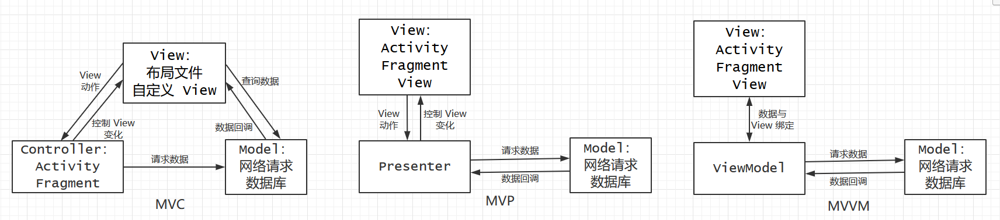
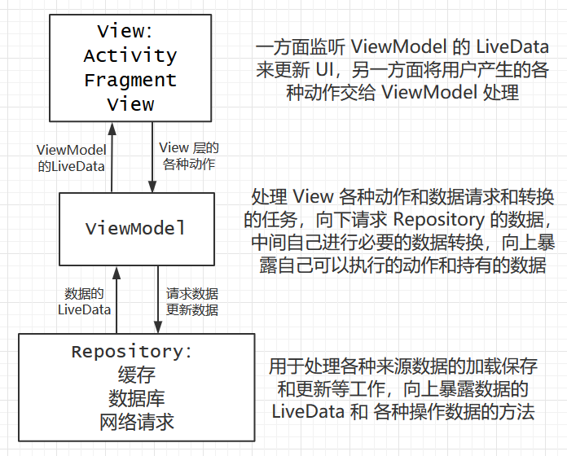
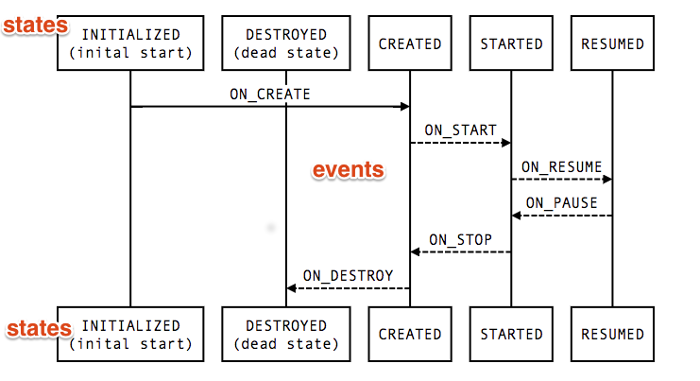

# 基于 Android Architecture Components 的 MVVM 浅析

## 0、前言

官方文档永远是最好的学习资料：  
[Android Jectpack](https://developer.android.google.cn/jetpack)  
[Android Jetpack: LiveData 和 Lifecycle 介绍 | 中文教学视频](https://www.bilibili.com/video/av33633628)  
[Android Jetpack - ViewModel | 中文教学视频](https://www.bilibili.com/video/av29949898)  
[Android Jetpack Room | 中文教学视频](https://www.bilibili.com/video/av30617550)  
深入了解还需多看文档和源码。

## 1、简介

### 1.1、AAC 是什么

AAC ([Android Architecture Components](https://developer.android.google.cn/topic/libraries/architecture/)) 是谷歌推出的一套包含在 [Jetpack](https://developer.android.google.cn/jetpack) 中的，帮助我们构建稳健、可测试且易维护应用的组件库，主要包括 [Lifecycle](https://developer.android.google.cn/topic/libraries/architecture/lifecycle)、[LiveData](https://developer.android.google.cn/topic/libraries/architecture/livedata)、[ViewModel](https://developer.android.google.cn/topic/libraries/architecture/viewmodel)、[Room](https://developer.android.google.cn/topic/libraries/architecture/room)、[WorkManager](https://developer.android.google.cn/topic/libraries/architecture/workmanager) 等一系列好用的工具。**注意**，AAC 并不是一种新的架构，只是一套和架构相关的工具，可以帮助你更加简单高效的构件你想要的架构。

### 1.2、AAC 与 MVVM

MVC (Model-View-Controller)、MVP (Model-View-Presenter) 和 MVVM (Model-View-ViewModel) 在 Android 中的应用大概可以概括为下图（架构分层因人而异，这里只是我自己的一些理解）  
  
在 MVP 的架构中，View 层和 Presenter 层相互引用对方，Presenter 层收到 View 层的动作或者拿到 Model 层的数据后主动调用 View 的一些方法，显示相应的结果。Presenter 层就像个全职保姆一样，上有 View 层要处理动作和显示，下有 Model 层要请求和处理数据，中间自己还要处理业务逻辑。我们一般需要定义 `IView` 和 `IPresenter` 之类的接口，然后 View 层和 Presenter 层相互持有对方的引用，这样就存在很多问题，比如：
- View 和 Presenter 解耦不彻底，Presenter 需要具体知道 View 层的能力；
- 因为 View 层和 Model 层之间的通讯和其他业务层面的大小事务都由它来处理，会导致 Presenter 过度膨胀；
- View 层的生命周期和 Presenter 层不一致，以及内存泄漏等问题；  
**注意** 弱引用只能解决内存泄露的问题，无法解决生命周期的问题，比如 `Activity` 已经 `onDestroy`，但并没有被回收的场景
- 扩展性差，增删 View 层或变更业务要改动很多代码。

MVVM 采用 View 层与 ViewModel 层的数据绑定的方式，View 层监听相应的数据，并在数据变更时自己更改视图，从而很好地解决了上述问题：
- View 层和 ViewModel 层松耦合，ViewModel 层不需要持有具体的 View，也不需要知道 View 层的任何东西；
- ViewModel 层很轻，ViewModel 层只需要把新的数据通知到各个 View，而不关心 `View` 的显示；
- 由于 ViewModel 层不直接引用 View 层，生命周期更好处理；
- ViewModel 层不关心 View 层的变更，不也不关心 View 的数量，甚至不关心监听的是不是 View。

可见 MVVM 更为先进好用，实现 MVVM 的方法也有很多，而 AAC 就是为 MVVM 而生的，通过 AAC 中的 `LiveData` 和 `ViewModel` 等组件，我们可以很容易地在 Android 上实现 MVVM。它的 [Lifecycle](https://developer.android.google.cn/topic/libraries/architecture/lifecycle) 组件可以让我们更有效的管理 app 内的各种生命周期，在配置变更时保存数据，避免内存泄漏，更方便地把数据加载到 UI 中；[LiveData](https://developer.android.google.cn/topic/libraries/architecture/livedata) 用来构建一个可以在数据变更时通知视图的数据对象，且具有生命周期感知的能力；[ViewModel](https://developer.android.google.cn/topic/libraries/architecture/viewmodel) 可以存储 UI 相关的数据，并保证在配置变更时不会丢失。

## 2、基于 AAC 的 MVVM 简单用法

### 2.1、LiveData

`LiveData` 是一个可观察的数据持有类，而且它可以感知其他应用组件 (如 `Activity`、`Fragment` 或 `Service`) 的生命周期，这种感知可确保 `LiveData` 仅更新生命周期处于激活状态（STARTED 和 RESUMED）的观察者。它的主要优点有：
- UI 与数据同步，利用观察者模式，可以在数据变化时通知 UI
- 不存在内存泄露，会在观察者对应的生命周期结束后自动移除观察者
- 不会更新非激活状态（STOPPED）状态的 UI，以免造成崩溃（Fragment Transaction）
- 不需要手动处理生命周期事件
- UI 从非激活状态切换到激活状态时，会收到 `LiveData` 的最新数据，数据预加载不再需要考虑 `View` 的状态
- `Activity` 和 `Fragment` 重建时也会收到通知（需要和 `ViewModel` 配合使用）

简单用法。假设我们的 `MainActivity` 的视图中有一个 `Button` 和一个 `TextView` 来实现一个简单的计数器，还有一个计数值的 `LiveData`。点击 `Button` 会更新计数值，而 `TextView` 监听该 `LiveData` 来更新自己。示例分析如下：
``` java
public class MainActivity extends AppCompatActivity {
    // 1、MutableLiveData 是什么
    private MutableLiveData<Integer> mLiveData = new MutableLiveData<>();
    
    @Override
    protected void onCreate(Bundle savedInstanceState) {
        super.onCreate(savedInstanceState);
        // 初始化工作
        // ...
        
        mLiveData.setValue(0);
        
        // 2、LiveData.observe() 的参数都是什么意思
        // public void observe(@NonNull LifecycleOwner owner, @NonNull Observer<? super T> observer)
        mLiveData.observe(this, new Observer<Integer>() {
            @Override
            public void onChanged(@Nullable final Integer count) {
                // Update the UI, in this case, a TextView.
                mTextView.setText(newName);
            }
        });
        
        // 3、LiveData 的值怎么更新
        mButton.setOnClickListener(v -> mLiveData.setValue(mLiveData.getValue() + 1));
    }
}
```
1、首先 `LiveData` 是一个抽象类，且 `setValue` 和 `postValue` 两个更新 value 的方法都是 `protected` 的，而 `MutableLiveData` 继承 `LiveData`，重写这两个方法，并将访问权限设置为 `public`；  
2、`public void observe(@NonNull LifecycleOwner owner, @NonNull Observer<? super T> observer)`  
第一个参数 `LifecycleOwner` 是持有生命周期的对象，比如 `Activity` 和 `Fragment`，可以让 `LiveData` 可以感知它的生命周期，并在生命周期结束时将其移除，避免内存泄漏；第二个参数 `Observer` 是一个接口，它只有一个方法 `void onChanged(T t)`，`LiveData` 会在数据更新时调用这个函数来通知 UI 层的观察者。  
3、`setValue` 和 `postValue` 两个都可以更新 value，不同之处在于 `setValue` 只能在主线程调用，而 `postValue` 可以用于子线程（**注意**：短时间内多次 `postValue`，`LiveData` 只会保留最后一个来通知观察者）。  
当然，这只是`LiveData` 用法的简单说明，实际项目中如果这样用会有些问题：
- 把数据相关的东西放在了 View 层，当然我们可以单独抽一层放 `LiveData` 来解决这个问题
- 在配置变更（如屏幕旋转）时，`Activity` 或 `Fragment` 会重建导致数据丢失，这个问题当然可以通过 `onSaveInstanceState` 来保留和恢复数据；
- 如果多个 View 都需要同样的数据源或者相互通讯，难以保证拿到同一个 `LiveData`，单例可以解决这个问题，但数据源不在被需要时也无法回收资源。

上面说的这些问题都可以通过某些手段解决，但是都不是很优雅，而谷歌当然考虑到了，这些问题在接下来的 `ViewModel` 中，都得到了很好的解决。

### 2.2、ViewModel

`ViewModel`，顾名思义，是用来存储和管理 View 相关数据的，而 AAC 中的 `ViewModel` 还可以感知生命周期，可以在配置变更（如屏幕旋转）时自动保存数据，还可以在生命周期真的结束时触发回调来清除不必要的请求，以免内存泄漏。而作为 MVVM 的中间层，它还肩负着响应 View 层的动作，以及操作 Model 层请求数据的任务。`ViewModel` 的生命周期如下图所示：  
  
**注意**：`ViewModel` 由于生命周期是长于 View 层（`Activity`，`Fragment` 或 `View`）的，不能（也不需要）持有 View 层的任何东西，如果要使用 context 可以继承 `AndroidViewModel`，它内部持有 Application 的 context。  
简单用法。
``` java
public class MyViewModel extends ViewModel {
    // ...
    
    public List<User> getUsers() {
        return users;
    }

    public void loadUsers() {
        // 请求 users 数据.
    }
    
    // 1、调用时机
    @Override
    protected void onCleared() {
        // 清除不必要的请求 
    }
}

public class MyActivity extends AppCompatActivity {
    public void onCreate(Bundle savedInstanceState) {
        // MyActivity 重建时还是能拿到同一个 MyViewModel
        // 2、ViewModelProviders.of 参数
        MyViewModel model = ViewModelProviders.of(this).get(MyViewModel.class);
        model.loadUsers();
    }
}
```
1、`ViewModel` 的 `onCleared` 函数会在持有它的对象的生命周期结束时调用，以免异步请求造成 `ViewModel` 的内存泄露；   
2、`public static ViewModelProvider of(@NonNull FragmentActivity activity)` 或 `public static ViewModelProvider of(@NonNull Fragment fragment)`，传入的参数可以是 `Activity` 或 `Fragment`，其内部会拿到 `Activity` 或 `Fragment` 的 `ViewModelStore`，顾名思义就是存储 `ViewModel` 的地方，其内部也只是一个 `HashMap<String, ViewModel>`，键是内部用 `ViewModel` 的 `Class` 的名字拼出的字符串。  
利用 `ViewModelStore` 存储 `ViewModel` 可以十分方便地管理 `ViewModel` ，前面说的 `ViewModel` 可以在配置变更后存活，其实就是在重建保存状态时，保存下了 `ViewModelStore`，实现方式和保存 `Fragment` 类似（`Bundle` 保存的数据是有限的，为了在配置变更时保存大量数据，也可以用 `Fragment` 来存）。利用 `ViewModelStore` 存储 `ViewModel` 的方式还可以方便 `Fragment` 之间的通讯和数据同步，只要多个 `Fragment` 隶属于 **同一个 `Activity`**，他们就可以通过 `Activity` 的 `ViewModelStore` 拿到同一个 `ViewModel`。

### 2.3、MVVM

虽然 `LiveData` 和 `ViewModel` 单独拿出来用也是强有力的工具，谷歌推出 AAC 的目的明显不仅仅是一个工具，这一整套服务于的架构相关的组件可以帮助我们轻松的打造 MVVM，而且都带着生命周期感知能力。接下来通过一个计数器例子，简单介绍下使用方法。  
``` java
public class CountViewModel extends ViewModel {
    private final MutableLiveData<Integer> mCountLiveData = new MutableLiveData<Integer>();
    
    public LiveData<Integer> getCountLiveData() { return mCountLiveData; }

    public void loadCount() {
        // 可以通过网络或数据库请求数据
        request.enquen(response -> { 
            if (response.isSuccess()) {
                mCountLiveData.postValue(response.data);
            }
        });
    }
    
    public void countDown() {
        // 减小计数
        if (mCountLiveData.getValue() != null) {
            mCountLiveData.setValue(mCountLiveData.getValue() - 1);
        } else {
            loadCount();
        }
    }
    
    public void countUp() {
        // 增大计数
        if (mCountLiveData.getValue() != null) {
            mCountLiveData.setValue(mCountLiveData.getValue() + 1);
        } else {
            loadCount();
        }
    }
}

public class ActionFragment extends Fragment {
    //...
    
    @Override
    public void onViewCreated(View v, Bundle savedInstanceState) {
        final CountViewModel countViewModel =  ViewModelProviders.of(getActivity()).get(MyViewModel.class);
        // 改变计数值
        v.findViewById(R.id.up_buttonn).setOnClickListener(v -> {
            countViewModel.countUp();
        });
        v.findViewById(R.id.down_buttonn).setOnClickListener(v -> {
            countViewModel.countDown();
        });
    }
    
    //...
}

public class ShowCountFragment extends Fragment {
    //...
    
    @Override
    public void onViewCreated(View v, Bundle savedInstanceState) {
        final TextView count = v.findViewById(R.id.count_text_view);
        // 这里的 getActivity() 是为了拿到同一个 CountViewModel
        ViewModelProviders.of(getActivity())
            .get(CountViewModel.class)
            .getCountLiveData()
            // 这里的 this 是为了让 LiveData 绑定观察者的生命周期
            .observe(this, data -> {
                count.setText(data);
            });
    }
    
    //...
}
```  
在该例子中，`CountViewModel` 中有一个 `mCountLiveData` 用于保存计数值，还有一组用于更新计数值的方法；`ActionFragment` 和 `ShowCountFragment` 位于同一个 `Activity` 中，这样可以保证两者拿到同一个 `CountViewModel`，`ActionFragment` 的两个按钮用于增减计数，而 `ShowCountFragment` 则监听并显示计数值。  
这样一个简单的 MVVM 架构的计数器就搭建好了。View 层的 `ShowCountFragment` 绑定 ViewModel 层的 `mCountLiveData`，并在数据变更时更新视图，而 ViewModel 层不需要直接持有任何 View 层的引用（`LiveData` 持有的观察者在 View 层，但是会自动根据生命周期来移除），ViewModel 也不关心监听数据的 View 的数量和类型，View 拿到数据后显示什么东西也都无所谓，多一个 View 只不过是多了一个观察者而已，而且多个 View 不需要借助其他工具（EventBus、RxBus 等事件总线）就可以通过 ViewModel 实现通信。  
 对于数据源比较多的场景，谷歌建议我们单独抽出 `Repository` 层（其实就是 Model 层）用于处理数据来源（缓存、数据库或网络），并向上返回数据的 `LiveData`（如 Room）来保持数据的同步，整个架构图如下图所示：  


## 3、进一步了解 AAC

**配合源码使用，效果更佳！**，特别推荐使用 androidx 来看源码，会清晰方便很多。

### 3.1、Lifecycle

View 层的动态性很强，各个界面切换、视图元素交替出现等都伴随着生命周期的变化，而下层元素的生命周期往往要长于 View 的生命周期，为了不造成资源浪费和内存泄漏，我们时常需要手动管理 View 的生命周期。比如我们有一个显示当前位置的 `Activity`，我们需要在 `onStart` 时开始监听位置信息，并在位置变化时更改视图，在 `onStop` 时注销监听。  
  
手动管理 `Activity` 和 `Fragment` 的生命周期是一件十分繁琐而且低效的事情，为了更有效地管理生命周期，许多第三方库（例如 Glide、RxLifecycle）都将监听与分发生命周期地任务交给 `Frgament`，因为 只要将 `Frgament` 塞进 `Activity` 中，`Frgament` 就能与 `Activity` 生命周期同步，然后通过自定义的 `Frgament` 将生命周期事件发送出来。AAC 中地 Lifecycle 组件也是通过这种方式和观察者模式实现了生命周期地自动管理。  
Lifecycle 组件主要有 `Lifecycle`、`LifecycleObserver` 和一套相关地类组成。`Lifecycle` 定义了一系列生命周期地状态和事件，其唯一子类 `LifecycleRegistry` 则实现了一个作为**生命周期被观察者**所具有的所有能力，在生命周期变化时向观察者们分发事件。`LifecycleObserver` 是一个起标识作用地接口，它的子接口 `LifecycleEventObserver` 的 `onStateChanged` 方法在 `LifecycleRegistry` 分发生命周期时会被回调。  
现在问题来了：  
1、我们怎么拿到 `Lifecycle`？  
`Lifecycle` 的持有者都会实现 `LifecycleOwner` 接口，重写 `Lifecycle getLifecycle();`方法，返回自己持有的生命周期对象 `LifecycleRegistry`，`Activity` 和 `Fragment` 都实现了该接口；  
2、`Lifecycle` 的生命周期事件从哪里来，和之前说的 `Frgament` 有什么关系？  
`LifecycleOwner` 的实现类既然持有 `Lifecycle`，那肯定就会发送事件啦。`Frgament` 的话比较简单，内部保存了一个 `mLifecycleRegistry`，并在自己的生命周期事件中调用 `mLifecycleRegistry` 的 `handleLifecycleEvent` 方法将事件传递给 `LifecycleRegistry`。`Activity` 自己也持有一个 `mLifecycleRegistry`，但是它不自己发送事件，而是把任务交给了一个叫 `ReportFragment` 的 `Fragment`，其实现也很简单，就是在自己的生命周期事件中拿到 `Activity` 的 `mLifecycleRegistry`，然后再进行分发。      
3、`LifecycleObserver` 怎么用？  
需要监听 `Lifecycle` 的对象实现这个接口，然后在 `onStateChanged` 方法中根据不同的生命周期做出相应的动作。比如前面说的监听位置信息的例子，我们就可以单独抽出一个对象来专门做监听操作，实现 `LifecycleObserver` 接口，并自己处理生命周期事件。
``` java
class MyLocationListener implements LifecycleObserver {
    private boolean enabled = false;
    public MyLocationListener(Context context, Lifecycle lifecycle, Callback callback) {
       //...
    }

    @OnLifecycleEvent(Lifecycle.Event.ON_START)
    void start() {
        if (enabled) {
           // connect
        }
    }

    public void enable() {
        enabled = true;
        if (lifecycle.getCurrentState().isAtLeast(STARTED)) {
            // connect if not connected
        }
    }

    @OnLifecycleEvent(Lifecycle.Event.ON_STOP)
    void stop() {
        // disconnect if connected
    }
}
```  

### 3.2、ViewModel

这里我们来扒一扒源码，看 `ViewModel` 是如何创建、如何挺过配置变更，又是何时真正的消失的。  

- `ViewModel` 的创建  

前面我们已经知道 `ViewModel` 都保存在 `ViewModelStore` 中，那只要知道 `ViewModelStore` 如何被创建、保存与销毁就行。在 `ComponentActivity` 的 `getViewModelStore` 方法可以看到 `ViewModelStore` 的创建过程。
``` java
if (mViewModelStore == null) {
    NonConfigurationInstances nc =
            (NonConfigurationInstances) getLastNonConfigurationInstance();
    if (nc != null) {
        // Restore the ViewModelStore from NonConfigurationInstances
        mViewModelStore = nc.viewModelStore;
    }
    if (mViewModelStore == null) {
        mViewModelStore = new ViewModelStore();
    }
}
```
可以看到 `ViewModelStore` 是从一个叫 `NonConfigurationInstances` 的实例中拿的，如果拿不到说明之前没经历过配置变更，那就 new 一个出来。接着看
``` java
// ComponentActivity 里的
static final class NonConfigurationInstances {
    Object custom;
    ViewModelStore viewModelStore;
}
```
`NonConfigurationInstances` 除了保存 `ViewModelStore` 还存着 `custom` 用于保存我们自己定制的数据，这个可以通过重写 `onRetainCustomNonConfigurationInstance` 方法来用。再来看下 `getLastNonConfigurationInstance`
``` java
public Object getLastNonConfigurationInstance() {
    return mLastNonConfigurationInstances != null
            ? mLastNonConfigurationInstances.activity : null;
}
// 这个是 Activity 中的，和 ComponentActivity 里的那个不一样
static final class NonConfigurationInstances {
    Object activity;
    HashMap<String, Object> children;
    FragmentManagerNonConfig fragments;
    ArrayMap<String, LoaderManager> loaders;
    VoiceInteractor voiceInteractor;
}
```
是在 `Activity` 的 `NonConfigurationInstances` 中的 `activity`，通过 `NonConfigurationInstances` 我们也能大致看出 `Fragment` 在配置变更的时候会被保存到 `FragmentManagerNonConfig` 中。 
 
- 接下来看如何挺过配置变更的  

在 `ComponentActivity` 的 `onRetainNonConfigurationInstance` 中会分别拿我们定制的 `custom` 和 `ViewModelStore`，然后返回创建好的 `NonConfigurationInstances`。而 `onRetainNonConfigurationInstance` 会在配置变更时被 `LocalActivityManager` 的 `dispatchRetainNonConfigurationInstance` 方法中调用，从而保存状态信息。至此我们就知道保存 `ViewModelStore` 的流程，再继续深入源码就无法自拔了。  

- 最后看下什么时候真正的销毁 `ViewModel`，调用它的 `onCleared`

``` java
getLifecycle().addObserver(new GenericLifecycleObserver() {
    @Override
    public void onStateChanged(LifecycleOwner source, Lifecycle.Event event) {
        if (event == Lifecycle.Event.ON_DESTROY) {
            if (!isChangingConfigurations()) {
                getViewModelStore().clear();
            }
        }
    }
});
```
在 `ComponentActivity` 的构造函数中有这么一段代码，刚好用到了我们前面说的 `Lifecycle` 和 `LifecycleObserver`，在 ON_DESTROY 时判断下是否是配置变更，不是的话就调用 `ViewModelStore` 的 `clear` 方法，会清除 `ViewModelStore` 中保存的 `ViewModel`，并调用他们的 `clear` 方法，进而调用到 `onCleared`。  

至此，`Activiy` 中的 `ViewModel` 相关生命周期已经分析完了，`Fragment` 中也大同小异，主要涉及 `FragmentManagerImpl`、`FragmentManagerViewModel` 等一些类，感兴趣的可以顺着 `ViewModelStore` 的思路，自己深入了解下。

### 3.3、LiveData 扩展用法

观察者模式的那套东西都可以玩一些骚操作，责任链、事件总线什么的，`LiveData` 作为一个可观察对象，当然也可以，这里简单分析两个。  
首先了解下一个叫 `MediatorLiveData` 的对象，它继承自 `MutableLiveData`，通过 `public <S> void addSource(@NonNull LiveData<S> source, @NonNull Observer<? super S> onChanged)` 方法实现了增加其他 `LiveData` 作为自己事件源的功能，源 `LiveData` 更新时，会调用传入的 `Observer` 的 `onChanged` 方法做处理。`MediatorLiveData` 是利用 `public void observeForever(@NonNull Observer<? super T> observer)` 方法来添加源的，这个方法不需要传 `LifecycleOwner`，但是需要手动移除观察者，不过不用担心，`MediatorLiveData` 已经帮我们做了。如果 `MediatorLiveData` 已经没有任何观察者，它会自动调用源 `LiveData` 的 `removeObserver` 方法来移除对源 `LiveData` 的监听，以防自己内存泄漏。  
利用 `MediatorLiveData` 对象，我们可以做一些事件变换的操作，`Transformations` 的 `map` 和 `switchMap` 就是通过该对象实现的。  
  
之前的事件总线都需要手动处理生命周期的问题，EventBus 需要手动注销，RxBus 需要 `RxLifecycle` 的扩展库来监听生命周期。有了 LiveData，我们完全可以用很少的代码撸一个具有生命周期感知能力的事件总线，实现很简单（一个简单但实用的 LiveDataBus 只需要一百行代码左右），网上也有很多开源的库，这里只讲下大致思路。  
要想做事件总线，核心就是发送方和接收方拿到同一个可观察对象，在这里就是同一个 `LiveData`。最简单的方法就是定义一个单例类，假设叫 `LiveDataBus`，里面放一个 `Map<Class<?>, MutableLiveData<?>>` 来保存所有的事件类型 `Class` 和对应的 `LiveData`，这样就能通过事件的 `Class` 拿到对应的唯一 `LiveData`。这里有几个需要注意的地方：
- `Map` 的并发问题，因为来拿 `LiveData` 的可能多个线程的，所以要做好同步工作，再考虑到可见性，建议用 `ConcurrentHashMap`；
- `Map` 里存的 `Class` 和 `MutableLiveData` 都被擦出了泛型（不同事件的 `Class<T>` 里泛型肯定不一样呀），所以要自己保证两者的泛型一致，可以定义一个保存 `Class<T>` 和 `MutableLiveData<T>` 的带泛型 <T> 的类，在里面保证一致；
- `LiveDataBus` 中的 `LiveData` 不会被释放，也就导致它里面的数据不会被释放，可以再事件不用时发送一个空事件；
- 全局的事件总线会造成业务间的耦合，而且不好调试，除非关键事件，不要滥用。

**注意**：`ViewModel` 已经能够解决很多场合的通信问题，而且能在不用时释放掉，所以能用 `ViewModel` 通信的就不要用事件总线，除非两个 `Activity` 必须通过某种方式进行通讯，也要先考虑下单例的 `LiveData`，实在不行再用事件总线。  
  
**最后再强调一遍，不要滥用事件总线**

### 3.4、LiveData 源码分析
`LiveData` 源码不多，这里只简单分析几个 `LiveData` 的特性。  
- 如何在观察者生命周期结束自动移除观察者

从 `LiveData` 的订阅方法看起 
``` java
public void observe(@NonNull LifecycleOwner owner, @NonNull Observer<? super T> observer) {
    // ...
    LifecycleBoundObserver wrapper = new LifecycleBoundObserver(owner, observer);
    ObserverWrapper existing = mObservers.putIfAbsent(observer, wrapper);
    // ...
    owner.getLifecycle().addObserver(wrapper);
}
```
可以看到 `LiveData` 不仅是一个可观察对象，同时还是一位观察者，它所观察的就是 `Activity` 或 `Fragment` 等持有 `Lifecycle` 的 `LifecycleOwner`，当然也要把观察自己的观察者保存下来，接下来看下 `LifecycleBoundObserver` 这个观察者是怎么处理 `Lifecycle` 的。首先它继承自 `ObserverWrapper` 这是一个会根据 `Lifecycle` 是否处于激活状态决定是否分数据的观察者，这里先跳过，`LifecycleBoundObserver` 还实现了 `GenericLifecycleObserver` 接口，其实就是前面说过的 `LifecycleEventObserver`，它的生命周期状态回调函数如下：
``` java
// LifecycleBoundObserver 的方法
public void onStateChanged(LifecycleOwner source, Lifecycle.Event event) {
    if (mOwner.getLifecycle().getCurrentState() == DESTROYED) {
        removeObserver(mObserver);
        return;
    }
    activeStateChanged(shouldBeActive());
}

// LiveData 的方法
public void removeObserver(@NonNull final Observer<? super T> observer) {
    // ...
    ObserverWrapper removed = mObservers.remove(observer);
    // ...
    removed.detachObserver();
    removed.activeStateChanged(false);
}

// LifecycleBoundObserver 的方法
void detachObserver() {
    mOwner.getLifecycle().removeObserver(this);
}
```
`onStateChanged` 在判断 `Lifecycle` DESTROYED 的时候调用 `LiveData` 的 `removeObserver`，首先将观察 `LiveData` 的观察者移除，防止内存泄漏，之后再调用`LifecycleBoundObserver` 的 `detachObserver` 将自己从 `LifecycleOwner` 的观察者中移除，自此将相互之间的观察状态接触。

- 生命周期从非激活态到激活态时怎么收到通知的

做预加载的时候，我们可以在 `Activity` 或 `Fragment` 创建时直接请求数据，塞到 `LiveData`，然后只要生命周期处于激活状态，不管什么时候监听 `LiveData`，都能收到最新的消息。我们再来看一下 `LifecycleBoundObserver` 的 `onStateChanged` 方法，它在最后调用了父类的 `activeStateChanged(shouldBeActive())` 方法，来大致看一下
``` java
void activeStateChanged(boolean newActive) {
    if (newActive == mActive) {
        return;
    }
    // immediately set active state, so we'd never dispatch anything to inactive
    // owner
    mActive = newActive;
    boolean wasInactive = LiveData.this.mActiveCount == 0;
    LiveData.this.mActiveCount += mActive ? 1 : -1;
    if (wasInactive && mActive) {
        // 该方法是 LiveData 的
        onActive();
    }
    if (LiveData.this.mActiveCount == 0 && !mActive) {
        // 该方法是 LiveData 的
        onInactive();
    }
    if (mActive) {
        dispatchingValue(this);
    }
}
```
它首先会根据当前的激活状态进行去重，然后会根据 `LiveData` 的观察者处于激活状态的数量和新的状态判断是否调用 `onActive` 和 `onInactive`，这两个也是 `LiveData` 的重要回调，不过都好理解，就不在细说了。最后会判断现在是否是激活状态，是的话就调用 `LiveData` 的 `dispatchingValue` 方法，顾名思义就是 `LiveData` 向其观察者发送通知。而 `dispatchingValue` 接收一个 `ObserverWrapper` 的参数，如果不为空就是说只用通知这个特定的观察者，否则通知所有处于激活的观察者。

- `setValue` 和 `postValue`

`setValue` 比较简单，直接改变当前的值，然后调用 `dispatchingValue(null)` 来通知所有激活状态的观察者，不过必须在主线程调用否则会抛异常。因为其他线程也都可以直接改变当前值的话会造成并发，加锁的话又会影响性能。  
所以就又搞了一个 `postValue`，它首先在拿到同步锁的情况下把值存到 `mPendingData`，然后向主线程的 `Handler` 抛一个更新当前值的 `mPostValueRunnable`，这个 `mPostValueRunnable` 在执行时也是先拿同步锁，然后调用 `setValue`（现在在主线程）把 `mPendingData` 设置到当前值。在 `mPostValueRunnable` 抛出去之后且还未执行前，如果再次调用 `postValue` 就又会修改 `mPendingData` 的值，而**不会**再次向 `Handler` 抛一次 `mPostValueRunnable`，这样就导致了后设置的值覆盖掉前面设置的，最后只会向观察者们通知最新的值。这个是需要注意的点，谷歌可能认为既然只是在主线程更新 View，那你拿最新的值就行，其他的都无所谓，当然这样也起到流量控制的作用，防止短时间内过多的事件触发无用的回调。

## 4、总结
谷歌推出的 AAC 库很好的解决了日常使用中的生命周期问题，使我们可以专心于业务层面的设计，而不需要再为生命周期等问题担忧。`LiveData` 和 `ViewModel` 确实好用，但用的时候也有需要注意的地方，ViewModel 层实际应用中要上承 View 层，提供必要的动作和数据，下接 Model 层，做好数据处理，都有很多需要考虑的地方，之后有时间再谈谈我在使用 AAC 的路上的经验和总结。
