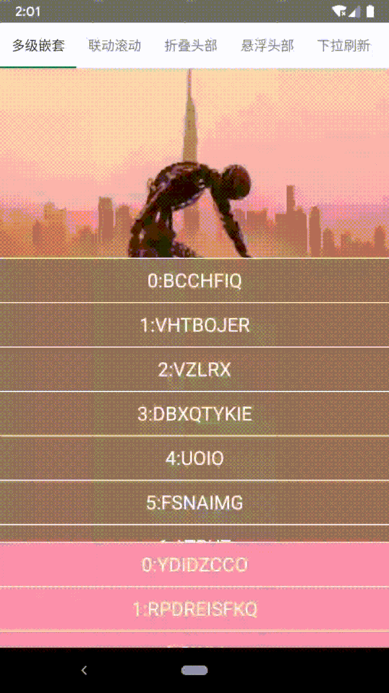
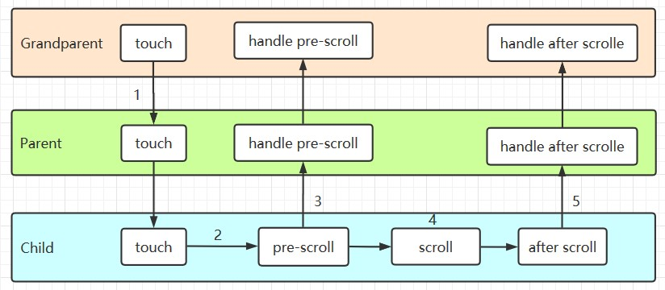
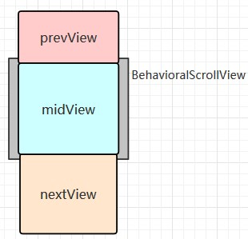
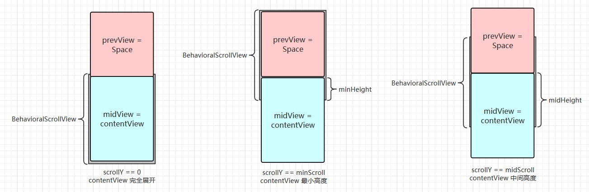
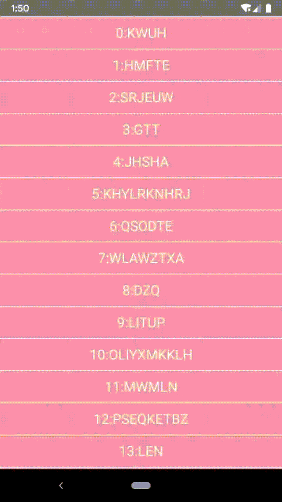
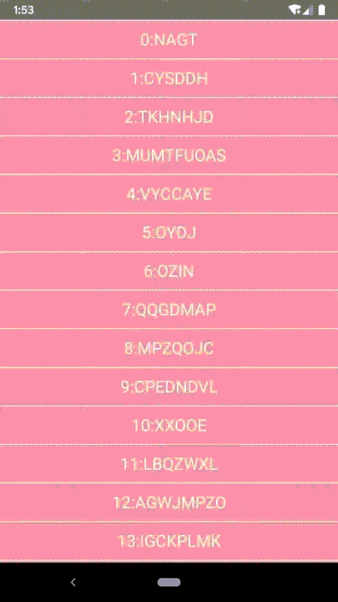

# BehaviorScrollView 帮你解决各种嵌套滚动问题

## 1、简介

之前在仿写豆瓣详情页，以及日常的一些涉及嵌套滚动的需求时，每次都需要新增自定义 View 来实现，而在 touch 事件的拦截和处理，滚动和 fling 的处理上，又有着很大的共性，为了减少之后处理类似需求的重复劳动，也为了更进一步学习 Android 提供的嵌套滚动框架，于是打造了 `BehaviorScrollView` 来解决嵌套滚动的共性问题。  

`BehaviorScrollView` 内部实现了对 touch 事件、嵌套滚动和 fling 的拦截和处理的通用逻辑，实现了 `NestedScrollingParent3` 和 `NestedScrollingChild3` 接口，支持多级嵌套（Demo 中会有一个四层嵌套的示例），支持水平和垂直方向滚动，外部可以通过实现 `NestedScrollBehavior` 接口来支持不同的嵌套滚动需求。  

  

## 2、嵌套滚动处理流程

在讲 `BehaviorScrollView` 和 `NestedScrollBehavior` 怎么使用之前，还是有必要介绍下 Android 是怎么处理嵌套滚动的，这部分的文章就很多了，这里只做简要介绍。  



1. 分发 touch 事件，父一级的 View 尽可能不拦截事件，一直向下分发，直到找到处理事件的 `Child`
2. `Child` 处理 touch 事件，在手指滑动时产生滚动量，开始滚动自身内容
3. `Child` 在处理滚动量之前，要告诉父 View 自己要开始滚动了 `pre-scroll`，并一级一级的向上分发
4. `Child` 此时需要计算下父级 View 还有多少滚动量没有消耗，然后开始滚动自己，并计算自己消耗了多少滚动量
5. `Child` 处理完自己后，将滚动量的消耗情况向父 View 分发 `after-scroll`

我们平时要处理的嵌套滚动问题也是 `Grandparent`、`Parent` 和 `Child` 三种角色中的一个或多个的组合，接下来分别介绍下这三种角色分别要处理那些问题。  

`Grandparent` 只需要处理子 View 的嵌套滚动事件，实现 `NestedScrollingParent` （后缀的 2、3 是为了兼容更多情况进行的扩展）接口，然后根据自身需求在滚动前 `pre-scroll` 或 滚动后 `after-scroll`，执行自己的操作。这种类型的 View 有很多，比如 `NestedScrollView`、`CoordinatorLayout`、`SwipeRefreshLayout` 等，我们平时需要的大多数嵌套滚动需求只需要处理子 View 分发的滚动，也是这种情况。  

`Child` 一般只负责处理 touch 事件，并将产生的滚动量向父 View 分发，实现 `NestedScrollingChild` 接口，在自己处理滚动前分发 `pre-scroll`，自己处理后分发 `after-scroll`。这种 View 都是些能够产生滚动的 View，比如 `RecyclerView`、`NestedScrollView` 等。  

`Parent` 相对比较复杂，即负责接收子 View 的嵌套滚动事件，还需要将其分发给自己的父 View，实现 `NestedScrollingParent` 和 `NestedScrollingChild` 接口（即当儿子有当爹），通常情况下还需要处理 touch 事件和 fling、动画等。常见的有 `NestedScrollView`、`SwipeRefreshLayout` 等，本文介绍的 `BehaviorScrollView` 就属于此类。  

同方向嵌套滚动最核心的问题是 **优先级** 问题，手指滑动时父 View 可以处理，子 View 也可以处理，那到底需要交给谁呢。比如常见的 `SwipeRefreshLayout` 嵌套 `RecyclerView`。在嵌套滚动的流程中，`Parent` 收到 `Child` 的 `pre-scroll` 时，需要决定自己是否要处理，还要决定是先分发给 `Grandparent` 然后自己处理，还是先自己处理，再分发给 `Grandparent`。  

当然，`BehaviorScrollView` 是不会帮你决定这些优先级的，它负责处理优先级之外的滚动量计算和分发，以及通用的 touch 事件、fling 和动画的处理，从而是我们能够更加方便地处理优先级问题。  

## 3、使用和原理

`BehaviorScrollView` 的使用主要是通过 `setupBehavior` 方法设置不同的 `NestedScrollBehavior`，从而实现不同的优先级策略。这里就从 `NestedScrollBehavior` 开始，介绍它在嵌套滚动各个阶段发挥的作用。  

``` java
interface NestedScrollBehavior {
    /**
     * 当前的可滚动方向
     */
    @ViewCompat.ScrollAxis
    val scrollAxis: Int

    val prevView: View?
    val midView: View
    val nextView: View?

    /**
     * 在 layout 之后的回调
     *
     * @param v
     */
    fun afterLayout(v: BehavioralScrollView) {
        // do nothing
    }

    /**
     * 在 [v] dispatchTouchEvent 时是否处理 touch 事件
     *
     * @param v
     * @param e touch 事件
     * @return true -> 处理，会在 dispatchTouchEvent 中直接返回 true，false -> 直接返回 false，null -> 不关心，会执行默认逻辑
     */
    fun handleDispatchTouchEvent(v: BehavioralScrollView, e: MotionEvent): Boolean? = null

    /**
     * 在 [v] onTouchEvent 时是否处理 touch 事件
     *
     * @param v
     * @param e touch 事件
     * @return true -> 处理，会直接返回 true，false -> 不处理，会直接返回 false，null -> 不关心，会执行默认逻辑
     */
    fun handleTouchEvent(v: BehavioralScrollView, e: MotionEvent): Boolean? = null

    /**
     * 在 onNestedPreScroll 时，是否优先自己处理
     *
     * @param v
     * @param scroll 滚动量
     * @param type 滚动类型
     * @return true -> 自己优先，false -> 自己不优先，null -> 不处理 onNestedPreScroll
     */
    fun handleNestedPreScrollFirst(v: BehavioralScrollView, scroll: Int, @ViewCompat.NestedScrollType type: Int): Boolean? = null

    /**
     * 在 onNestedScroll 时，是否优先自己处理
     *
     * @param v
     * @param scroll 滚动量
     * @param type 滚动类型
     * @return true -> 自己优先，false -> 自己不优先，null -> 不处理 onNestedPreScroll
     */
    fun handleNestedScrollFirst(v: BehavioralScrollView, scroll: Int, @ViewCompat.NestedScrollType type: Int): Boolean? = null

    /**
     * 在需要 [v] 自身滚动时，是否需要处理
     *
     * @param v
     * @param scroll 滚动量
     * @param type 滚动类型
     * @return 是否处理自身滚动，true -> 处理，false -> 不处理，null -> 不关心，会执行默认自身滚动
     */
    fun handleScrollSelf(v: BehavioralScrollView, scroll: Int, @ViewCompat.NestedScrollType type: Int): Boolean? = null

}
```

### 3.1 布局

`NestedScrollBehavior` 提供的 `scrollAxis` 决定了 `BehavioralScrollView` 要处理的滚动方向，同时也会决定布局的方向。  

`BehavioralScrollView` 的子 View 是由 `NestedScrollBehavior` 提供的 `prevView`、`midView` 和 `nextView`，会在 `onLayout` 时形成水平或垂直线性布局。具体来说，`BehavioralScrollView` 是继承自 `FrameLayout` 的，在垂直布局的情况下，`midView` 的位置不变，`prevView` 会移动它的上面，`nextView` 移动到其下面，从而使得 `BehavioralScrollView` 有一个可以上下滚动的范围。布局完成后会计算滚动范围，从 `preView.top` 到 `nextView.bottom`，并且回调 `NestedScrollBehavior.afterLayout` 方法。  



``` java
private fun layoutVertical() {
    // midView 位置不变
    val t = midView?.top ?: 0
    val b = midView?.bottom ?: 0
    // prevView 移动到 midView 之上，bottom 和 midView 的 top 对齐
    prevView?.also {
        it.offsetTopAndBottom(t - it.bottom)
        minScroll = it.top
    }
    // nextView 移动到 midView 之下，top 和 midView 的 bottom 对齐
    nextView?.also {
        it.offsetTopAndBottom(b - it.top)
        maxScroll = it.bottom - height
    }
}
```

这里为什么用三个 `View` 而不是两个或着更多呢？一方面在我涉及到的场合下，三个 `View` 足够用了，实在不够还可以嵌套，另一方面，三个 `View` 能够比较方便地控制一些边界条件。比如在垂直滚动情况下，会在 `scrollY == 0` 的边界处做一些判断，调整嵌套滚动的优先级策略，判断 `scrollY` 是大于 0 还是小于 0，从而判断是 `nextView` 滚动出来还是 `prevView` 滚动出来了。如果增加到了四个以上，这种边界的判断就会变得很麻烦。  

### 3.2 Touch 事件处理

首先看下 `dispatchTouchEvent`，会先回调 `NestedScrollBehavior.handleDispatchTouchEvent`，返回非空的值表示 `NestedScrollBehavior` 已经处理了，会直接返回，空的话会在 `ACTION_DOWN` 时复位一些标志位，无特殊处理。  

这里回调给 `NestedScrollBehavior` 是为了可以尽早拿到 touch 事件，这里通常会在 `ACTION_UP` 抬手时做一些动画或复位。  

``` java
override fun dispatchTouchEvent(e: MotionEvent): Boolean {
    // behavior 优先处理，不处理走默认逻辑
    behavior?.handleDispatchTouchEvent(this, e)?.also {
        log("handleDispatchTouchEvent $it")
        return it
    }
    // 在 down 时复位一些标志位，停掉 scroller 的动画
    if (e.action == MotionEvent.ACTION_DOWN) {
        lastScrollDir = 0
        state = NestedScrollState.NONE
        scroller.abortAnimation()
    }
    return super.dispatchTouchEvent(e)
}
```

`onInterceptTouchEvent` 没有回调给 `NestedScrollBehavior`，这里就不贴代码了，主要逻辑是只有手指在滚动方向上发生了滑动，且触点位置没有可以处理嵌套滑动的 `NestedScrollingChild` 才去拦截事件自己处理。  

`onTouchEvent` 也会优先分发给 `NestedScrollBehavior.handleTouchEvent` 处理，默认会 `ACTION_MOVE` 时计算滚动量，并通过 `dispatchScrollInternal`（这个方法后面再讲）进行分发，在 `ACTION_UP` 时进行 fling 的处理。  

``` java
override fun onTouchEvent(e: MotionEvent): Boolean {
    // behavior 优先处理，不处理时自己处理 touch 事件
    behavior?.handleTouchEvent(this, e)?.also {
        return it
    }
    when (e.action) {
        MotionEvent.ACTION_DOWN -> {
            // ...
        }
        MotionEvent.ACTION_MOVE -> {
            // ...
            dispatchScrollInternal(dx, dy, ViewCompat.TYPE_TOUCH)
        }
        MotionEvent.ACTION_UP -> {
            // ...
            if (!dispatchNestedPreFling(vx, vy)) {
                dispatchNestedFling(vx, vy, true)
                fling(vx, vy)
            }
        }
    }
    // ...
}
```

### 3.3 嵌套滚动事件处理

`BehavioralScrollView` 实现的 `NestedScrollingParent3` 和 `NestedScrollingChild3` 的大多数方法都不需要我们做什么特殊处理，用 `NestedScrollingParentHelper` 和 `NestedScrollingChildHelper` 两个帮助类就能解决，可以多参考 `NestedScrollView`。这里主要介绍作为 `Grandparent` 角色的 `onNestedPreScroll` 和 `onNestedScroll` 两个方法，顾名思义，对应上面说的 `pre-scroll` 和 `after-scroll` 两个时机。  

`onNestedPreScroll` 会有两个重载的方法，第二个比第一个多了 `NestedScrollType` 参数用以区分滚动是否是 touch 事件产生的，这里统一回调到 `dispatchNestedPreScrollInternal` 处理。  

代码逻辑比较简单，首先时回调 `NestedScrollBehavior.handleNestedPreScrollFirst` 判断处理的优先级，返回值有三种情况：
1. `null`：表示不处理 `pre-scroll`，这时会直接调用 `dispatchNestedPreScroll` 将滚动量分发给父 View
2. `true`：表示自己优先处理，这时会先调用 `handleScrollSelf`（这个方法后面再讲）自己处理，然后计算未消耗的滚动量，再 `dispatchNestedPreScroll` 分发给父 View
3. `false`：表示父 View 优先处理，这时会先 `dispatchNestedPreScroll` 分发给父 View，然后计算未消耗的滚动量，再 `handleScrollSelf` 自己处理

``` java
/**
 * 分发 pre scroll 的滚动量
 */
private fun dispatchNestedPreScrollInternal(
    dx: Int,
    dy: Int,
    consumed: IntArray,
    type: Int = ViewCompat.TYPE_TOUCH
) {
    when (scrollAxis) {
        ViewCompat.SCROLL_AXIS_HORIZONTAL -> {
            // ...
        }
        ViewCompat.SCROLL_AXIS_VERTICAL ->{
            val handleFirst = behavior?.handleNestedPreScrollFirst(this, dy, type)
            when (handleFirst) {
                true -> {
                    val selfConsumed = handleScrollSelf(dy, type)
                    dispatchNestedPreScroll(dx, dy - selfConsumed, consumed, null, type)
                    consumed[1] += selfConsumed
                }
                false -> {
                    dispatchNestedPreScroll(dx, dy, consumed, null, type)
                    val selfConsumed = handleScrollSelf(dy - consumed[1], type)
                    consumed[1] += selfConsumed
                }
                null -> dispatchNestedPreScroll(dx, dy, consumed, null, type)
            }
        }
        else -> dispatchNestedPreScroll(dx, dy, consumed, null, type)
    }
}
```

`onNestedScroll` 会有三个重载方法，依次增加了 `NestedScrollType` 和父 View 用于记录消耗滚动量的数组 `consumed`，这里会统一回调给 `dispatchNestedScrollInternal` 处理。  

处理逻辑和 `dispatchNestedPreScrollInternal` 类似，先回调 `NestedScrollBehavior.handleNestedScrollFirst` 得到优先级，再进行分发和处理，这里不再赘述。  

``` java
/**
 * 分发 nested scroll 的滚动量
 */
private fun dispatchNestedScrollInternal(
    dxConsumed: Int,
    dyConsumed: Int,
    dxUnconsumed: Int,
    dyUnconsumed: Int,
    type: Int = ViewCompat.TYPE_TOUCH,
    consumed: IntArray = intArrayOf(0, 0)
) {
    when (scrollAxis) {
        ViewCompat.SCROLL_AXIS_HORIZONTAL -> {
            // ...
        }
        ViewCompat.SCROLL_AXIS_VERTICAL -> {
            val handleFirst = behavior?.handleNestedScrollFirst(this, dyUnconsumed, type)
            when (handleFirst) {
                true -> {
                    val selfConsumed = handleScrollSelf(dyUnconsumed, type)
                    dispatchNestedScroll(dxConsumed, dyConsumed + selfConsumed, dxUnconsumed, dyUnconsumed - selfConsumed, null, type, consumed)
                    consumed[1] += selfConsumed
                }
                false -> {
                    dispatchNestedScroll(dxConsumed, dyConsumed, dxUnconsumed, dyUnconsumed, null, type, consumed)
                    val selfConsumed = handleScrollSelf(dyUnconsumed - consumed[1], type)
                    consumed[1] += selfConsumed
                }
                null -> dispatchNestedScroll(dxConsumed, dyConsumed, dxUnconsumed, dyUnconsumed, null, type, consumed)
            }
        }
    }
}
```

`NestedScrollBehavior` 对滚动量分发的优先级控制主要体现在 `handleNestedPreScrollFirst` 和 `handleNestedScrollFirst` 两个方法，通过 `BehavioralScrollView` 当前状态、滚动的距离、滚动类型和不同策略设置不同的优先级，从而满足不同嵌套滚动需求。  

### 3.4 自身滚动的处理

`dispatchScrollInternal` 用来处理自身产生的来自 touch 事件或者 fling 的滚动量，这里其实是处于 `Child` 的角色，所以在自身处理的前后都要分发嵌套滚动事件，这里复用了前面的 `dispatchNestedPreScrollInternal` 和 `dispatchNestedScrollInternal`，在自身滚动时实现精细的优先级控制。  

``` java
/**
 * 分发来自自身 touch 事件或 fling 的滚动量
 * -> dispatchNestedPreScrollInternal
 * -> handleScrollSelf
 * -> dispatchNestedScrollInternal
 */
private fun dispatchScrollInternal(dx: Int, dy: Int, type: Int) {
    val consumed = IntArray(2)
    when (scrollAxis) {
        ViewCompat.SCROLL_AXIS_HORIZONTAL -> {
            // ...
        }
        ViewCompat.SCROLL_AXIS_VERTICAL -> {
            var consumedY = 0
            dispatchNestedPreScrollInternal(dx, dy, consumed, type)
            consumedY += consumed[1]
            consumedY += handleScrollSelf(dy - consumedY, type)
            val consumedX = consumed[0]
            // 复用数组
            consumed[0] = 0
            consumed[1] = 0
            dispatchNestedScrollInternal(consumedX, consumedY, dx - consumedX, dy - consumedY, type, consumed)
        }
    }
}
```

`handleScrollSelf` 是真正到了自身滚动的时刻，会先回调 `NestedScrollBehavior.handleScrollSelf` 判断是否处理该滚动量，同样的有三种返回值：
1. `null` 表示 `NestedScrollBehavior` 不做特殊处理，此时 `BehavioralScrollView` 会根据自身是否可以滚动进行滚动，并返回消耗的滚动量
2. `true` 表示处理，消耗所有的滚动量
3. `false` 表示不处理，不消耗滚动量

`handleScrollSelf` 主要用于在 `BehavioralScrollView` 自身滚动时做特殊处理，比如下拉刷新等不希望 fling 的 `ViewCompat.TYPE_NON_TOUCH` 类型滚动造成自身的位移，有些弹性滚动的场合希望自身的滚动带有阻尼效果等都可以在这里处理。  

``` java
/**
 * 处理自身滚动
 */
private fun handleScrollSelf(scroll: Int, @ViewCompat.NestedScrollType type: Int): Int {
    // behavior 优先决定是否滚动自身
    val handle = behavior?.handleScrollSelf(this, scroll, type)
    val consumed = when(handle) {
        true -> scroll
        false -> 0
        else -> if (canScrollSelf(scroll)) {
            scrollBy(scroll, scroll)
            scroll
        } else {
            0
        }
    }
    return consumed
}
```

自身的滚动最终是通过 `scrollBy` 实现的，通过 `getScrollByX/getScrollByY` 实现了边界控制。同时 `scrollX/scrollY` 在 0 处做了特殊处理，如 `scrollY > 0` 时，滚动范围是 从 0 到 `maxScroll`，这和「3.1 布局」中说的边界处的特殊处理有关，需要在 `scrollY` 小于 0、等于 0 或大于 0 时使用不用的优先级策略。  

``` java
override fun scrollBy(x: Int, y: Int) {
    val xx = getScrollByX(x)
    val yy = getScrollByY(y)
    super.scrollBy(xx, yy)
}

/**
 * 根据方向计算 y 轴的真正滚动量
 */
private fun getScrollByY(dy: Int): Int {
    val newY = scrollY + dy
    return when {
        scrollAxis != ViewCompat.SCROLL_AXIS_VERTICAL -> scrollY
        scrollY > 0 -> newY.constrains(0, maxScroll)
        scrollY < 0 -> newY.constrains(minScroll, 0)
        else -> newY.constrains(minScroll, maxScroll)
    } - scrollY
}
```

### 3.5 fling 和动画

fling 和动画都是通过 `Scroller` 处理的，fling 需要 `VelocityTracker` 帮助类在 touch 事件中记录手指移动速度。  

这里需要介绍 `BehavioralScrollView` 保存当前状态的一个属性 `NestedScrollState`，方便嵌套滚动事件的优先级判断。    

``` java
/**
 * 用于描述 [BehavioralScrollView] 正处于的嵌套滚动状态，和滚动类型 [ViewCompat.NestedScrollType] 共同描述滚动量
 */
@IntDef(NestedScrollState.NONE, NestedScrollState.DRAGGING, NestedScrollState.ANIMATION, NestedScrollState.FLING)
@Retention(AnnotationRetention.SOURCE)
annotation class NestedScrollState {
    companion object {
        /**
         * 无状态
         */
        const val NONE = 0
        /**
         * 正在拖拽
         */
        const val DRAGGING = 1
        /**
         * 正在动画，动画产生的滚动不会被分发
         */
        const val ANIMATION = 2
        /**
         * 正在 fling
         */
        const val FLING = 3
    }
}
```

fling 和动画最终都会回调到 `computeScroll` 中处理，不同的是动画产生的滚动不需要进行分发（因为动画不是 touch 事件产生的，而是外部明确调用的），而 fling 的需要 `dispatchScrollInternal` 进行分发。  

``` java
override fun computeScroll() {
    when {
        scroller.computeScrollOffset() -> {
            val dx = (scroller.currX - lastX).toInt()
            val dy = (scroller.currY - lastY).toInt()
            lastX = scroller.currX.toFloat()
            lastY = scroller.currY.toFloat()
            // 不分发来自动画的滚动
            if (state == NestedScrollState.ANIMATION) {
                scrollBy(dx, dy)
            } else {
                dispatchScrollInternal(dx, dy, ViewCompat.TYPE_NON_TOUCH)
            }
            invalidate()
        }
        // ...
    }
}
```

## 4、示例

`BehavioralScrollView` 已经处理了共性的东西，个性化的部分是 `NestedScrollBehavior` 实现的，因此这里的示例可能不具备通用性。当有特殊需要是，可以很方便地自定义 `NestedScrollBehavior` 实现，这也正是 `BehavioralScrollView` 希望达到的效果。  

这里以底部浮层 `BottomSheetBehavior` 为例大致介绍下 `NestedScrollBehavior` 的使用。   

  

构造 `BottomSheetBehavior` 需要知道内容视图 `contentView` 以及浮层弹出的范围和初始位置。  

``` java
class BottomSheetBehavior(
    /**
     * 浮层的内容视图
     */
    contentView: View,
    /**
     * 初始位置，最低高度 [POSITION_MIN]、中间高度 [POSITION_MID] 或最大高度 [POSITION_MAX]
     */
    private val initPosition: Int,
    /**
     * 内容视图的最低显示高度
     */
    private val minHeight: Int,
    /**
     * 内容视图中间停留的显示高度，默认等于最低高度
     */
    private val midHeight: Int = minHeight
)
```

由于滚动范围是由 `prevView`、`midView` 和 `nextView` 确定的，顶部的空白区域需要设置 `prevView` 进行占位，通过 `topMargin` 控制其高度，从而控制滚动的范围，`midView` 设置为 `contentView`，这里不需要 `nextView` 设为 `null`。

``` java
/**
 * 用于控制滚动范围
 */
override val prevView: View? = Space(contentView.context).also {
    val lp = LayoutParams(LayoutParams.MATCH_PARENT, LayoutParams.MATCH_PARENT)
    lp.topMargin = minHeight
    it.layoutParams = lp
}

override val midView: View = contentView
override val nextView: View? = null
```

在 `afterLayout` 时计算中间高度时 `scrollY` 的值，并在第一次 layout 后直接滚动指定的初始位置。  

``` java
    override fun afterLayout(v: BehavioralScrollView) {
        // 计算中间高度时的 scrollY
        midScroll = v.minScroll + midHeight - minHeight
        // 第一次 layout 滚动到初始位置
        if (firstLayout) {
            firstLayout = false
            v.scrollTo(
                v.scrollX,
                when (initPosition) {
                    POSITION_MIN -> v.minScroll
                    POSITION_MAX -> v.maxScroll
                    else -> midScroll
                }
            )
        }
    }
```

简单画了下布局的示意图  



在 `handleDispatchTouchEvent` 的 up 或 cancel 时，需要根据当前滚动位置和上次滚动的方向，决定动画的目标位置。  

``` java
override fun handleDispatchTouchEvent(
    v: BehavioralScrollView,
    e: MotionEvent
): Boolean? {
    if ((e.action == MotionEvent.ACTION_CANCEL || e.action == MotionEvent.ACTION_UP)
        && v.scrollY != 0) {
        // 在 up 或 cancel 时，根据当前滚动位置和上次滚动的方向，决定动画的目标位置
        v.smoothScrollTo(
            if (v.scrollY > midScroll) {
                if (v.lastScrollDir > 0) { v.maxScroll } else { midScroll }
            } else {
                if (v.lastScrollDir > 0) { midScroll } else { v.minScroll }
            }
        )
        return true
    }
    return super.handleDispatchTouchEvent(v, e)
}
```

`handleTouchEvent` 需要在 down 在 `prevView` 时不进行处理，因为它只是个占位的，这样不会影响下层视图对事件的处理。  

``` java
override fun handleTouchEvent(v: BehavioralScrollView, e: MotionEvent): Boolean? {
    // down 事件触点在 prevView 上时不做处理
    return if (e.action == MotionEvent.ACTION_DOWN && prevView?.isUnder(e.rawX, e.rawY) == true) {
        false
    } else {
        null
    }
}
```

嵌套滚动的优先级处理比较简单，`handleNestedPreScrollFirst` 只在 `contentView` 没有完全展开，即 `v.scrollY != 0` 时处理，而 `handleNestedScrollFirst` 总是优先处理。  

``` java
override fun handleNestedPreScrollFirst(
    v: BehavioralScrollView,
    scroll: Int,
    @ViewCompat.NestedScrollType type: Int
): Boolean? {
    // 只要 contentView 没有完全展开，就在子 View 滚动前处理
    return if (v.scrollY != 0) { true } else { null }
}

override fun handleNestedScrollFirst(
    v: BehavioralScrollView,
    scroll: Int,
    type: Int
): Boolean? {
    return true
}
```

自身的滚动只处理 touch 类型的，其他的过滤掉。  

``` java
override fun handleScrollSelf(
    v: BehavioralScrollView,
    scroll: Int,
    @ViewCompat.NestedScrollType type: Int
): Boolean? {
    // 只允许 touch 类型用于自身的滚动
    return if (type == ViewCompat.TYPE_NON_TOUCH) { true } else { null }
}
```

Demo 中还有其他各种类型的 `NestedScrollBehavior`，如实现顶部 `TabLayout` 悬浮效果的 `FloatingHeaderBehavior`，兼容嵌套的下拉刷新 `SwipeRefreshBehavior` 等。这里简单说明下为什么 `SwipeRefreshLayout` 已经实现了 `NestedScrollingParent` 和 `NestedScrollingChild`，却无法适用于嵌套滚动呢？  

`NestedScrollingChild.dispatchNestedScroll` 缺少 `NestedScrollingChild3.dispatchNestedScroll` 中的 `consumed` 参数，所以在向父 View 分发时，无法得知父 View 消耗了多少滚动量，嵌套使用就会存在问题，来看下 `SwipeRefreshLayout.onNestedScroll` 方法。  

``` java
public void onNestedScroll(final View target, final int dxConsumed, final int dyConsumed, final int dxUnconsumed, final int dyUnconsumed) {
    // Dispatch up to the nested parent first
    dispatchNestedScroll(dxConsumed, dyConsumed, dxUnconsumed, dyUnconsumed, mParentOffsetInWindow);
    // ...
    final int dy = dyUnconsumed + mParentOffsetInWindow[1];
    if (dy < 0 && !canChildScrollUp()) {
        mTotalUnconsumed += Math.abs(dy);
        moveSpinner(mTotalUnconsumed);
    }
}
```

它在 `dispatchNestedScroll` 之后是不知道父 View 有没有消耗滚动量的，而函数中的 `mParentOffsetInWindow` 得到的是 `SwipeRefreshLayout` 在屏幕上的位移，`SwipeRefreshLayout` 认为的父 View 没有消耗的滚动量等于 `dyUnconsumed + mParentOffsetInWindow[1]`。  

这样看起来没啥问题，但当父 View 消耗的滚动量不等于其子 View 在屏幕上的位移时（比如增加了阻尼效果，消耗了 n 的滚动量，却只移动了 n/2）就会出问题，即使滚动量已经全部被外部消耗了，`SwipeRefreshLayout` 还是有下拉效果：  

  

所以为了解决这种问题，就需要实现了 `NestedScrollingChild3` 的接口，下面是 `BehavioralScrollView` + `SwipeRefreshBehavior` 的效果：  

  

## 5、结束

嵌套滚动的核心问题是优先级问题，我们应该专注于优先级的策略而不是各种事件的处理和分发问题，这也真是 `BehavioralScrollView` 在尝试做到的，希望这篇文章能够对你有所帮助，有不同思路的也欢迎相互探讨。  

[https://github.com/funnywolfdadada/HollowKit](https://github.com/funnywolfdadada/HollowKit)
