# [译] App 的未来：使用 Kotlin MultiPlatform 的声明式 UI（D-KMP）

这里由三篇文章介绍基于声明式 UI、Kotlin MultiPlatform 和 MVI 模式（起始翻译成架构也行）的新 D-KMP（Declarative UIs with Kotlin MultiPlatform）架构。  

译者注：这里将三篇翻译后地文章放在了一起，原文链接如下：

1. [D-KMP 架构和声明式 UI](https://danielebaroncelli.medium.com/the-future-of-apps-declarative-uis-with-kotlin-multiplatform-d-kmp-part-1-3-c0e1530a5343)
2. [Kotlin MultiPlatform 和 MVI 模式](https://danielebaroncelli.medium.com/the-future-of-apps-declarative-uis-with-kotlin-multiplatform-d-kmp-part-2-3-1bbadaf19aef)
3. [D-KMP 分层和团队组织](https://danielebaroncelli.medium.com/the-future-of-apps-declarative-uis-with-kotlin-multiplatform-d-kmp-part-3-3-959a2628526d)  

# D-KMP 架构和声明式 UI

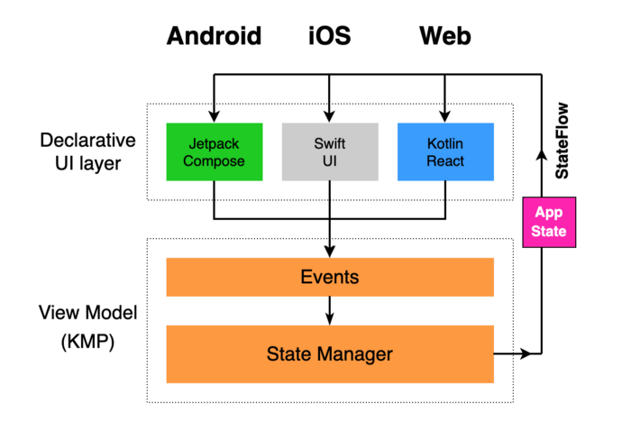  

2020 年不仅是新冠肆虐的一年，也是在应用程序开发中 **过去** 与 **未来** 的分界点。  

2021 年是未来的开始，**声明式 UI（DeclarativeUIs）** 和 **跨平台（MultiPlatform）** 将永远改变应用程序架构和实现方式。为所有平台构建应用程序，各平台共享 85% 的代码并具有最新的原生 UI/UX，将成为常态，并大大提高应用程序的开发效率和质量！  

在本文中，我们将介绍 D-KMP 的主要概念，以及如何将这些东西完美地融合在一起。  

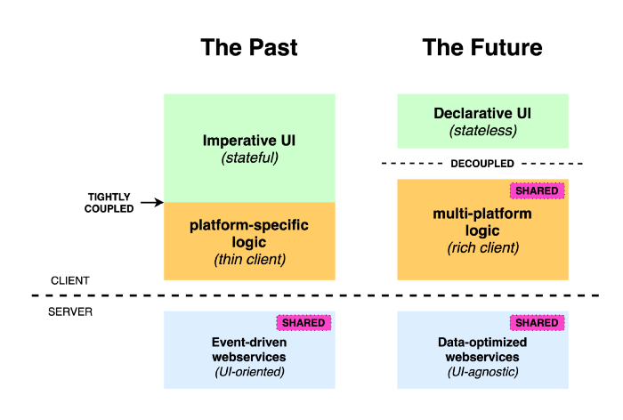  

## 过去

「过去」是迄今为止的应用程序开发方式，大多数公司为每个平台（Android、iOS 和 Web）构建了单独的应用程序，客户端 **没有共享代码**。  

为了减少各平台重复的代码量，大多数应用程序 **倾向于[「瘦客户端」](https://zh.wikipedia.org/wiki/%E7%98%A6%E5%AE%A2%E6%88%B7%E7%AB%AF)**，将大多数业务逻辑和数据处理委派给真正共享的唯一部分：服务端（the webservices）。  

这样，服务端往往是 **「面向 UI（UI-oriented）」** 的。架构设计多数是，点击触发接口调用，然后提供下一个视图显示所需的信息，客户端的逻辑非常有限。  

任何额外的客户端逻辑都需要在 **每个平台上复制相同的代码**，除非它能提升用户体验，否则要避免这种操作。  

在客户端共享代码方面，这些年已经有多家公司进行了尝试，但是在大多数都以失败告终，恢复了纯原生/特定于平台的开发。典型的例子，如 DropBox（[弃用共享 C++ 代码](https://dropbox.tech/mobile/the-not-so-hidden-cost-of-sharing-code-between-ios-and-android)）和 AirBnB（[弃用 ReactNative](Sunsetting )）。换句话说，没有可以使公司对共享代码进行长期投资的合适技术。  

## 未来

2020 年，我们正在经历两个同时发生的重要范例：**声明式 UI** 和 **Kotlin MultiPlatform**，这将带来前所未有的机遇，并将使「*Multi-Platform*」和 *客户端共享代码* 成为应用程序开发的首选。  

声明式 UI 非常适合跨平台架构，因为它们是 **无状态的** ，并且可以与业务逻辑 **完全分离**。通过将声明式 UI 与 Kotlin MultiPlatform 结合使用，我们可以安全地构建具有大量客户端共享代码（最多 85%）的应用程序，并且在每个平台上的性能都达到完美。同时，我们可以在每个平台上获得最新的原生 UI/UX。  

现在，由于无需再为每个平台重复客户端逻辑，**客户端逻辑的成本很低**，应用程序可以是[「富客户端」](https://en.wikipedia.org/wiki/Rich_client)。应用程序可以变得相当智能，并为用户体验方面带来最先进的优化，从而减少了用户单击后需要等待的情况。  

服务端现在可以完全 **「UI 无关的（UI-agnostic）」**，并专注于以最标准化的方式提供数据，消除任何冗余，因为所有数据处理和格式化都可以在客户端进行，这也可以大大 **改善流量消耗（data consumption）**。  

但是，让我们按着顺序，首先定义一下即将到来的应用程序开发时代的支柱。  

## 应用程序未来的三大支柱

- **声明式 UI**（JetpackCompose on Android, SwiftUI on iOS）
- **KMP**（Kotlin MultiPlatform）
- **MVI 模式**（Model-View-Intent）

我们称这种架构为 **D-KMP**，代表 Kotlin MultiPlatform 的声明式 UI，MVI 模式是使两者最佳配合的原因。  

## The D-KMP 架构

  

请务必弄清楚我们介绍的D-KMP架构是针对 **新项目** 的，而不是在谈论如何逐步将声明性 UI 和 Kotlin MultiPlatform 引入现有项目。  

我们的目标是建立一个干净、牢固、面向未来的架构，该架构不会与过去妥协，而是以最具创新性的技术和范例为基础。  

现在，从声明式 UI 开始，详细介绍该体系结构的三个支柱。  

## 声明式用户界面已登陆Android和iOS！

十多年来，我们正在经历移动框架最重要的革命。Android 和 iOS 都已开始发布其新的具声明式的 UI 工具包，它们都从 React 和 Flutter 的范例中汲取了灵感，将完全取代当前在两个操作系统中定义视图的方式。  

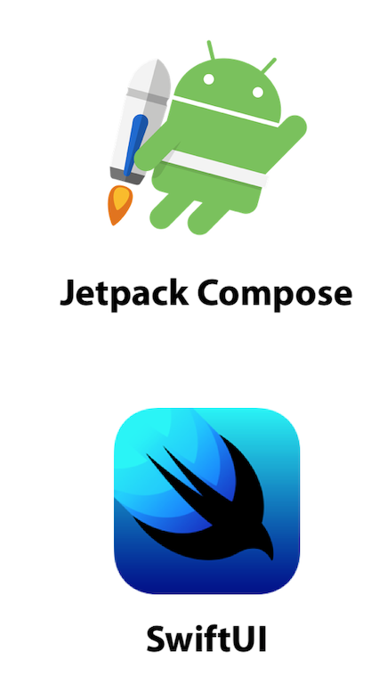  

谷歌在 [Google I/O 2019](https://www.youtube.com/watch?v=VsStyq4Lzxo) 上宣布了 **JetpackCompose**，它于 2020 年 8 月进入 Alpha 阶段，将在 2021 年春季发布 Beta 版本，并在 2021 年底发布 1.0 版本。**JetpackCompose 支持 Android 5 及更高版本（目标API 21）的任何设备**，这意味着所有新的 JetpackCompose API 将向后兼容，并且不需要新的Android版本。 这是因为 JetpackCompose 通过在 Android 视图画布上绘制的底层方式实现。  

苹果在 [WWDC 2019](https://developer.apple.com/videos/play/wwdc2019/204) 上发布了 **SwiftUI**，随 iOS13 一起发布，并在今年的 iOS14 上有了进一步的改进。与 JetpackCompose 不同，**SwiftUI绑定到iOS框架进行更新**，新的 SwiftUI API 将不会向后兼容。但是，考虑到所有支持 iOS13 的设备也都支持 iOS14（通常，苹果今年不弃用任何设备），因此我们可以安全地将 iOS14 定位为使用 SwiftUI 的应用。

## 为什么要使用声明式 UI？

JetpackCompose 和 SwiftUI 都是声明式 UI 框架，这意味着它们仅 **描述 UI 在不同状态下的外观**，而 **无需直接管理状态**。React.js 和 Flutter 之类的框架，使得声明式 UI 范式变得流行起来，展现了与无状态组件进行交互的易用性，他们的成功最终促使 Android 和 iOS 都加入了声明式 UI 世界！  

使用 *JetpackCompose*，你可以忘却繁琐的 Android 视图系统及其可怕的 *Fragment* 和 *Activity* 生命周期，借助 SwiftUI，你可以忘记僵硬的 iOS *Storyboard* 和 *Interface Builders*。**这是一个简洁的开始（clean start），这是未来！**  

声明式 UI 具有很大的优势，因为 UI 层可以很轻，仅关注于如何显示信息（应用程序状态），而不是如何管理信息。**现在可以将状态管理完全委派给应用程序的与平台无关的层**，这是我们 D-KMP 架构的关键概念，我们将在后面进一步详细讨论。  

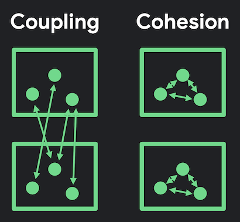  

声明式 UI 的性质允许应用程序的视图和业务逻辑分离得十分整洁，而传统的 Android 和 iOS 视图无法做到这一点，因为每个 UI 组件都与业务逻辑紧密耦合。关于这个主题，Google 的 Leland Richardson 撰写了一篇[有趣的文章](https://medium.com/androiddevelopers/understanding-jetpack-compose-part-1-of-2-ca316fe39050)，解释了 **最大内聚** 和 **最小耦合** 的重要性。  

**JetpackCompose 和 SwiftUI 非常相似**，除了语法（JetpackCompose 使用 Kotlin，SwiftUI 使用 Swift）和导航模式存在微不足道的区别，其背后的概念是完全相同的。最重要的是，要提供给（fed into）这两个无状态 UI 框架的数据完全相同，因此*ViewModel* 和 *DataLayer* 都可以与 *平台无关*！  

## Web 的声明式 UI

Web 上最著名的声明式 UI 是 **React.js**（由Facebook创建），它是带领声明式 UI 范式走向成功，并且 **改变行业** 的框架。没有 React.js 的成功，我们可能现在也无法在 Android 和 iOS 上用得上声明式 UI。  

Kotlin 方便地为 React.js 提供了封装，这使我们能够将 **Kotlin/React** 用作 Web 上的声明式 UI 层。可以像 Android 上的 *JetpackCompose* 和 iOS 上的 *SwiftUI* 一样，将其插入到我们的 D-KMP 体系结构中。  

在 Kotlin/React 中，你可以使用 Kotlin 而非 Javascript 来访问任何现有的 React.js 组件，还可以仅用 Kotlin 创建自己的自定义组件。更多信息可以参考 [Kotlin/React文档](https://kotlinlang.org/docs/tutorials/javascript/setting-up.html)。  

除了 Kotlin/React 之外，更有趣的是 **Compose for Web**，它是 JetpackCompose 的 Web 版本，目前由 [JetBrains](https://twitter.com/bashorov/status/1324329633458913280)（Kotlin 的缔造者）开发。如果 *Kotlin/React* UI 实现需要 15% 的额外工作（另外 85% 是共享的 KMP（Kotlin MultiPlatform）代码），那么 *Compose for Web* 的需求可能要少得多，因为它与 *JetpackCompose for Android* 几乎一样，我们相当期待。  

## 桌面应用的声明式 UI

在我们等待 Web 版本期间，JetBrains在本月（2020 年 11 月）宣布了 **[Compose for Desktop](https://blog.jetbrains.com/cross-post/jetpack-compose-for-desktop-milestone-1-released/)** 的预览版，该版本允许在 *Windows*、*macOS* 和 *Linux* 上开发桌面应用程序。  

在桌面应用需要注意的是，**SwiftUI 已开箱即用地支持 macOS**，你用 SwiftUI 编写的任何 UI 都可以无缝地适应 iOS、macOS、tvOS 和 watchOS。我们可以期望所有平台（Android、桌面和 Web）上的 JetpackCompose 都能进行同样的无缝调整。  

## 为什么不只为所有平台提供一个UI框架？

你可能想知道我们是否可以期望一个适用于所有平台地声明式 UI 框架。换句话说，*JetpackCompose* 最终会支持所有 Apple 操作系统（*iOS*、*macO*、*tvOS* 和 *watchOS*），而 *SwiftUI* 最终会支持非 Apple 设备吗？  

就目前来看，这可能会由第三方或社区完成，而不是 *Google* 或 *Apple*。我们已经可以看到 *JetpackCompose* 是由 *JetBrains* 不是由 *Google* 移植到桌面和 Web 的。而 Google 和 Apple 将继续专注于自己的操作系统，这对于 UI/UX 的未来非常有利，意味着我们将继续拥有两个强大且独立的工具包，以竞争创新。  

*接下来让我们专注于 Kotlin MultiPlatform：*  

# Kotlin MultiPlatform 和 MVI 模式

## Kotlin 1.4 使跨平台成为现实！

随着 Kotlin 1.4 版（2020 年 8 月）的发布，*Kotlin MultiPlatform* 退出了 *实验*，并进入了 *Alpha 阶段*。由于技术的 *稳定性* 已经 *非常出色*，我们现在可以在生产项目中使用了，任何更改或改进都将在背后进行。  

目前为止，实施 D-KMP 的任何阻力，全都来自 UI 而不是 KMP 部分（*JetpackCompose* 仍在积极开发中，在本月发布的 Navigation 后将会更好）。  

Kotlin 最初是一种仅针对 JVM 的语言，由 JetBrains 于 2011 年发布，它的目的是通过避免冗余代码让 JVM 开发更加有趣，从而成为 Java 更好的替代品。由于其在 JVM 社区中的成功，Google 在 2017 年宣布了对 Android 上 Kotlin 的 **优先支持**，两年后提名 Kotlin 为 Android 开发的 **首选语言**（有效替代Java）。  

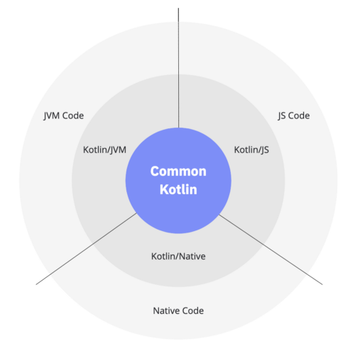  

现在 Kotlin 正在发展成为一种「跨平台」语言，它能够将代码编译到三个不同的目标平台：

- **JVM**（Android 和后端）
- **Javascript**（前端，并提供了 React 的封装）
- **Native**（iOS/macOS、Windows 和 Linux）

因此，我们现在可以用 Kotlin 在不同平台上开发原生运行的共享代码。  

当前有两个用于多平台的首字母缩写词：  

- **KMM** = Kotlin Multiplatform Mobile (just Android and iOS)
- **KMP** = Kotlin MultiPlatform (also includes Desktop and Web)

从 Kotlin 1.4 开始，一个解释如何开始进行多平台移动开发的 [KMM 专用门户](https://kotlinlang.org/lp/mobile/)已经可用，这对于 Kotlin MultiPlatform 的新手来说是非常有用的材料。  

JetBrains（除了 Kotlin，也是 Android Studio 的创建者）发布了适用于 Android Studio 的 [KMM 插件](https://plugins.jetbrains.com/plugin/14936-kotlin-multiplatform-mobile)，允许开发人员直接从 Android Studio 运行 iOS 应用，非常有用。  

Kotlin 不仅仅是使多平台成为可能的编程语言，开发起来也很有趣，避免了很多样板代码。它具有你梦寐以求的最高级功能：*协程、计算属性、委托属性、扩展函数、高阶函数、lambda* 等。  
Kotlin 迅速成为顶级主流编程语言之一，你在 Kotlin 中编写的代码将持续数十年。对于长期项目，这是一个非常安全的选择。   

## 为什么 Kotlin MultiPlatform 是未来？

在谈论跨平台时，最常听到的两个框架是 *Flutter* 和 *React Native*，它们都允许拥有共享的代码库。同时，你也会听到很多人不喜欢这些框架，因为它们没有给你自由在每个平台上原生定制 UI 的自由。  

Kotlin MultiPlatform 可以为您提供以下两项好处：

- **在所有平台之间共享代码**
- **可以自由定制各平台上的原生 UI**

## KMP vs Flutter vs ReactNative

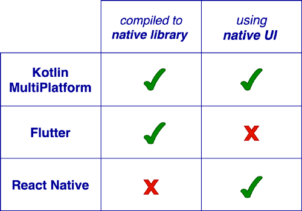  

在 **KMP** 中，共享代码是用 Kotlin 编写的，被编译为本地库：
Android 的 Jar 文件，iOS 的 ObjectiveC 框架，Web 的 JS 库，因此，原生 UI 层可以在每个平台上以最自然的方式与共享代码交互。  

在 **Flutter** 中，代码是用 Dart 编写的，并通过 Android 上的 NDK，iOS 上的 LLVM，Web 上的 JS 编译为本地库。但是与 KMP 不同，Flutter 需要交付自己的引擎，这大大增加了应用程序的包体积。  

Flutter 不使用原生 UI，而是自己拥有一套通过 Skia 图形引擎绘制的 **声明式 UI 控件**。Flutter 在过去的两年中开始被采用，证明了使用声明式 UI（而不是传统的 Android 和 iOS 视图系统）可以大大简化移动开发。但是，现在在 Android 和 iOS 上都可以使用声明式 UI 工具包，使用 Flutter 失去了其可以加快开发速度的主要优点。而 JetpackCompose 和 SwiftUI 将继续存在，以帮助快速构建高质量的应用程序。  

在 **React Native** 中，代码是用 Javascript 编写的，并且只能通过运行 JS 代码的 [C/C++ 桥](https://hackernoon.com/understanding-react-native-bridge-concept-e9526066ddb8)与原生框架进行通信。React Native 中的 UI 组件包装了原生的Android 和 iOS 视图，但是开发人员对它们的控制非常有限。而事实证明，React Native 的整体体系结构并不是特别出色，甚至[其创建者 Facebook 也正在远离 React Native](https://www.infoq.com/news/2020/03/facebook-messenger-rewrite/)，[AirBnB 也在 2018 年宣布将淘汰 React Native](https://medium.com/airbnb-engineering/sunsetting-react-native-1868ba28e30a)。  

### 语言问题：Kotlin，Dart和Javascript

与 Flutter 和 React Native 相比，KMP 的另一个明显优势是编程语言。与 Dart 和 Javascript 相比，Kotlin 是下一代一流的语言，非常注重 **可读性** 和 **简洁性**，由于协程、计算属性、高阶函数等智能功能，使用Kotlin编写高质量的代码非常容易。  

## D-KMP 中特定于平台的代码仅为 15%

此时，有些人可能会认为：“好吧。KMP 很棒，我明白了。Android 和 iOS 有了声明式 UI，我明白了。但是以这种方式，我仍然需要为每个平台编写一个单独的 UI，有很多重复！”  

答案是：“不！:-) 根本没有那么读多重复！”  

在原生声明式 UI 的新世界中，UI 层非常轻。到目前为止，在我们使用 D-KMP 架构构建的应用程序中，**UI 层约占整个应用程序代码的 15%**。这是唯一针对平台的代码，其余所有都是 KMP 共享代码。  

这额外的 15% 完全是值得的，因为它使我们能够像 Flutter 和 React Native 一样不受限制地在各个平台上定制 UI。Android 和 iOS 是两个具有有意义差异的不同框架。一流的应用程序需要在每个平台上保持 UI/UX 模式。  

根据我们的经验，一旦我们为 Android 编写了 JetpackCompose UI层，就可以直接为 iOS 创建等效的 SwiftUI，代码结构基本相同。对于一个简单的应用程序，它只需不到一天的时间。  

这两个框架中有 **相同的控件**，只是名称不同。例如，如果要水平组织一组文本，则将它们包含在 JetpackCompose 中名为 `Row` 的控件和 SwiftUI 中 `HStack` 的控件中，而两个框架中的文本控件均为 `Text`，只是语法不同。熟悉了细微的差异之后，你可以快速从另一个创建一个声明式 UI。  

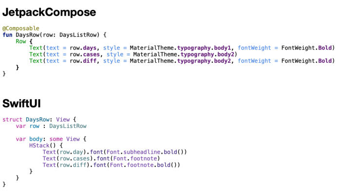

所有数据均来自 **应用状态**，这些状态由通过 StateFlow 传递的 KMP 共享代码完全管理（我们将在后面详细讨论）。在每个平台的声明式 UI 上，只是组织视图这一项轻松的任务。  

重要的是，**声明式 UI 不需要处理任何数据**，它只需要显示，这也大大减少了平台特定的 bug！  

拥有没有 bug 的共享代码后，一切都可以非常顺利地应用于每个平台，这就是为什么每个平台都具有特定的 UI 十分容易！  

## MVI 模式：D-KMP 的第三大支柱

正如我们在一开始所提到的，**MVI（Model-View-Intent）模式** 是我们体系结构的第三大支柱，它背后的主要概念是 **单向数据流**，这使其与 *MVC、MVP、MVVM* 等较旧的模式区分开来。MVI 是一种响应式模式，可以看作是 MVVM 的演进，具有更可靠和可预测的应用程序行为。  

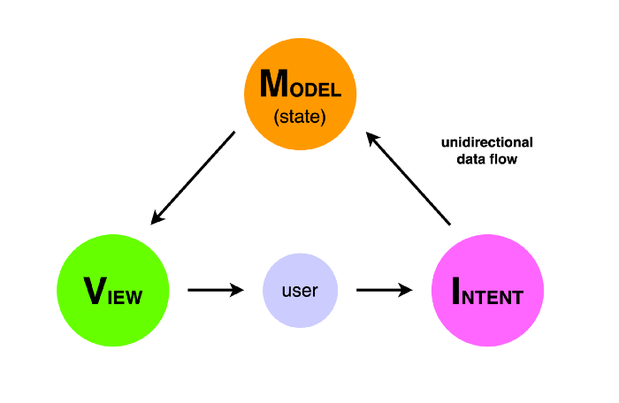  

在 MVI 中，我们只有 **一个事实来源**，即 **应用程序状态（app state，后面简称为 State）**。在任何时候，State 都包含 **不可变的数据**，并且只能由 *Model 层* 进行修改。一切都在一个方向上起作用，用户触发事件/意图，Model 层通过执行相关操作并更改 State 来对此做出响应，而新的 State 将直接反映在视图上。  

在我们的 D-KMP 架构中，**将 MVI 模型实现为 KMP 共享代码**（如下图所示），这使我们能够在共享代码中保留状态管理！这很关键！因此，我们平台特定代码只是声明式 UI 层，它非常轻且无状态，因为它将状态管理完全委派给 KMP ViewModel。  

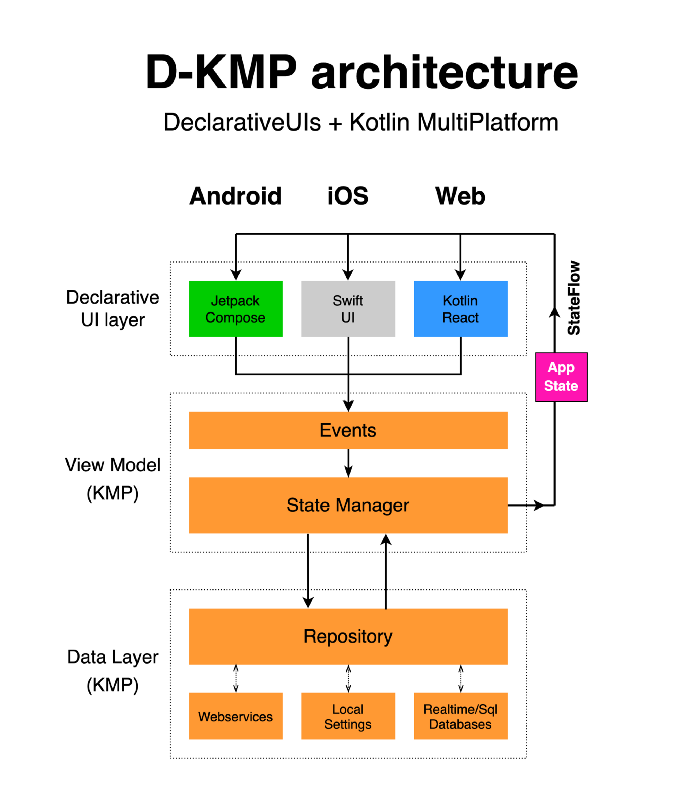  

## StateFlow：KMP 上的 MVI 模式驱动器

如果搜索有关「MVI模式」的文章，你会发现大多数人将 RxJava 视为实现 MVI 模式的最佳（甚至唯一）方法。幸运的是，再也不会这样了！  

2020 年 5 月，作为 [Kotlin Coroutines 1.3.6](https://github.com/Kotlin/kotlinx.coroutines/releases/tag/1.3.6) 版本的一部分，JetBrains 发布了 **StateFlow**，用于管理和表示应用程序中状态的 Kotlin Flow 实现。有关更详细的说明，您可以阅读 JetBrains Roman Elizarov 发布的 [GitHub 问题](https://github.com/Kotlin/kotlinx.coroutines/issues/1973)。  

简而言之，StateFlow 是使我们的 D-KMP 架构能够依靠 Kotlin 语言而不是外部库来 **优雅地实现 MVI 模式** 的原因。最重要的是，它采用了跨平台方式！因为 **StateFlow 可以在 Kotlin 支持的任何平台上使用**！  

从上图可以看到，StateFlow 允许数据以 **单向流** 的形式循环。UI 层在 ViewModel 上发出事件，该事件对应用程序状态进行修改，并通过 StateFlow 将状态传回 UI 层。  

*现在让我们看一些代码：*  

# D-KMP 分层和团队组织

## D-KMP ViewModel

现在，让我们看看 *D-KMP ViewModel* 长什么样。它有一个 **StateFlow** 类型的属性，因为 MVI 模式要求传递不可变的数据，所以是只读的。这个 StateFlow 的值为 `AppState` 类型，包含着我们需要提供给 UI 层的所有数据。  

``` kotlin
class CoreViewModel() {
    val stateFlow: StateFlow<AppState>
        get() = stateManager.mutableStateFlow    
    
    internal val stateManager by lazy { StateManager() }
}
```

从上面的类定义中所看到的，我们的 StateFlow 实际上是一个计算属性，getter 返回 `StateFlow` 的读/写版本 `MutableStateFlow`，该状态由一个叫 `StateManager` 的自定义组件管理，如下图的 *D-KMP 完整架构图* 所示。  

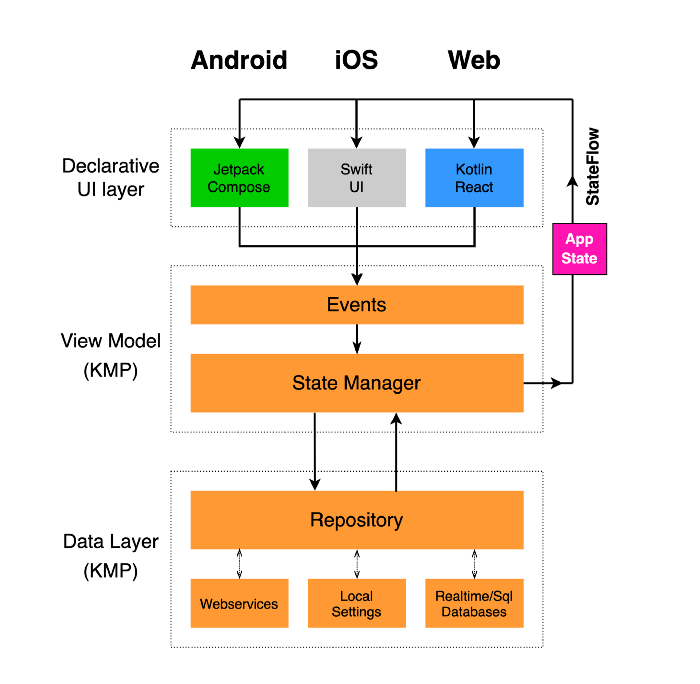

## StateManager

`StateManager` 是 UI 层调用的 ViewModel **事件** 与来 Repository 层 **数据** 之间的「桥梁」。  

``` kotlin
class StateManager() {    
    internal val mutableStateFlow : MutableStateFlow<AppState> = MutableStateFlow(AppState())    

    internal val dataRepository by lazy { Repository() }
}
```

StateManager 的功能是：
1. 从 Repository 层中 **获取未格式化的数据**
2. 根据应如何显示 **格式化数据**
3. 使用新数据 **修改应用状态**，再由 UI 层通过 *StateFlow* 接收

AppState 是 **不可变的** 数据类（根据 MVI 模式的要求），但是可以使用 `copy()` 函数方便地对其进行修改，复制现有对象，同时修改某些属性并保持其余的不变。下面的一些示例中 AppState 是 mutableStateFlow 的值：  

``` kotlin
suspend fun StateManager.getDataByTab(filter: String) {
    val rawTabData = dataRepository.filterData(filter)
    val formattedTabData = formatFilteredData(rawTabData)
    mutableStateFlow.value.copy(tabData = formattedTabData)
}

fun StateManager.resetDetailData() {
    mutableStateFlow.value.copy(detailData = DetailData())
}

suspend fun StateManager.getDetailData(name: String) {
    val rawDetailData = dataRepository.fetchDetails(name)
    val formattedDetailData = formatDetailData(rawDetailData)
    mutableStateFlow.value.copy(detailData = formattedDetailData))
}
```

## 事件

**事件** 是 *ViewModel* 的扩展功能，可以由UI层直接调用。  

事件函数是更高层的（更接近 UI 层）操作，并调用 `StateManager` 的函数实现对底层的操作（检索数据，格式化数据，更改应用状态）。  

事件函数的两个示例：

``` kotlin
fun CoreViewModel.selectTab(tab: String) {
    myScope.launch(Dispatchers.Main) {
        stateManager.getDataByTab(tab)
    }
}

fun CoreViewModel.loadDetailItem(name: String) {
    stateManager.resetDetailData()
    myScope.launch(Dispatchers.Main) {
        stateManager.getDetailData(name)
    }
}
```

对 StateManager 函数的任何调用都会触发状态更新，然后通过 StateFlow 传递到 UI 层（如前所述）。  

事件函数至关重要，因为这是我们设计应用程序高级行为的地方，它通过定义何时以及如何调用 StateManager 函数直接影响用户体验。  

## 收集 UI 层上的应用状态

让我们看看如何在每个平台上收集 StateFlow 传播的应用状态。  

在所有情况下，我们都将 KMP ViewModel（`CoreViewModel`）包装到特定于平台的ViewModel（`AppViewModel`）中。 这样，我们可以完全遵守每个平台上的原生生命周期。  

### Android:

Android 上非常简单，**只需一行代码**！因为 Android 团队已将特殊方法`collectAsState()` 作为 *JetpackCompose* 库的一部分实现。  

``` kotlin
class MainActivity : AppCompatActivity() {
    private val appViewModel: AppViewModel by viewModels()

    override fun onCreate(savedInstanceState: Bundle?) {
        super.onCreate(savedInstanceState)
        setContent {
            MyNavigation(appViewModel.coreModel)
        }
    }
}

class AppViewModel : ViewModel() {
    val coreModel = CoreViewModel()
}

@Composable
fun MyNavigation(model: CoreViewModel) {   

    val appState by model.stateFlow.collectAsState()
    ....
    
}
```

### iOS:

在 iOS 上目前需要一些样板代码，但是我们希望 *JetBrains* 会使它变得更简单，我们在这里已经提了一个 [issue](https://youtrack.jetbrains.com/issue/KT-41953)。不过目前我们需要在特定于平台的 ViewModel 上初始化「监听器」：

``` kotlin
@main
struct iosApp: App {
    @ObservedObject var appViewModel = AppViewModel()
    var body: some Scene {
        WindowGroup {
            ContentView(state: appViewModel.appState, model: appViewModel.coreModel)
        }
    }
}

class AppViewModel: ObservableObject {
    let coreModel : CoreViewModel = CoreViewModel()
    @Published var appState : AppState = AppState()    
    
    init() {
        coreModel.onChange { newState in
            self.appState = newState
        }
    }
}
```

其中 `onChange` 是扩展功能，我们需要将其添加到 KMP 共享 *ViewModel* 中（只用 iOS 需要这样）：

``` kotlin
fun CoreViewModel.onChange(provideNewState: ((AppState) -> Unit)) : Closeable {
    val job = Job()
    stateFlow.onEach {
        provideNewState(it)
    }.launchIn(
        CoroutineScope(Dispatchers.Main + job)
    )
    return object : Closeable {
        override fun close() {
            job.cancel()
        }
    }
}
```

### Web:

Kotlin/React 上同样需要一些样板代码来收集 StateFlow。我们在这里提了一个[issue](https://youtrack.jetbrains.com/issue/KT-42129) 并提供了代码。 但是，在即将到来的 *Compose for Web* 上，我们可以确信，收集 StateFlow 将与 Android 一样简单。

## D-KMP DataLayer

在 D-KMP 体系结构中，我们的目标是将 *ViewModel* 与 *DataLayer* 明确分离。  

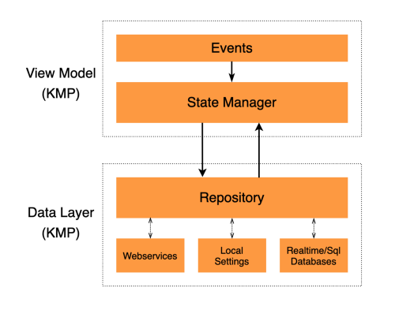  

DataLayer 由一个 **仓库层** 组成，从 **多个来源** 收集数据：*Web 服务、运行时对象、平台设置、平台服务，sqlite 数据库、实时数据库和本地文件等*。仓库层还提供合适的 **缓存机制**，一次性编写并应用于所有平台，非常地明智，不需要在每个平台重复任何复杂的逻辑。  

仓库层的作用是处理所有未格式化的数据，并将其提供给 ViewModel 的`StateManager` 用于进行格式化处理，而 `StateManager` 无需知道数据来源。仓库层还负责管理资源/缓存机制。  

## KMP 库

现在您可能会想：「好吧，D-KMP 看起来很棒！通过 MVI 将声明式 UI 连接到 Kotlin MultiPlatform 允许疯狂的代码重用！但是第三方库呢？KMP 背后有开发者社区吗？」

答案是：**YES！！！而且还在增长！**  

让我们看一些将很快成为你最好朋友的库：
- [Ktor Http Client](https://ktor.io/docs/http-client-multiplatform.html) 由 *JetBrains* 开发。它是最好的 KMP 网络库，在每个平台上都包装了本地 HTTP 客户端。
- [Serialization](https://github.com/Kotlin/kotlinx.serialization) 由 *JetBrains* 开发。提供了一种非常简单的方法来序列化数据，通常与 Ktor Http Client 结合使用，以解析 Json 数据。  
- [DateTime](https://github.com/Kotlin/kotlinx-datetime) 由 *JetBrains* 开发。它是最近发布的，提供了日期和时间的多平台支持。  
- [MultiPlatform Settings](https://github.com/russhwolf/multiplatform-settings) 由 Russell Wolf（*TouchLab*）开发。它封装了 Android 上的 *SharedPreferences*，iOS 上的 *NSUserDefaults*，Javascript 上的 *Storage*。 
- [SqlDelight](https://cashapp.github.io/sqldelight/) 由 *Square* 开发。它为本地 SQLite 数据库提供了多平台支持。  

除了现有的 KMP 库，任何人都可以使用允许包装特定于平台的代码的 [expect/actual 机制](https://kotlinlang.org/docs/mobile/connect-to-platform-specific-apis.html)构建自定义的 KMP 库。  

仍有许多库可供使用，很快就会到来一些库：
- **定位**，包装 Android 和 iOS 位置服务/API
- **蓝牙**，包装 Android 和 iOS 蓝牙服务/API
- **应用内购买**，包装 Google Play 和 AppStore 应用内购买 API
- **Firebase**，官方的 KMP 服务实现，例如 Analytics、Firestore、Authentication

## 脱离平台特定的库

在 KMP 上，我们显然不能使用特定于平台的库，除非我们自己编写它们的 KMP 封装库。但是，由于已经存在许多高质量的库，因此我们不这样做也不会有任何损失。  

特定于 Android/Java 的库（例如 *Retrofit、Gson、LiveData、Dagger、Room、RxJava*）将过时。但是，我们不必担心，因为它们的替换品效果更好：*Ktor Client、Serialization、StateFlow、SqlDelight、协程* 等。  

同样，在 iOS 上，我们不再需要使用平台特定的库，如 *CoreData* 和 *Combine*。KMP 库可以以最有效的方式处理一切。  

## 团队组织

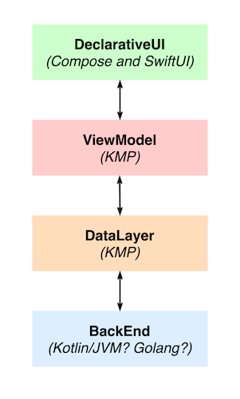  

现在，让我们讨论一下围绕 D-KMP 组织开发结构的新方法。  

我们有四个主要角色：
- **声明式 UI** 开发人员（JetpackCompose 和 SwiftUI）
- **ViewModel** 开发人员（KMP）
- **DataLayer** 开发人员（KMP）
- **后端** 开发人员（Kotlin/JVM？Golang？）

### 声明式 UI 开发人员

我们认为，在 D-KMP 团队中，UI 开发人员应该是多平台的，同时管理 *JetpackCompose* 和 *SwiftUI* 实现。考虑到声明式 UI 框架的易用性，同一开发人员同时管理这两者是完全可行的（而且很有趣！）。专注于两个框架，有助于开发人员更好地了解 UI 趋势并建立最佳的用户体验。  

### ViewModel 开发人员

这个角色是最关键和最重要的。它是开发的中心，需要对项目有充分的了解。
ViewModel 开发人员需要与 UI 开发人员合作以定义应用程序状态，并与 DataLayer 开发人员合作以定义应用程序状态所需的源数据。ViewModel 的功能本质上是从 DataLayer 中获取未格式化的数据，应用正确的可视化格式并将其提供给 UI层。它还管理文本的本地化和可访问性。  

### DataLayer 开发人员

就技术知识而言，这是最苛刻的角色。DataLayer 开发人员必须处理所有数据，包括缓存机制的实现。他/她需要组织所有数据源，可能还需要特定于平台的数据源：例如在位置服务或蓝牙服务的情况下。这个角色需要对 Kotlin MultiPlatform 有全面的了解，并且能够自定义 KMP 库。  

### 后端开发人员

在 D-KMP 团队中，此角色仍然很重要，但比在特定于平台的开发时必须与所有应用程序团队（Android、iOS、Web）协调 Web 服务的情况，要好很多。后端开发人员由 DataLayer 开发人员直接协调，后者负责定义应用程序所需的数据，而网络服务不需要了解应用程序中发生的任何事情。Web 服务可以用任何选择的语言编写（例如Golang，这可能是当今的首选语言），但是如果你对 Kotlin 全栈方法感兴趣，您还可以考虑通过 Ktor 框架在 Kotlin/JVM 中编写它们。在服务器端使用 Kotlin 可以让你在客户端的 DataLayer 和 Web 服务之间共享数据类定义。  

*这是本文的结尾。谢谢阅读！期待你的反馈！*

你可以在 Twitter [@dbaroncellimob](https://twitter.com/dbaroncellimob) 上关注我

# 译者注
原文作者通过对各平台声明式 UI 的兴起，以及 kotlin 跨平台技术的完善，利用 MVI 模式/架构（对 MVI 还不了解的可以参考[图解 Flux](https://zhuanlan.zhihu.com/p/20263396)，思想都很类似）把应用程序进行分层并串在一起，以达到代码复用/共享的目的，从而提高开发效率。  

简单来说，就是把各平台的声明式 UI 和业务逻辑完全分离开，从而实现业务逻辑（各平台一致）的共享。   

我个人很欣赏作者的远见和开阔思维，架构的分层也十分值得学习，但是对于 D-KMP 架构持谨慎乐观的态度。因为我认为各平台 UI 分离而共享一套业务的阻力很大，难以协调和平衡平台差异，而且很难与现有业务结合。  

分开来说，我很看好 *JetpackCompose* 的发展，以及它的其他跨平台版本（Compose Destop 等），*JetpackCompose* 之后肯定会极大改变 Android 的 UI 的开放方式，而且它可以和现有业务无缝结合，个人认为会比 flutter 更快普及。  

我也看好 Kotlin MultiPlatform，kotlin 从一开始的 java 语法糖到现在的多平台支持，在 Android 上大有取代 java 之势。当然一部分是因为 kotlin 的确好用，另一部分就是因为它可以和现有代码无缝互调，从而一点一点蚕食原生代码的份额。

而 flutter 现在还未像 kotlin 一样大范围使用，个人认为一个很大的原因就是 flutter 无法像 kotlin 与原生代码无缝结合，这也是我为什么看好 *JetpackCompose* 发展的原因。  

最后再吐槽一下谷歌，人家苹果都发布 arm 的 M1 芯片了，而且还这么强，从硬件上就准备开始大一统了，以后 swift 写一套代码就直接多平台运行了。而谷歌这里明显慢了一拍呀（最近听说 win10 要原生运行 Android app 了），还开了那么多条产品线，集中力量办大事才是王道呀。  

总之，百花齐放，相互竞争才是好事，我们这些普通开发者兼吃瓜群众还是需要多多了解最新进展，跟上时代。  


