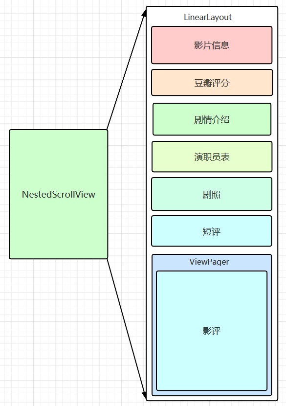
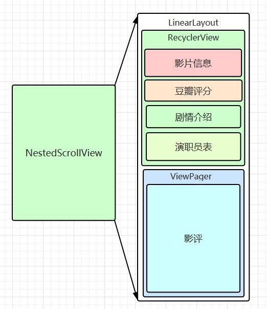
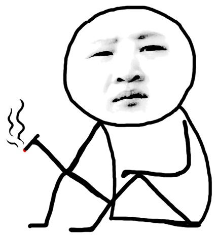
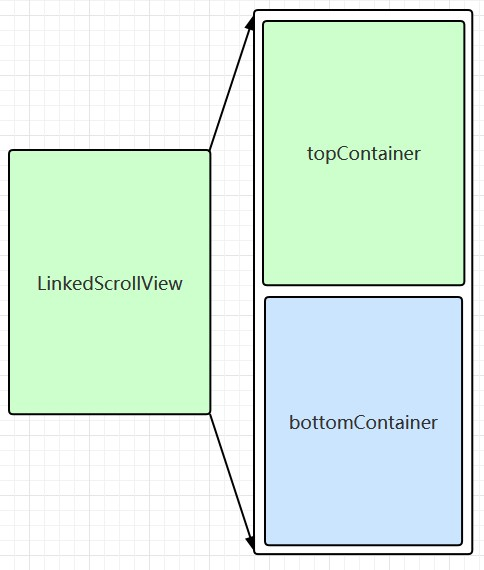
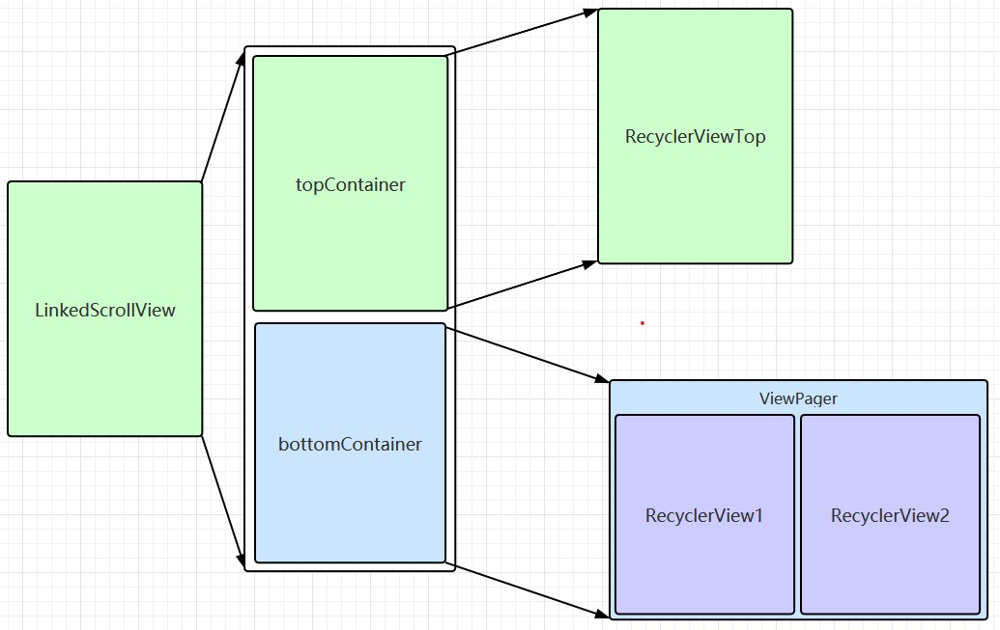
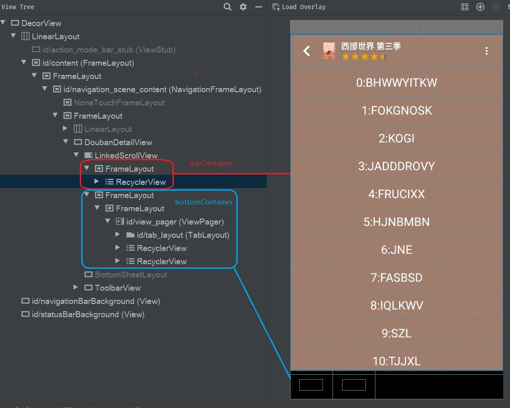
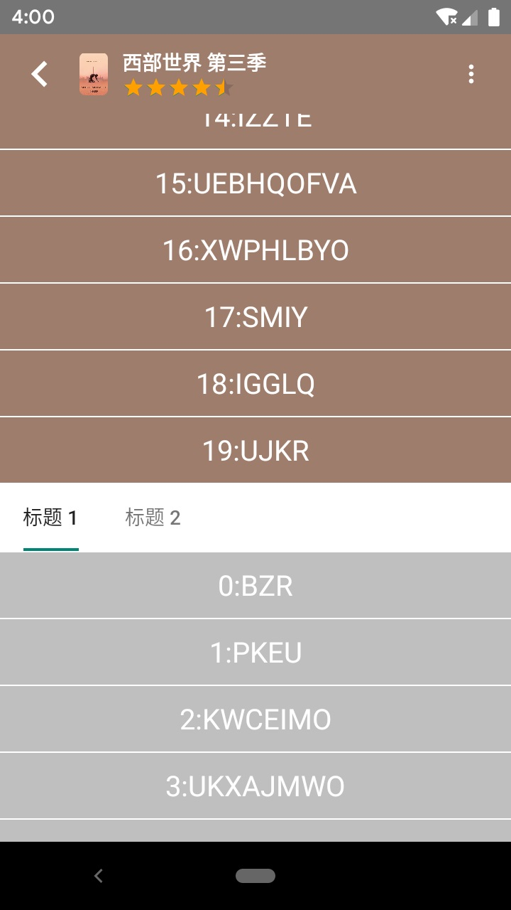
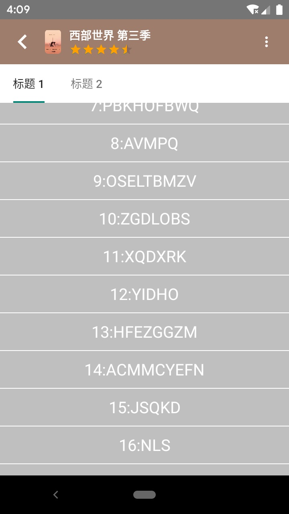
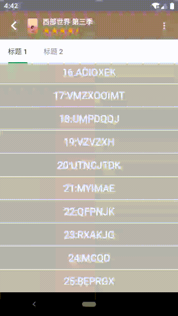

# 仿写豆瓣详情页（三）内容列表

[仿写豆瓣详情页（一）开篇](https://juejin.im/post/5ea3f88b6fb9a03c8b4c1ed2)  
[仿写豆瓣详情页（二）底部浮层](https://juejin.im/post/5ea3fc386fb9a03c7a333830)  
[仿写豆瓣详情页（三）内容列表](https://juejin.im/post/5ea3ffade51d4546ca30ccec)   
[仿写豆瓣详情页（四）弹性布局](https://juejin.im/post/5eb2c471e51d454d980e3db7)  
[仿写豆瓣详情页（五）联动和其他细节](https://juejin.im/post/5eb2c552e51d454dd94067fb)  

## 1、前言


[查看动图](./douban_content_list.gif)

如果不考虑浮层，这其实就是一个大的可滑动列表。我一开始想，这个页面不就是个 `NestedScrollView` 加 `LinearLayout`，里面放不同的卡片，最后再来一个 `ViewPager`。后来发现事情没那么简单，仅仅用 `NestedScrollView` 会有问题，最后还需要通过自定义 View 来解决，解决的关键依然是「滚动量」的分发问题，下面请听我细细道来。  

## 2、方案选择

### 2.1、`NestedScrollView` 加 `LinearLayout`

这个方案在交互效果上可以说和豆瓣详情页没有差别，从直觉上看也是如此，而且是且实可行的。但是上面说这个方案有问题，有啥问题呢？我们先看下这样实现的话，View 的布局是啥样的。  



由于 `NestedScrollView` 不会限制子 View 的高度，所以会导致 `LinearLayout` 里面放的 View 全都 layout 出来。就会导致性能很差，用户只看到了一两个卡片，却把所以卡片都给 layout 处理了；其实卡片少的话还好，但是豆瓣详情页不仅卡片多，而且还有两三个横向滑动的嵌套 `RecyclerView`，这种方案在性能上就存在严重问题。而且不利于数据统计，因为我们无法得知哪个卡片展现出来了，那些没有，当然了，通过计算卡片位置和滚动位置是可以得到这些数据，但还是麻烦。  

### 2.2、`RecyclerView`

既然 `NestedScrollView` 不行，那我很快就想到 `RecyclerView`，用不同的 `ViewType` 和 `ViewHolder` 就是实现，这里推荐下本源码仓库下[本源码仓库下](https://github.com/funnywolfdadada/HollowKit)的 `SimpleAdapter`，能够方便实现这种效果。  

不过这种方案有个嵌套滑动冲突的问题，水平滑动倒是无所谓，最下面的 `ViewPager` 里是有垂直滑动的 `RecyclerView` 的，由于暂时没法先什么现成的解决方案，又不想继承 `RecyclerView` 进行冲突处理，当然也是怕改出 bug，就放弃这种方案了。

### 2.3、`NestedScrollView` 加 `LinearLayout` 加 `RecyclerView`

既然 `NestedScrollView` 有性能问题，而 `RecyclerView` 有滑动冲突，那就两者结合一下，在 `LinearLayout` 里只放 `RecyclerView` 和 `ViewPager`，`RecyclerView` 里只上面的那些卡片，这样问题就解决了。  

这里需要注意的是 `RecyclerView` 的 `layout_height` 不能是 `wrap_content` 的，而是需要写死高度，不然由于 `NestedScrollView` 不会限制子 View 的高度，就会让 `RecyclerView` 无限高，把子 View 全都 layout 出来。  



手指往上滑动的时候，`RecyclerView` 的内容先往下滚，滚到头了 `NestedScrollView` 会开始滚，接着露出下面的 `ViewPager`。如果此时 `RecyclerView` 和 `ViewPager` 都显示了一部分，就有个比较尴尬的问题，滑上面的 `RecyclerView` 是可以滑的（滑不动了，`NestedScrollView` 才会滚动），下面的 `ViewPager` 也是可以滑的。还有就是，连续滑动时，不能实现 `RecyclerView` 和 `NestedScrollView` 联动起来滚动的效果。  



怎么会这样呢？这个就是本文要解决的一个核心问题：`父 View 和子 View 都可以滚动时，如何分发滚动量？`  

要解决这个问题就需要自定义一套规则来解决，既然要自定义，我们就不用这个方案了，这里不管是继承 `NestedScrollView` 还是 `RecyclerView` 都挺麻烦，还是单独搞把。  

### 2.4 本文方案

方便起见，这里继承自 `FrameLayout`，命名为 `LinkedScrollView`，旨在实现可以联动的滚动效果。只设置 `topContainer` 和 `bottomContainer` 两个容器子 View，两者上下挨着，使用 scroll 方式实现 View 的位移。  



期望实现 `topContainer` 的子 View 里的内容滚到底时，整个 `LinkedScrollView` 开始滚到，滚到 `bottomContainer` 全部露出来时再滚到 `topContainer` 的子 View 的内容。  

这里需要解答下 `如何分发滚动量` 的核心问题：
1. 触点位置的容器（`topContainer` 或 `bottomContainer`）完全显示出来，且容器中有可以处理「滚到量」的 View，则分发给该 View 处理
2. 其他情况自己（`LinkedScrollView`）优先，自己可以处理「滚到量」就直接处理
3. 自己不处理时，向下的「滚到量」（大于 0）交给 `bottomContainer` 的子 View 处理，向上的交给 `topContainer` 的子 View 处理

这么说太抽象了，我们拿最终实现的 demo 来说明吧。  



结构上，会在 `topContainer` 放一个 `RecyclerView` 暂且命名为 `RecyclerViewTop`，`bottomContainer` 放一个 `ViewPager`，里面放两个 `RecyclerView` 分别命名为 `RecyclerView1` 和 `RecyclerView2`。   



交互上：  
1. 初始化后，`topContainer` 全屏，`bottomContainer` 则布局到 `topContainer` 下面
2. 手指上滑时，`RecyclerViewTop` 里的内容先开始向底部滚动，直到滚动到底部
3. 手指继续上滑，整个 `LinkedScrollView` 开始向底部滚动，`bottomContainer` 露出  
   
4. 此时不管手指在那个方位上下滑，都会滚动 `LinkedScrollView`，因为`topContainer` 和 `bottomContainer` 都没有完全显示出来
5. 继续上滑，直到 `bottomContainer` 完全显示出来后，开始滚动 `ViewPager` 里对应 `RecyclerView1` 或 `RecyclerView2` 的内容  
   
6. 手指下滑的情况同理

Fling 比较特殊，这里单独说下。简单的看，fling 就是一系列的滚动，所以也遵循上述规则，fling 的速度大的时候有两个稍特殊的情况：
1. `bottomContainer` 里的 `RecyclerView1` 或 `RecyclerView2` 向上的 fling（快速下滑），滚动会经过 `RecyclerView1/2` -> `LinkedScrollView`，当 `LinkedScrollView` 滚到顶，即 `topContainer` 完全显示出来后，会继续将「滚动量」传递到 `RecyclerViewTop`
2. 同理 `RecyclerViewTop` 向下的 fling（快速上滑）的滚动会经过： `RecyclerViewTop` -> `LinkedScrollView`，当 `LinkedScrollView` 滚到底，即 `bottomContainer` 完全显示出来后，会继续将「滚动量」传递到 `ViewPager` 的 `RecyclerView1/2`（不过豆瓣的 Android 版没做这个处理，iOS 版倒是有）

效果如下：  
  
[查看动图](./linked_fling_demo.gif)

## 3、对外暴露的方法和属性

对外主要提供上下两个容器的操作，`topContainer` 和 `bottomContainer` 中子 View 的添加和删除。`topScrollableView` 和 `bottomScrollableView` 的设置，这两个会用于 fling，`LinkedScrollView` 无法处理滚动时，会根据 fling 方向分发给 `topContainer` 的 `topScrollableView` 或者 `bottomContainer` 的 `bottomScrollableView` 所指向的 View。`scrollableChild` 以 lambda 表达式的形式提供，主要是因为像 `ViewPager`，在切到不同的 page 时，需要滚动的 View 也是不同的。  

``` java
fun setTopView(v: View, scrollableChild: (()->View?)? = null) {
    topContainer.removeAllViews()
    topContainer.addView(v)
    topScrollableView = scrollableChild
    requestLayout()
}

fun removeTopView() {
    topContainer.removeAllViews()
    topScrollableView = null
}

fun setBottomView(v: View, scrollableChild: (()->View?)? = null) {
    bottomContainer.removeAllViews()
    bottomContainer.addView(v)
    bottomScrollableView = scrollableChild
    requestLayout()
}

fun removeBottomView() {
    bottomContainer.removeAllViews()
    bottomScrollableView = null
}
```

除此之外，由于 `LinkedScrollView` 是通过 scroll 的方式移动 View 的，所以相关的 scroll 方法也是可用的。  

## 4、Layout 处理和滚动范围的确定

布局的处理比较简单，`topContainer` 和 `bottomContainer` 上下布局，布局完成后会计算最大滚动范围 `maxScrollY`

``` java
    /**
     * 布局时，topContainer 在顶部，bottomContainer 紧挨着 topContainer 底部
     * 布局完还要计算下最大的滚动距离
     */
    override fun onLayout(changed: Boolean, left: Int, top: Int, right: Int, bottom: Int) {
        topContainer.layout(0, 0, topContainer.measuredWidth, topContainer.measuredHeight)
        bottomContainer.layout(0, topContainer.measuredHeight, bottomContainer.measuredWidth,
            topContainer.measuredHeight + bottomContainer.measuredHeight)
        maxScrollY = topContainer.measuredHeight + bottomContainer.measuredHeight - height
    }
```

滚动范围是从 0 到 `maxScrollY`，同时在 `scrollTo` 的时候也会进行边界限制。  

``` java
    /**
     * 滚动范围是[0, [maxScrollY]]，根据方向判断垂直方向是否可以滚动
     */
    override fun canScrollVertically(direction: Int): Boolean {
        return if (direction > 0) {
            scrollY < maxScrollY
        } else {
            scrollY > 0
        }
    }

    /**
     * 滚动前做范围限制
     */
    override fun scrollTo(x: Int, y: Int) {
        super.scrollTo(x, when {
            y < 0 -> 0
            y > maxScrollY -> maxScrollY
            else -> y
        })
    }
```

## 5、Touch 事件拦截

事件拦截在 [仿写豆瓣详情页（二）底部浮层]() 中有过详细探讨，这里就不赘述了，这里还是采用「尽可能拦截」的思想，拦截后再将 touch 移动产生的「滚动量」进行分发。  

`LinkedScrollView` 只处理 y 轴的滚动，所以只要 y 轴的移动大于 x 轴就拦截。  

``` java
    override fun onInterceptTouchEvent(e: MotionEvent): Boolean {
        return when (e.action) {
            // ...
            MotionEvent.ACTION_MOVE -> {
                if (abs(lastX - e.x) < abs(lastY - e.y)) {
                    true
                } else {
                    // ...
                    false
                }
            }
            // ...
        }
    }
```

## 6、Touch 事件的处理和滚动的分发

在 move 时要计算「滚动量」`dScrollY`，`findChildUnder` 找到触点所在的直接子 View `child` 用来判断其是否完全显示出来，同时还要 `child?.findScrollableTarget` 找到 `child` 中可以处理「滚动量」的 View，最后 `dispatchScrollY` 进行滚动的分发。  

``` java
    override fun onTouchEvent(e: MotionEvent): Boolean {
        return when (e.action) {
            // ...
            MotionEvent.ACTION_MOVE -> {
                // 移动时分发滚动量
                val dScrollY = (lastY - e.y).toInt()
                val child = findChildUnder(e.rawX, e.rawY)
                dispatchScrollY(dScrollY, child, child?.findScrollableTarget(e.rawX, e.rawY, dScrollY))
                lastY = e.y
                // ...
                true
            }
            // ...
        }
    }
```

「滚动量」分发的逻辑在「2.4」中已经阐明过，代码中实现起来更加简明一点。  

``` java
    private fun dispatchScrollY(dScrollY: Int, child: View?, target: View?) {
        if (dScrollY == 0) {
            return
        }
        // 滚动所处的位置没有在子 view，或者子 view 没有完全显示出来
        // 或者子 view 中没有要处理滚动的 target，或者 target 不在能够滚动
        if (child == null || !isChildTotallyShowing(child)
            || target == null || !target.canScrollVertically(dScrollY)) {
            // 优先自己处理，处理不了再根据滚动方向交给顶部或底部的 view 处理
            when {
                canScrollVertically(dScrollY) -> scrollBy(0, dScrollY)
                dScrollY > 0 -> bottomScrollableView?.invoke()?.scrollBy(0, dScrollY)
                else -> topScrollableView?.invoke()?.scrollBy(0, dScrollY)
            }
        } else {
            target.scrollBy(0, dScrollY)
        }
    }
```

## 7、Fling 的处理

Fling 的处理需要两个辅助类，`VelocityTracker` 用于计算抬手时的速度，`Scroller` 用于计算 fling 每次滚动的距离。  

在 `onTouchEvent` 中通过 `VelocityTracker` 记录每次事件，在 up 时计算抬手时的速度 `yv`（这里取反的原因之前也说过，就是 touch 事件的方向和 scroll 的方向刚好相反）。和 move 时一样，还需要 `findChildUnder` 找到 `child`，`child?.findScrollableTarget` 找到可以处理 fling 的目标 View。  

``` java
    override fun onTouchEvent(e: MotionEvent): Boolean {
        return when (e.action) {
            MotionEvent.ACTION_DOWN -> {
                // 手指按下时记录 y 轴初始位置
                lastY = e.y
                velocityTracker.clear()
                velocityTracker.addMovement(e)
                true
            }
            MotionEvent.ACTION_MOVE -> {
                // ...
                velocityTracker.addMovement(e)
                true
            }
            MotionEvent.ACTION_UP -> {
                // 手指抬起时计算 y 轴速度，然后自身处理 fling
                velocityTracker.addMovement(e)
                velocityTracker.computeCurrentVelocity(1000)
                val yv = -velocityTracker.yVelocity.toInt()
                val child = findChildUnder(e.rawX, e.rawY)
                handleFling(yv, child, child?.findScrollableTarget(e.rawX, e.rawY, yv))
                true
            }
            // ...
        }
    }
```

Fling 的处理只要靠 `Scroller` 来进行计算，之前也说过 fling 是一些列的滚动，所以需要临时存放一些参数，比如上次 fling 计算的 y 值 `lastFlingY`（这里从 0 开始，我们只需要相对值就行），触点所在的直接子 View `flingChild` 和可以处理 fling 的目标 View `flingTarget`。  

``` java
    /**
     * 处理 fling，通过 scroller 计算 fling，暂存 fling 的初值和需要 fling 的 view
     */
    private fun handleFling(yv: Int, child: View?, target: View?) {
        lastFlingY = 0
        scroller.fling(0, lastFlingY, 0, yv, 0, 0, Int.MIN_VALUE, Int.MAX_VALUE)
        flingChild = child
        flingTarget = target
        invalidate()
    }
```

在 `computeScroll` 计算「滚动量」`dScrollY`，和 move 事件一样进行 `dispatchScrollY` 分发。  

``` java
    /**
     * 计算 fling 的滚动量，并将其分发到真正需要处理的 view
     */
    override fun computeScroll() {
        if (scroller.computeScrollOffset()) {
            val currentFlingY = scroller.currY
            val dScrollY = currentFlingY - lastFlingY
            dispatchScrollY(dScrollY, flingChild, flingTarget)
            lastFlingY = currentFlingY
            invalidate()
        } else {
            flingChild = null
        }
    }
```

## 结束

`LinkedScrollView` 的事件处理方式和 `BottomSheetLayout` 一样，具体逻辑实现还更简单一点，不过我自身文笔不好，讲的有点啰嗦，大佬们有什么不同意见，欢迎在评论区交（dui）流（xian）。  

接下来会实现一个弹性布局 `JellyLayout` 来实现豆瓣详情页横向滑动列表的弹性效果。  

[https://github.com/funnywolfdadada/HollowKit](https://github.com/funnywolfdadada/HollowKit)  
