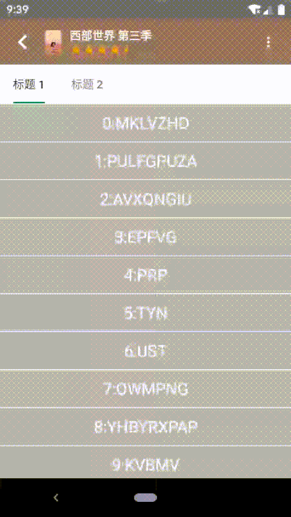

# 仿写豆瓣详情页（二）底部浮层

[仿写豆瓣详情页（一）开篇](https://juejin.im/post/5ea3f88b6fb9a03c8b4c1ed2)  
[仿写豆瓣详情页（二）底部浮层](https://juejin.im/post/5ea3fc386fb9a03c7a333830)  
[仿写豆瓣详情页（三）内容列表](https://juejin.im/post/5ea3ffade51d4546ca30ccec)   
[仿写豆瓣详情页（四）弹性布局](https://juejin.im/post/5eb2c471e51d454d980e3db7)  
[仿写豆瓣详情页（五）联动和其他细节](https://juejin.im/post/5eb2c552e51d454dd94067fb)  

## 1、前言


[查看动图](./douban_floating_page.gif)  

浮层的交互，简单来说，就是
1. 未全部展开时，随着滑动进行拖拽
2. 全部展开后，上滑交给子 View 处理
3. 全部展开后，下滑时如果子 View 可以处理滑动，就给子 View 处理
4. 全部展开后，下滑时如果子 View 不可处理，就随着下滑把整个内容再托拖拽下来

之前说过改变 View 的位置的方法有多种，`BottomSheetBehavior` 通过 `ViewDragHelper` 采用改变 View 的布局位置 top/bottom/left/right 的方式移动 View，这里拟采用 scroll 的方式进行处理。  

为什么要采用 scroll 方式？其实完全是个人喜好，我觉得 View 自己自带了很多现成的关于 scroll 的方法（`scrollTo`、`scrollBy`、`canScrollVertically`、`onScrollChanged` 等），不需要我自己再订一套。  


本文自定义的浮层视图名为 `BottomSheetLayout`，继承自 `FrameLayout`，就不自己处理 measure 和 layout 了。  

## 2、对外暴露的方法和属性

### 2.1、当前状态

首先我们需要定义浮层的状态，尽量简化，只定义三种状态：
- `BOTTOM_SHEET_STATE_COLLAPSED`：折叠状态，此时只露出最小显示高度
- `BOTTOM_SHEET_STATE_SCROLLING`：正在滚动中的状态
- `BOTTOM_SHEET_STATE_EXTENDED`：展开状态，此时露出全部内容

### 2.2、当前进度

进度即 View 移动的相对位置的百分比，根据 View 露出的最小高度，以及完全展开时的高度，确认 View 的移动范围，进而根据 View 的当前位置计算当前进度。  

`BOTTOM_SHEET_STATE_COLLAPSED` 时进度为 0，`BOTTOM_SHEET_STATE_EXTENDED` 时进度为 1，`BOTTOM_SHEET_STATE_SCROLLING` 则根据实际位置进行计算。  

当然还需要支持进度的设置，方便外部进行一些动画等操作。

由于 `BottomSheetLayout` 采用滚动的方式移动 View，所以进度就和 `View.scrollY` 相关，对进度的设置也就是 `View.scrollTo`。  

``` java
/**
 * 当前滚动的进度，[BOTTOM_SHEET_STATE_COLLAPSED] 时是 0，[BOTTOM_SHEET_STATE_EXTENDED] 时是 1
 */
@FloatRange(from = 0.0, to = 1.0)
var process = 0F

fun setProcess(@FloatRange(from = 0.0, to = 1.0) process: Float, smoothly: Boolean = true)
```

### 2.3、设置内容视图

由于我们需要一些特殊的属性，所以不能直接采用 `addView` 的方式。除了内容视图 `contentView`，还需要同时设置最小的显示高度 `minShowingHeight` 来计算滚动范围，初始状态 `initState` 来确定 `contentView` 的初始位置。

``` java
fun setContentView(
    contentView: View,
    minShowingHeight: Int,
    initState: Int = BOTTOM_SHEET_STATE_COLLAPSED
)
```

## 3、Layout 处理和滚动范围的确定

这里不改变原有的布局方式，只在布局后确定滚动范围，`scrollY` 的最小值 `minScrollY` 和最大值 `maxScrollY`，并根据初始状态设置进度（其实就是设置 `scrollY`）。

``` java
override fun onLayout(changed: Boolean, left: Int, top: Int, right: Int, bottom: Int) {
    super.onLayout(changed, left, top, right, bottom)
    // ...
    contentView?.also {
        // ...
        minScrollY = it.top + minShowingHeight - height
        maxScrollY = it.bottom - height
        if (initState == BOTTOM_SHEET_STATE_EXTENDED) {
            setProcess(1F, false)
        } else {
            setProcess(0F, false)
        }
    }
}
```

确定的滚动范围会用于 `canScrollVertically` 和 `scrollTo`，当然也会用在当前状态和进度的计算上。

``` java
/**
 * 滚动范围是[[minScrollY], [maxScrollY]]，根据方向判断垂直方向是否可以滚动
 */
override fun canScrollVertically(direction: Int): Boolean {
    return if (direction > 0) {
        scrollY < maxScrollY
    } else {
        scrollY > minScrollY
    }
}

/**
 * 滚动前做范围限制
 */
override fun scrollTo(x: Int, y: Int) {
    super.scrollTo(x, when {
        y < minScrollY -> minScrollY
        y > maxScrollY -> maxScrollY
        else -> y
    })
}
```

## 4、Touch 事件拦截

### 4.1、拦截的方案探讨

事件拦截的关键在于父 View 和子 View 都能处理事件时，事件要怎么分发的问题。一种是不拦截，让子 View 处理，子 View 不处理了父 View 在拦截；另一种是父 View 直接拦截，然后自己在事件处理的时候在进行分发。  

拦截的方式有个蛋疼的地方在于只要你拦截了事件，那之后子 View 就再也无法处理了。所以也就有了嵌套滚动的处理方式，不拦截事件，但是子 View 滚动时会先回调父 View，父 View 可以在那里进行拦截。  

事件拦截的逻辑是受滚动处理方式的影响的，最开始的时候我是采用嵌套滚动的方式处理滚动的，即：能不拦截事件就不拦截，交给子 View 处理，子 View 在发生滚动时，在收到的滚动时的 `onNestedPreScroll` 中判断是要自己滚还是子 View 滚。当然还要考虑子 View 不能滚动的情况，这时候就拦截下来自己进行滚动。  

### 4.2、本文的拦截方案

后来发现既要处理事件的拦截，又要处理滚动的拦截，太麻烦了（也可能是杀鸡用牛刀了）。我就改成了尽可能地拦截事件，然后根据手指的滑动计算需要的「滚动量」，再对「滚动量」进行分发，决定是自己滚，还是子 View 滚，逻辑为：
- `BOTTOM_SHEET_STATE_SCROLLING` 只是一个中间状态，肯定拦截
- `ACTION_MOVE` 时，如果触点在 `contentView` 上，且垂直移动大于水平移动，就拦截

``` java
override fun onInterceptTouchEvent(e: MotionEvent): Boolean {
    // 正在滚动中肯定要自己拦截处理
    if (state == BOTTOM_SHEET_STATE_SCROLLING) {
        return true
    }
    // move 时，在内容 view 区域，且 y 轴偏移更大，就拦截
    return if (e.action == MotionEvent.ACTION_MOVE) {
        contentView?.isUnder(e.rawX, e.rawY) == true && abs(lastX - e.x) < abs(lastY - e.y)
    } else {
        lastX = e.x
        lastY = e.y
        super.onInterceptTouchEvent(e)
    }
}
```

### 4.3、这里再多 BB 两句

尽可能拦截事件，然后自己分发「滚动量」稍微有点麻烦，但是处理逻辑更加明确。之前还做过体验不是很好的其他尝试：`BOTTOM_SHEET_STATE_EXTENDED` 时判断子 View 是否能够处理，子 View 能处理就不拦截事件，不能处理才拦截下来自己滚动。这种方式看起来没啥问题，但是在 `BOTTOM_SHEET_STATE_EXTENDED` 边界处体验就不是很好。  

比如刚开始是未全部展开 `BOTTOM_SHEET_STATE_SCROLLING`，手指向上滑，我们自己拦截了事件，然后到滚动展开状态 `BOTTOM_SHEET_STATE_EXTENDED`，之后轮到子 View 处理了，这时候由于事件已经被我们拦截了，没法交给子 View 处理，只能抬手然后再上滑，才能让子 View 的内容开始滚动。下拉的时候也存在这样的问题，滚动不连贯，体验不好。  


[查看动图](./old_touch_interception.gif)  

## 5、滚动处理

在事件拦截中，我们的策略是尽可能地拦截事件，垂直方向的事件都被拦截了，那子 View （不论是直接的还是间接的）的滚动和自身的滚动都需要我们来进行分发。


在 `ACTION_MOVE` 时要计算「滚动量」，等于上次触点的 y 值减去这次触点的 y 值。为什么是上次减去这次呢？因为手指上滑时，触点的 y 值减少，列表内容向下滚动（是的，是向下），此时 scrollY 是会增大。还不明白的话就自己打 log 看下。  

有了「滚动量」，还需要找到能够处理该「滚动量」的子 View，方法 `fun View.findScrollableTarget(rawX: Float, rawY: Float, dScrollY: Int): View?` 就是通过递归的方式，在触点 (rawX, rawY) 位置所处的 View 中，从父级一层一层向里，找到可以处理「滚动量」`dScrollY` 的 View。  

``` java
override fun onTouchEvent(e: MotionEvent): Boolean {
    return when (e.action) {
        // ...
        // move 时分发滚动量
        MotionEvent.ACTION_MOVE -> {
            val dy = (lastY - e.y).toInt()
            lastY = e.y
            dispatchScrollY(dy, contentView?.findScrollableTarget(e.rawX, e.rawY, dy))
        }
        // ...
    }
}

```

滚动的分发是由 `dispatchScrollY` 方法处理的，逻辑暂时还不复杂，`BOTTOM_SHEET_STATE_EXTENDED` 时，优先滚动 `target`（就是 `findScrollableTarget` 找到的处理 `dScrollY` 的 View），再滚动自己，其他状态就只滚动自己。  

``` java
private fun dispatchScrollY(dScrollY: Int, target: View?) {
    if (state == BOTTOM_SHEET_STATE_EXTENDED) {
        if (target != null && target.canScrollVertically(dScrollY)) {
            target.scrollBy(0, dScrollY)
        } else {
            scrollBy(0, dScrollY)
        }
    } else if (canScrollVertically(dScrollY)) {
        scrollBy(0, dScrollY)
    }
}
```

这样我们就解决了交互上不连贯的问题。  


[查看动图](./dispatch_scroll_y.gif)  

## 6、Up 事件和 Fling 处理

### 6.1、Up 和 Cancel 时的复位操作

Up 和 Cancel 时，如果状态是 `BOTTOM_SHEET_STATE_SCROLLING`，此时需要通过动画滚动到 `BOTTOM_SHEET_STATE_EXTENDED` 或 `BOTTOM_SHEET_STATE_COLLAPSED` 状态进行复位，具体是哪个状态还看具体需求吧，我这里是按最后一次移动的方向来算的。  

这里为外部拦截处理提供了 `onReleaseListener`，可以先不考虑。  

放在 `dispatchTouchEvent` 是为了提前处理，而直接返回 true，不再分发是因为 `onTouchEvent` 的 up 会处理子 View 的 fling，如果这里处理了复位，同时又让子 View fling 的话，看起来会很奇怪，感兴趣的可以去掉试下。  

``` java
override fun dispatchTouchEvent(e: MotionEvent): Boolean {
    when (e.action) {
        // ...
        // up 或 cancel 时判断是否要平滑滚动到稳定位置
        MotionEvent.ACTION_UP, MotionEvent.ACTION_CANCEL -> {
            // 发生了移动，且处于滚动中的状态，且未被拦截，则自己处理
            if (lastDir != 0
                && state == BOTTOM_SHEET_STATE_SCROLLING
                && onReleaseListener?.invoke(this) != true) {
                smoothScrollToY(if (lastDir > 0) { maxScrollY } else { minScrollY })
                // 这里返回 true 防止分发给子 view 导致其抖动
                return true
            }
        }
    }
    return super.dispatchTouchEvent(e)
}
```

`smoothScrollToY` 通过 `Scroller` 实现动画效果，`lastComputeY` 是为了在 `computeScroll` 中辅助计算「滚动量」的。`flingTarget` 是用于 fling，因为 fling 也是用 `Scroller` 进行处理的，所以 `flingTarget` 起到了区分 fling 和普通滚动的作用。  

``` java
/**
 * 利用 [scroller] 平滑滚动到目标位置，只用于自身的滚动
 */
private fun smoothScrollToY(y: Int) {
    if (scrollY == y) {
        return
    }
    lastComputeY = scrollY
    flingTarget = null
    scroller.startScroll(0, scrollY, 0, y - scrollY)
    invalidate()
}
```

这里的 `dispatchScrollY` 多了个 boolean 返回值，用于表示是否处理这个「滚动量」，不处理的话会把动画关掉，这个主要和 fling 有关，下面会继续介绍。  

``` java
/**
 * 计算 [scroller] 当前的滚动量并分发，不再处理就关掉动画
 * 动画结束时及时复位 fling 的目标 view
 */
override fun computeScroll() {
    if (scroller.computeScrollOffset()) {
        val currentY = scroller.currY
        val dScrollY = currentY - lastComputeY
        lastComputeY = currentY
        if (!dispatchScrollY(dScrollY, flingTarget)) {
            scroller.abortAnimation()
        }
        invalidate()
    } else {
        flingTarget = null
    }
}
```

### 6.2、Fling

Fling 其实就是抬手后的一系列减速的滚动事件，首先需要明确一点，fling 只作用于子 View 的滚动，不用于自身的滚动。  

这是因为在全部展开时，向下的 fling 会把整个内容带下来，而 up 时状态又不是 `BOTTOM_SHEET_STATE_SCROLLING`，这时整个内容视图会悬在半空中（`BOTTOM_SHEET_STATE_SCROLLING` 状态），如果我们在 fling 结束后像 up 时一样进行复位，再进行滚动，又会速度不一致，体验不好。  

Fling 需要用到 `VelocityTracker`，在 `onTouchEvent` 收集一系列事件，在 up 时计算垂直方向的速度，进行 fling。

这里对 `velocityTracker.yVelocity` 取反才是 `Scroller` 处理 fling 的速度，和 move 的滑动事件一个原因，不再赘述。同样的，也需要 `findScrollableTarget` 找到能够处理这个 fling 的子 View。  

``` java
override fun onTouchEvent(e: MotionEvent): Boolean {
    return when (e.action) {
        // down 时，触点在内容视图上时才继续处理
        MotionEvent.ACTION_DOWN -> {
            velocityTracker.clear()
            velocityTracker.addMovement(e)
            contentView?.isUnder(e.rawX, e.rawY) == true
        }
        // move 时分发滚动量
        MotionEvent.ACTION_MOVE -> {
            velocityTracker.addMovement(e)
            val dy = (lastY - e.y).toInt()
            lastY = e.y
            dispatchScrollY(dy, contentView?.findScrollableTarget(e.rawX, e.rawY, dy))
        }
        // up 时要处理子 view 的 fling
        MotionEvent.ACTION_UP, MotionEvent.ACTION_CANCEL -> {
            velocityTracker.addMovement(e)
            velocityTracker.computeCurrentVelocity(1000)
            val yv = -velocityTracker.yVelocity.toInt()
            handleFling(yv, contentView?.findScrollableTarget(e.rawX, e.rawY, yv))
            true
        }
        else -> super.onTouchEvent(e)
    }
}
```

前面说了 fling 只用于子 View，没有要处理的子 View 就直接返回。
`flingTarget` 用于记录本次 fling 的目标子 View。之后还是交给 `Scroller` 处理，在 `computeScroll` 中分发滚动。

``` java
private fun handleFling(yv: Int, target: View?) {
    target ?: return
    lastComputeY = 0
    flingTarget = target
    scroller.fling(0, lastComputeY, 0, yv, 0, 0, Int.MIN_VALUE, Int.MAX_VALUE)
    invalidate()
}
```

`dispatchScrollY` 的完整代码如下，加入了对 fling 的判断和是否能够处理的判断。  

``` java
/**
 * 分发 y 轴滚动事件
 * 展开状态：优先处理 [target]，然后如果不是 fling （fling 不用于自身的滚动）才处理自己
 * 非展开状态：只处理自己
 *
 * @param dScrollY y 轴的滚动量
 * @param target 可以处理改滚动量的目标 view
 * @return 是否可以处理
 */
private fun dispatchScrollY(dScrollY: Int, target: View?): Boolean {
    // 0 默认可以处理
    if (dScrollY == 0) {
        return true
    }
    return if (state == BOTTOM_SHEET_STATE_EXTENDED) {
        if (target != null && target.canScrollVertically(dScrollY)) {
            target.scrollBy(0, dScrollY)
            true
        } else if (!isFling() && canScrollVertically(dScrollY)) {
            scrollBy(0, dScrollY)
            true
        } else {
            false
        }
    } else if (canScrollVertically(dScrollY)) {
        scrollBy(0, dScrollY)
        true
    } else {
        false
    }
}
```



[查看动图](./up_fling.gif)  

## 结束

这样我们算是完成了底部浮层，但并不完美，比如每次分发「滚动量」时都要 `findScrollableTarget` 寻找处理滚动的 View，那如果一个 View 和它的子 View 都能处理呢？这时候优先级不应该有我们决定，但是 `findScrollableTarget` 是直接返回第一个的。  

这里的确是有点小问题，但就像我在 [仿写豆瓣详情页（一）开篇]() 结尾处所说的，不要过于追求大而全，目前我也没遇到这样的 case，就先不管了。如果真要解决，就需要更改拦截事件的方案，或者利用嵌套滚动来处理。  

[https://github.com/funnywolfdadada/HollowKit](https://github.com/funnywolfdadada/HollowKit)  
