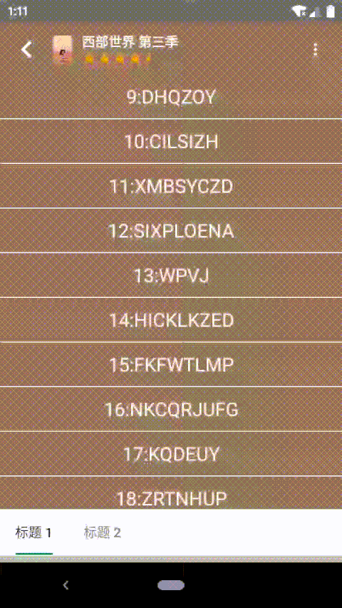

# 仿写豆瓣详情页（五）联动和其他细节

[仿写豆瓣详情页（一）开篇](https://juejin.im/post/5ea3f88b6fb9a03c8b4c1ed2)  
[仿写豆瓣详情页（二）底部浮层](https://juejin.im/post/5ea3fc386fb9a03c7a333830)  
[仿写豆瓣详情页（三）内容列表](https://juejin.im/post/5ea3ffade51d4546ca30ccec)   
[仿写豆瓣详情页（四）弹性布局](https://juejin.im/post/5ea3f88b6fb9a03c8b4c1ed2)  
[仿写豆瓣详情页（五）联动和其他细节](https://juejin.im/post/5ea3f88b6fb9a03c8b4c1ed2)  

## 1、前言

前面几篇文章主要讲了几个为了仿写豆瓣详情页而自定义的 `View`，底部浮层 `BottomSheetLayout`、内容列表联动滚动的 `LinkedScrollView` 和弹性布局 `JellyLayout`，有了这些基本就可以实现详情页的效果，本文简单介绍一下我在具体实现的时候是怎么组织这些自定义 `View` 的，具体代码可以参考 [https://github.com/funnywolfdadada/HollowKit](https://github.com/funnywolfdadada/HollowKit) 中 `com.funnywolf.hollowkit.douban` 下的文件。

## 2、内容列表和底部浮层的联动

[查看动图](./content_bottom_sheet.gif)

这里的内容列表主要是上面的 `RecyclerView` 列表和下面 `ViewPager` 两个 `View`，`RecyclerView` 始终放在 `LinkedScrollView` 的 `topView` 中，`ViewPager` 放在 `LinkedScrollView` 的 `bottomView` 中，从而实现上下连贯的滚动。  

浮层 `BottomSheetLayout` 在 `LinkedScrollView` 上面盖着，根据 `LinkedScrollView` 的 `bottomView` 的位置决定将内容列表的 `ViewPager` 放在 `LinkedScrollView` 的 `bottomView` 中，还是 `BottomSheetLayout` 中。当 `bottomView` 露出的高度小于 `TabLayout` 的高度时，就放在浮层中，大于时就从浮层中移除，放到 `LinkedScrollView` 的 `bottomView` 中，从而实现内容列表和底部浮层的联动。  

## 3、标题栏

[查看动图](./toolbar.gif)

首先，标题栏背景的透明度是随着内容列表滚动渐变；然后，再滚动到一定阈值时，会出现标题和内容详情的翻转动画；最后，浮层的是否弹起也影响标题和内容详情的显示。所以我们需要 `LinkedScrollView` `topView` 中 `RecyclerView` 滚动的累加值，需要知道 `LinkedScrollView` 滚动的累加值（因为可能 `RecyclerView` 内容不足一屏时是没法滚动的），还需要知道浮层的状态。  

这里我自定义了 `ToolbarView`，对外暴露一个 `process` 属性，限制范围在 `@FloatRange(from = 0.0, to = 1.0)`。背景透明度直接等于 `process`（这样性能会稍微差点，不过还好），在 `process` 从 `1` 的边界变化时，做动画改变标题和内容详情的显示。外部使用时，如果浮层是全部展开的 `BOTTOM_SHEET_STATE_EXTENDED`，`process` 赋值为 `1`，其他情况时等于「`RecyclerView` 滚动的累加值和`LinkedScrollView` 滚动的累加值中最大的」/「标题栏高度」。

## 4、内容列表

`LinkedScrollView` 的 `topView` 中只有一个 `RecyclerView`，使用 [SimpleAdapter](https://juejin.im/post/5e773cb8518825494822eabd) 实现不同 `ViewHolder` 的分发处理。   

## 5、结束

前面几篇文章介绍的 `BottomSheetLayout`、`LinkedScrollView` 和 `JellyLayout` 等自定义 `View` 都是为了解决同方向滚动时的嵌套滚动问题（其核心就是「滚动量」的分发），也提供了不同的解决思路和方案，在仿写豆瓣详情页的过程中也验证了方案的可行性。不过这些 `View` 的整体实现还是比较简陋的，很多情况并没有考虑到，比如想要 `LinkedScrollView` 和 `JellyLayout` 直接嵌套起来实现弹性的效果就不太行，之后还需要继续学习，不断改进。  

