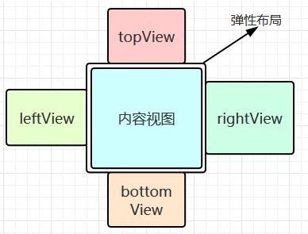
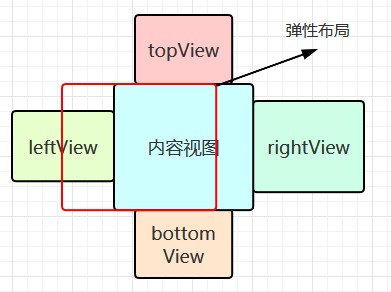
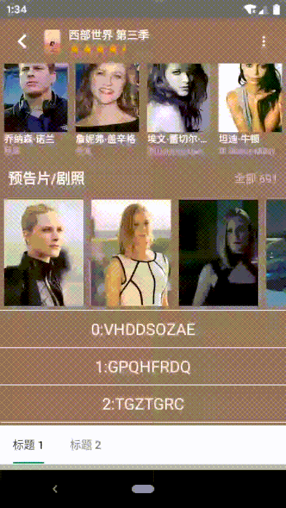

# 仿写豆瓣详情页（四）弹性布局

[仿写豆瓣详情页（一）开篇](https://juejin.im/post/5ea3f88b6fb9a03c8b4c1ed2)  
[仿写豆瓣详情页（二）底部浮层](https://juejin.im/post/5ea3fc386fb9a03c7a333830)  
[仿写豆瓣详情页（三）内容列表](https://juejin.im/post/5ea3ffade51d4546ca30ccec)   
[仿写豆瓣详情页（四）弹性布局](https://juejin.im/post/5ea3f88b6fb9a03c8b4c1ed2)  
[仿写豆瓣详情页（五）联动和其他细节](https://juejin.im/post/5ea3f88b6fb9a03c8b4c1ed2)  

## 1、前言


[查看动图](./elastic_layout.gif)

首先声明一下，这里说的「弹性布局」并不是指的 `FlexLayout`，而是上图所示的这种视图。在某个方向滚动到底，再进行滑动时，会滑出边界外的视图，松手后弹回，就像弹簧一样。这个视图的应用其实很广泛，开源方案也有很多，和「仿写豆瓣详情页」的关系并不是很大，这里只是顺便造一个轮子，学习下嵌套滚动的知识。  

## 2、方案选择

### 2.1、视图布局

自定义弹性布局继承自 `FrameLayout`，命名为 `JellyLayout`。这里需要决定下如何布局和展示弹性拖拽时，拖拽方向的视图。  

  

为了通用性，这里采用 `topView`、`bottomView`、`leftView` 和 `rightView` 等布局外视图，放在布局边界的上下左右四个方向，通过滚动整个视图的方式来露出对应的视图。  

### 2.2、事件处理方案

[仿写豆瓣详情页（二）底部浮层](https://juejin.im/post/5ea3fc386fb9a03c7a333830)、[仿写豆瓣详情页（三）内容列表](https://juejin.im/post/5ea3ffade51d4546ca30ccec) 的方案是尽可能拦截事件，然后自己分发滚动。之前也说过这种方案的一个缺点，就是内部有嵌套滚动的视图时，无法准确确定如何分发「滚动量」，因为这个时候应该由子 View 来分发事件。  

这里采用嵌套滚动的方案，对嵌套滚动还不了解的可以参考下 [自定义View事件之进阶篇(一)-NestedScrolling(嵌套滑动)机制](https://juejin.im/post/5d3e639e51882508dc163606)，大体思想就是自己尽可能不拦截事件，交给子 View 处理，而子 View 再滚动时会先通知父 View（需实现 `NestedScrollingParent` 接口），父 View 可以在滚动前后进行处理。   

## 3、对外暴露的方法和属性

### 3.1、视图的设置

设置上下左右视图的方法。  

``` java
// ...
fun setTopView(v: View?): JellyLayout {
    removeView(topView)
    topView = v
    if (v != null) { addView(v) }
    return this
}
// ...
```

### 3.2、滚动的区域和进度

为了详细处理「滚动量」的分发和表示当前滚动的状态，除了 `scrollX`、`scrollY` 等参数，我们还需要知道边界外的哪个区域视图显示了出来 `currRegion`，显示了多少 `currProcess`。  

这里我们定义下滚动的区域：
- `JELLY_REGION_NONE` 表示边界外的视图都没显示出来
- `JELLY_REGION_TOP` 表示顶部视图显示出来
- `JELLY_REGION_BOTTOM` 表示底部视图显示出来
- `JELLY_REGION_LEFT` 表示左边视图显示出来
- `JELLY_REGION_RIGHT` 表示右边视图显示出来

同时还需要规定一次只有一个区域的视图会显示出来，如下图，左边的视图显示出来时，`currRegion` 是 `JELLY_REGION_LEFT`，这个时候右边的视图就不会显示出来（废话），同时也不处理垂直方向的滚动，上下区域的视图也不会显示出来。  

  

``` java
    const val JELLY_REGION_NONE = 0
    const val JELLY_REGION_TOP = 1
    const val JELLY_REGION_BOTTOM = 2
    const val JELLY_REGION_LEFT = 3
    const val JELLY_REGION_RIGHT = 4

    /**
     * 当前滚动所在的区域，一次只支持在一个区域滚动
     */
    @JellyRegion
    var currRegion = JELLY_REGION_NONE
        get() = when {
            scrollY < 0 -> JELLY_REGION_TOP
            scrollY > 0 -> JELLY_REGION_BOTTOM
            scrollX < 0 -> JELLY_REGION_LEFT
            scrollX > 0 -> JELLY_REGION_RIGHT
            else -> JELLY_REGION_NONE
        }
        private set
```

说了区域，进度 `currProcess` 就很简单了，就是在 `currRegion` 的视图显示出来的比例（`minScrollY`、`maxScrollY`、`minScrollX`、`maxScrollX` 是滚动的范围，之后会说）。这样通过 `currRegion` 和 `currProcess`，我们就能够精确而方便地知道弹性视图滚动的状态了，即哪个区域的视图显示或滚动出来了多少。  

``` java
    /**
     * 当前区域的滚动进度
     */
    @FloatRange(from = 0.0, to = 1.0)
    var currProcess = 0F
        get() = when {
            scrollY < 0 -> if (minScrollY != 0) { scrollY.toFloat() / minScrollY } else { 0F }
            scrollY > 0 -> if (maxScrollY != 0) { scrollY.toFloat() / maxScrollY } else { 0F }
            scrollX < 0 -> if (minScrollX != 0) { scrollX.toFloat() / minScrollX } else { 0F }
            scrollX > 0 -> if (maxScrollX != 0) { scrollX.toFloat() / maxScrollX } else { 0F }
            else -> 0F
        }
        private set
```

为了支持一下外部自定义的动画，这里还支持进度的设置，即滚动到某个区域 `region` 的某个进度 `process`，以及是否平滑滚动 `smoothly`。`smoothScrollTo` 会利用 `Scroller` 做平滑的滚动，之后说。  

``` java
    fun setProcess(
        @JellyRegion region: Int,
        @FloatRange(from = 0.0, to = 1.0) process: Float = 0F,
        smoothly: Boolean = true
    ) {
        var x = 0
        var y = 0
        when (region) {
            JELLY_REGION_TOP -> y = (minScrollY * process).toInt()
            JELLY_REGION_BOTTOM -> y = (maxScrollY * process).toInt()
            JELLY_REGION_LEFT -> x = (minScrollX * process).toInt()
            JELLY_REGION_RIGHT -> x = (maxScrollX * process).toInt()
        }
        if (smoothly) {
            smoothScrollTo(x, y)
        } else {
            scrollTo(x, y)
        }
    }
```

### 3.3、其他

一些更细节的配置和当前属性，方便外部做动画之类的。  

``` java
    /**
     * 上次 x 轴的滚动方向，主要用来判断是否发生了滚动
     */
    var lastScrollXDir: Int = 0
        private set

    /**
     * 上次 y 轴的滚动方向
     */
    var lastScrollYDir: Int = 0
        private set
        
    /**
     * 发生滚动时的回调
     */
    var onScrollChangedListener: ((JellyLayout)->Unit)? = null

    /**
     * 复位时的回调，返回是否拦截处理复位事件
     */
    var onResetListener: ((JellyLayout)->Boolean)? = null

    /**
     * 复位时的动画时间
     */
    var resetDuration: Int = 500

    /**
     * 滚动的阻尼
     */
    var resistence = 2F
```

## 4、Layout 处理和滚动范围的确定

布局时偷下懒，对于边界外的 `View` 没采用 laypout 的方式，而是属性动画的 translation。将边界外视图移动到对应侧的位置，同时根据对于 `View` 的宽高计算出滚动范围 `minScrollY`、`maxScrollY`、`minScrollX` 和 `maxScrollX`。  

``` java
    override fun onLayout(changed: Boolean, left: Int, top: Int, right: Int, bottom: Int) {
        super.onLayout(changed, left, top, right, bottom)
        topView?.also {
            // 水平方向居中
            it.x = (width - it.width) / 2F
            // topView 的底部与弹性视图顶部对齐
            it.y = -it.height.toFloat()
        }
        bottomView?.also {
            it.x = (width - it.width) / 2F
            it.y = height.toFloat()
        }
        leftView?.also {
            it.x = -it.width.toFloat()
            it.y = (height - it.height) / 2F
        }
        rightView?.also {
            it.x = width.toFloat()
            it.y = (height - it.height) / 2F
        }
        minScrollX = -(leftView?.width ?: 0)
        maxScrollX = rightView?.width ?: 0
        minScrollY = -(topView?.height ?: 0)
        maxScrollY = bottomView?.height ?: 0
    }
```

滚动范围的限制比较简单，水平方向 `minScrollX ~ maxScrollX`，垂直方向 `minScrollY ~ maxScrollY`。  

``` java
    override fun canScrollHorizontally(direction: Int): Boolean {
        return if (direction > 0) {
            scrollX < maxScrollX
        } else {
            scrollX > minScrollX
        }
    }
    override fun canScrollVertically(direction: Int): Boolean {
        return if (direction > 0) {
            scrollY < maxScrollY
        } else {
            scrollY > minScrollY
        }
    }
```

在真正滚动时要复杂一些，由于 `JELLY_REGION_NONE` 和其他区域在滚动处理上逻辑不同，简单来说就是 `JELLY_REGION_NONE` 时不会拦截嵌套滚动的「滚动量」，而其他区域会拦截相应方向上的「滚动量」，因此需要按照区域进行限制。  

举例来说，内容视图是一个横向滚动的 `View`，在 `JELLY_REGION_LEFT` -> `JELLY_REGION_RIGHT` 的过程中，左滑时先回到 `JELLY_REGION_NONE`，然后经过内容视图自己滚动，滚到右边界，再往左滑才能到 `JELLY_REGION_RIGHT`。而如果不按照 `currRegion` 进行滚到限制，就有可能直接从 `JELLY_REGION_LEFT` 滚到 `JELLY_REGION_RIGHT`，这样内容视图是没有机会滚到的，会有问题，如下图。  



[查看动图](./scroll_not_by_region.gif)

``` java
    /**
     * 具体滚动的限制取决于当前的滚动区域 [currRegion]，这里的区域判断分得很细，可以使得一次只处理一个区域的滚动，
     * 否则会存在在临界位置的一次大的滚动导致滚过了的问题。
     * 具体规则:
     * [JELLY_REGION_LEFT] -> 只能在水平 [[minScrollX], 0] 范围内滚动
     * [JELLY_REGION_RIGHT] -> 只能在水平 [0, [maxScrollX]] 范围内滚动
     * [JELLY_REGION_TOP] -> 只能在垂直 [[minScrollY], 0] 范围内滚动
     * [JELLY_REGION_BOTTOM] -> 只能在垂直 [0, [maxScrollY]] 范围内滚动
     * [JELLY_REGION_NONE] -> 水平是在 [[minScrollX], [maxScrollX]] 范围内，垂直在 [[minScrollY], [maxScrollY]]
     */
    override fun scrollTo(x: Int, y: Int) {
        val region = currRegion
        val xx = when(region) {
            JELLY_REGION_LEFT -> x.constrains(minScrollX, 0)
            JELLY_REGION_RIGHT -> x.constrains(0, maxScrollX)
            else -> x.constrains(minScrollX, maxScrollX)
        }
        val yy = when(region) {
            JELLY_REGION_TOP -> y.constrains(minScrollY, 0)
            JELLY_REGION_BOTTOM -> y.constrains(0, maxScrollY)
            else -> y.constrains(minScrollY, maxScrollY)
        }
        super.scrollTo(xx, yy)
    }

    private fun Int.constrains(min: Int, max: Int): Int = when {
        this < min -> min
        this > max -> max
        else -> this
    }
```

## 5、Touch 事件拦截

按照 2 中说的，这次采用嵌套滚动方式，在拦截事件时就要能不拦截就不拦截。根据触点和滑动方向，找到对应方向可以进行嵌套滚动的视图 `target`，如果右这样的视图，那就不拦截事件，走之后的嵌套滚动逻辑。  

水平方向的查找方法即 `findHorizontalNestedScrollingTarget`，深度优先遍历，查找触点下的、实现了 `NestedScrollingChild` 的、可以水平滚动的 `View`，垂直方向的同理。  

``` java
override fun onInterceptTouchEvent(e: MotionEvent): Boolean {
    return when (e.action) {
        // ...
        // move 时需要根据是否移动，是否有可处理对应方向移动的子 view，判断是否要自己拦截
        MotionEvent.ACTION_MOVE -> {
            val dx = (lastX - e.x).toInt()
            val dy = (lastY - e.y).toInt()
            lastX = e.x
            lastY = e.y
            if (dx == 0 && dy == 0) {
                false
            } else {
                val child = findChildUnder(e.rawX, e.rawY)
                val target = if (abs(dx) > abs(dy)) {
                    child?.findHorizontalNestedScrollingTarget(e.rawX, e.rawY)
                } else {
                    child?.findVerticalNestedScrollingTarget(e.rawX, e.rawY)
                }
                target == null
            }

        }
        // ...
    }
}

fun ViewGroup.findHorizontalNestedScrollingTarget(rawX: Float, rawY: Float): View? {
    for (i in 0 until childCount) {
        val v = getChildAt(i)
        if (!v.isUnder(rawX, rawY)) {
            continue
        }
        if (v is NestedScrollingChild
            && (v.canScrollHorizontally(1)
                    || v.canScrollHorizontally(-1))) {
            return v
        }
        if (v !is ViewGroup) {
            continue
        }
        val t = v.findHorizontalNestedScrollingTarget(rawX, rawY)
        if (t != null) {
            return t
        }
    }
    return null
}
```

## 6、Touch 事件的处理和滚动的分发

虽然主要是用嵌套滚动的方式处理，但是在内容视图不支持滚动时，还是需要自己处理 touch 事件的。主要逻辑时计算 x 轴和 y 轴的「滚动量」，然后就行 `dispatchScroll` 分发，其返回是否处理。由于 `JellyLayout` 会与其他可滚动布局嵌套使用，在处理了「滚动量」后还需要用 `requestDisallowInterceptTouchEvent(true)` 请求父 `View` 不要拦截之后的事件。

``` java
    override fun onTouchEvent(e: MotionEvent): Boolean {
        return when (e.action) {
            // ...
            // move 时判断自身是否能够处理
            MotionEvent.ACTION_MOVE -> {
                val dx = (lastX - e.x).toInt()
                val dy = (lastY - e.y).toInt()
                lastX = e.x
                lastY = e.y
                if (dispatchScroll(dx, dy)) {
                    // 自己可以处理就请求父 view 不要拦截事件
                    requestDisallowInterceptTouchEvent(true)
                    true
                } else {
                    false
                }
            }
            // ...
        }
    }
```

`dispatchScroll` 会根据阻尼系数 `resistence`，计算出各方向要处理的「滚动量」，然后根据 `currRegion` 决定进行水平还是垂直方向的滚动，最后进行滚动。  

``` java
    /**
     * 分发滚动量，当滚动区域已知时，只处理对应方向上的滚动，未知时先通过滚动量确定方向，再滚动
     */
    private fun dispatchScroll(dScrollX: Int, dScrollY: Int): Boolean {
        val dx = (dScrollX / resistence).toInt()
        val dy = (dScrollY / resistence).toInt()
        if (dx == 0 && dy == 0) {
            return true
        }
        val horizontal = when (currRegion) {
            JELLY_REGION_TOP, JELLY_REGION_BOTTOM -> false
            JELLY_REGION_LEFT, JELLY_REGION_RIGHT -> true
            else -> abs(dScrollX) > abs(dScrollY)
        }
        return if (horizontal) {
            if (canScrollHorizontally(dx)) {
                scrollBy(dx, 0)
                true
            } else {
                false
            }
        } else {
            if (canScrollVertically(dy)) {
                scrollBy(0, dy)
                true
            } else {
                false
            }
        }
    }
```

## 7、嵌套滚动的处理

这里实现了 `NestedScrollingParent2`，用它主要是因为它的接口里增加了 `NestedScrollType` 注解标识的滚动的类型，取值如下，主要是用来区分滚动时来自手指滑动还是 fling。  

``` java
    /**
     * Indicates that the input type for the gesture is from a user touching the screen.
     */
    public static final int TYPE_TOUCH = 0;

    /**
     * Indicates that the input type for the gesture is caused by something which is not a user
     * touching a screen. This is usually from a fling which is settling.
     */
    public static final int TYPE_NON_TOUCH = 1;
```

在一次嵌套滚动开始时会回调 `onStartNestedScroll`，需要我们返回是否处理这次嵌套滚动。这里和 [系列的第二篇](https://juejin.im/post/5ea3fc386fb9a03c7a333830) 里介绍的 `BottomSheetLayout` 一样，我不希望 fling 影响容器视图的滚动，所以嵌套滚动也就只处理 `TYPE_TOUCH` 的。  

``` java
    override fun onStartNestedScroll(child: View, target: View, axes: Int, type: Int): Boolean {
        // 只处理 touch 相关的滚动
        return type == ViewCompat.TYPE_TOUCH
    }
```

在子 `View` 发生嵌套滚动时，会先回调到我们的 `onNestedScrollAccepted`，这里也没啥特殊处理。这里用到了一个嵌套滚动的帮助类 `NestedScrollingParentHelper`，不过对于 `NestedScrollingParent` 来说作用不大，这里不多赘述。  

``` java
    override fun onNestedScrollAccepted(child: View, target: View, axes: Int, type: Int) {
        parentHelper.onNestedScrollAccepted(child, target, axes, type)
    }
```

在子 `View` 开始滚动前，会先回调 `onNestedPreScroll`，我们可以在这里进行拦截，将我们消耗掉的「滚动量」赋值给 `consumed` 数组的对于位置。这里根据 `currRegion` 进行拦截处理，当处于水平的区域 `JELLY_REGION_TOP` 或 `JELLY_REGION_BOTTOM` 时，我们只处理 y 轴滚动，能处理就消耗掉，垂直方向同理，最后进行分发。  

``` java
    /**
     * 根据滚动区域和新的滚动量确定是否消耗 target 的滚动，滚动区域和处理优先级关系：
     * [JELLY_REGION_TOP] 或 [JELLY_REGION_BOTTOM] -> 自己优先处理 y 轴滚动
     * [JELLY_REGION_LEFT] 或 [JELLY_REGION_RIGHT] -> 自己优先处理 x 轴滚动
     */
    override fun onNestedPreScroll(target: View, dx: Int, dy: Int, consumed: IntArray, type: Int) {
        when (currRegion) {
            JELLY_REGION_TOP, JELLY_REGION_BOTTOM -> if (canScrollVertically(dy)) {
                consumed[1] = dy
            }
            JELLY_REGION_LEFT, JELLY_REGION_RIGHT -> if (canScrollHorizontally(dx)) {
                consumed[0] = dx
            }
        }
        dispatchScroll(consumed[0], consumed[1])
    }
```

子 `View` 滚动之后会回调 `onNestedScroll`，参数的意思也很明确，这里会告诉我们子 `View` 消耗了多少「滚动量」，以及还有多少「滚动量」没有消耗。对于子 `View` 不消耗的滚动，我们就自己分发。  

``` java
    override fun onNestedScroll(
        target: View,
        dxConsumed: Int,
        dyConsumed: Int,
        dxUnconsumed: Int,
        dyUnconsumed: Int,
        type: Int
    ) {
        dispatchScroll(dxUnconsumed, dyUnconsumed)
    }
```

一次嵌套滚动停止后会回调 `onStopNestedScroll`，这里也没啥特殊处理，交给 `NestedScrollingParentHelper`。  

``` java
    override fun onStopNestedScroll(target: View, type: Int) {
        parentHelper.onStopNestedScroll(target, type)
    }
```

这样 `onNestedPreScroll` 和 `onNestedScroll` 结合就实现了嵌套滚动的主要处理逻辑：
1. 一开始 `currRegion` 为 `JELLY_REGION_NONE`，不会在 `onNestedPreScroll` 里拦截「滚动量」
2. 当 `onNestedScroll` 里子 `View` 有未消耗的「滚动量」时，我们自己滚动，露出对应方向的边界外视图，`currRegion` 改变
3. 再次进行滚动前 `onNestedPreScroll` 里就会拦截掉对应方向的「滚动量」进行分发
4. 向相反的方向滑动，当 `currRegion` 回到 `JELLY_REGION_NONE` 后，又回到 1

## 8、抬手处理和平滑滚动

`JellyLayout` 抬手默认会有一个回弹的逻辑，如果 `currRegion` 不是在 `JELLY_REGION_NONE`、之前发生了移动、且未拦截回弹地处理 `onResetListener`，就平滑地滚动到初始位置 `smoothScrollTo(0, 0)`。  

``` java
    override fun dispatchTouchEvent(e: MotionEvent): Boolean {
        when (e.action) {
            // ...
            // up 或 cancel 时复位到原始位置，被拦截就不再处理
            // 在这里处理是因为自身可能并没有处理任何 touch 事件，也就不能在 onToucheEvent 中处理到 up 事件
            MotionEvent.ACTION_CANCEL, MotionEvent.ACTION_UP -> {
                // 发生了移动，且不处于复位状态，且未被拦截，则执行复位操作
                if ((lastScrollXDir != 0 || lastScrollYDir != 0)
                    && currRegion != JELLY_REGION_NONE
                    && onResetListener?.invoke(this) != true) {
                    smoothScrollTo(0, 0)
                }
            }
        }
        // ...
    }
```

`onResetListener` 的返回值是是否拦截回弹，作用主要是方便外部自定义的一些需求。比如拿 `JellyLayout` 做一个下拉刷新（当然可能还需要其他特殊处理），下拉一段后松手，就停留在某个位置，刷新完弹回；比如做一个像 iOS 那样左滑显示「删除」等操作。  

`setProcess` 和回弹都用到了 `smoothScrollTo`，还是利用 `Scroller` 来做平滑滚动，当然了手指再次放下时还需要停掉 `Scroller`。  

``` java
    /**
     * 利用 scroller 平滑滚动
     */
    private fun smoothScrollTo(x: Int, y: Int) {
        if (scrollX == x && scrollY == y) {
            return
        }
        scroller.startScroll(scrollX, scrollY, x - scrollX, y - scrollY, resetDuration)
        invalidate()
    }
    /**
     * 计算并滚到需要滚动到的位置
     */
    override fun computeScroll() {
        if (scroller.computeScrollOffset()) {
            scrollTo(scroller.currX, scroller.currY)
            invalidate()
        }
    }
    override fun dispatchTouchEvent(e: MotionEvent): Boolean {
        when (e.action) {
            // down 时停掉 scroller 的滚动，复位滚动方向
            MotionEvent.ACTION_DOWN -> {
                scroller.abortAnimation()
                lastScrollXDir = 0
                lastScrollYDir = 0
            }
            // ...
        }
        // ...
    }
```

## 9、仿写豆瓣横向图片列表的左滑查看更多

`JellyLayout` 对外暴露了区域 `currRegion` 和进度 `currProcess`，同时也有发生滚动时的回调 `onScrollChangedListener`，通过这些信息和一个受进度控制的自定义视图 `RightDragToOpenView` 就可以做到豆瓣的效果。代码比较简单，就不再赘述了。  


[查看动图](./jelly_layout_demo.gif)

## 结束

嵌套滚动在处理嵌套同方向的滚动是十分高效的，和 [仿写豆瓣详情页（二）底部浮层](https://juejin.im/post/5ea3fc386fb9a03c7a333830)、[仿写豆瓣详情页（三）内容列表](https://juejin.im/post/5ea3ffade51d4546ca30ccec) 中拦截所有事件再分发滚动相比，能够更好的处理优先级的问题，不过代码也更加复杂一点，具体实践中怎么选择还要看具体场景，能用就行。  

[https://github.com/funnywolfdadada/HollowKit](https://github.com/funnywolfdadada/HollowKit)  

