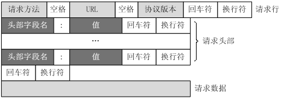

# OkHttp 的 IO 操作和进度监听

其实在使用 OkHttp 的过程中，我一直有这么一些疑问：  
- OkHttp 是怎么操作 Socket 的？
- 文件是怎么上传的，怎么读到内存里，再从内存里传给 Socket？
- 文件下载呢？
- 请求的进度怎么监听呢，有没有啥通用办法？

本文会带着上述问题，通过对 OkHttp（版本号 4.9.0） IO 操作流程的分析和介绍，说明 OkHttp 是如何处理请求和响应 body 的，进而用拦截器实现一个通用的上传和下载的进度监听。   

## 1、OkHttp 是如何操作 IO 的

### 1.1、一切要从 `CallServerInterceptor` 说起

稍微了解 OkHttp 的朋友应该知道 OkHttp 请求的最后一个拦截器就是 `CallServerInterceptor`，它负责将 HTTP 格式的请求数据写入 socket，并从 socket 读取返回的响应数据。我们就从这里开始分析 OkHttp 是如何操作 IO 的。  

``` kotlin
class CallServerInterceptor(private val forWebSocket: Boolean) : Interceptor {
  // ...
  override fun intercept(chain: Interceptor.Chain): Response {
    val exchange = realChain.exchange!!
    // ...
    exchange.writeRequestHeaders(request)
    // ...
  }
  // ...
}
```

`CallServerInterceptor` 首先会拿到一个叫 `Exchange` 的东西，然后调用它的 `writeRequestHeaders`，看起来是写入请求的头部数据。

``` kotlin
class Exchange {
  fun writeRequestHeaders(request: Request) {
    try {
      eventListener.requestHeadersStart(call)
      codec.writeRequestHeaders(request)
      eventListener.requestHeadersEnd(call, request)
    } catch (e: IOException) {
      eventListener.requestFailed(call, e)
      trackFailure(e)
      throw e
    }
  }
}

/** Encodes HTTP requests and decodes HTTP responses. */
interface ExchangeCodec
```

跟进去看下，这里封装了请求相关事件的处理，真正 `writeRequestHeaders` 的是一个 `ExchangeCodec` 类型的 `codec`，看注释这玩意儿是负责 HTTP 的请求编码和响应的解码，简单说就是写入请求数据和读取响应数据。`ExchangeCodec` 有 `Http1ExchangeCodec` 和 `Http2ExchangeCodec` 两个实现（这里是一个策略模式，`Exchange` 只管操作 `ExchangeCodec` 就行，不关心用的哪个），HTTP/2 是一个二进制协议，而且有多路复用，不像 HTTP/1 易读，我们这里只分析 `Http1ExchangeCodec`（挑软柿子捏）。  

``` kotlin
class Http1ExchangeCodec {
  // ...
  override fun writeRequestHeaders(request: Request) {
    val requestLine = RequestLine.get(request, connection.route().proxy.type())
    writeRequest(request.headers, requestLine)
  }

  fun writeRequest(headers: Headers, requestLine: String) {
    check(state == STATE_IDLE) { "state: $state" }
    sink.writeUtf8(requestLine).writeUtf8("\r\n")
    for (i in 0 until headers.size) {
      sink.writeUtf8(headers.name(i))
          .writeUtf8(": ")
          .writeUtf8(headers.value(i))
          .writeUtf8("\r\n")
    }
    sink.writeUtf8("\r\n")
    state = STATE_OPEN_REQUEST_BODY
  }
  // ...
}
```

`Http1ExchangeCodec.writeRequestHeaders` 先 `RequestLine.get` 拿到类似「GET / HTTP/1.1」的请求行，然后通过 `writeRequest` 将请求行和请求头写入一个 `sink` 中，这个看起来是不是很熟悉，就是 HTTP 的请求报文格式。   

  

### 1.2 Socket 在哪儿

看来数据都是往 `sink`（对 okio 不了解的朋友，可以简单认为它就是个 `OutputStream` 用来写入数据的）中写入的，它应该就是进行 socket IO 操作的，我们继续追查它的到底是谁。  

``` kotlin
class RealConnection {
  // ...
  internal fun newCodec(client: OkHttpClient, chain: RealInterceptorChain): ExchangeCodec {
    val socket = this.socket!!
    val source = this.source!!
    val sink = this.sink!!
    val http2Connection = this.http2Connection

    return if (http2Connection != null) {
      Http2ExchangeCodec(client, this, chain, http2Connection)
    } else {
      // 设置超时时间
      socket.soTimeout = chain.readTimeoutMillis()
      source.timeout().timeout(chain.readTimeoutMillis.toLong(), MILLISECONDS)
      sink.timeout().timeout(chain.writeTimeoutMillis.toLong(), MILLISECONDS)
      Http1ExchangeCodec(client, this, source, sink)
    }
  }
}
```

在 `RealConnection.newCodec` 中我们可以找到如何构建 `Http1ExchangeCodec` 的，这里除了我们要的 `sink`，还会有一个 `source` 用于读取数据的，这两个也会分别设置 `writeTimeoutMillis` 和 `readTimeoutMillis` 的超时时间，而这俩就是我们初始化 `OkHttpClient` 设置的其中两个超时时间。我们再来寻找这里的 `sink` 是谁。  

``` kotlin
class RealConnection {
  private fun connectSocket(
    connectTimeout: Int,
    readTimeout: Int,
    call: Call,
    eventListener: EventListener
  ) {
    val proxy = route.proxy
    val address = route.address
    // 创建 socket
    val rawSocket = when (proxy.type()) {
      Proxy.Type.DIRECT, Proxy.Type.HTTP -> address.socketFactory.createSocket()!!
      else -> Socket(proxy)
    }
    this.rawSocket = rawSocket
    eventListener.connectStart(call, route.socketAddress, proxy)
    // 设置下超时时间
    rawSocket.soTimeout = readTimeout
    try {
      // 连接 socket，再往里就是 socket 的一些内部操作了，不在深入
      Platform.get().connectSocket(rawSocket, route.socketAddress, connectTimeout)
    } catch (e: ConnectException) {
      // ...
    }
    // ...
    try {
      // 这里就是我们要的 sink 和 source 赋值的地方
      source = rawSocket.source().buffer()
      sink = rawSocket.sink().buffer()
    } catch (npe: NullPointerException) {
      // ...
    }
  }
}
```

`connectSocket` 顾名思义，就是要去连接 socket，这里就会通过 socket 拿到对应的 `sink` 和 `source` 用于写入和读取，当然还有另一个方法 `connectTls` 里面会创建 `sslSocket` 并生成 `sink` 和 `source` 用于 HTTPS 的加密通讯。  

``` kotlin
fun Socket.sink(): Sink {
  val timeout = SocketAsyncTimeout(this)
  val sink = OutputStreamSink(getOutputStream(), timeout)
  return timeout.sink(sink)
}

fun Socket.source(): Source {
  val timeout = SocketAsyncTimeout(this)
  val source = InputStreamSource(getInputStream(), timeout)
  return timeout.source(source)
}
```

okio 将 socket 的 `OutputStream` 和 `InputStream` 转换成 `Sink` 和 `Source` 的操作用到了适配器模式，或者说 okio 就是在用适配器将整个 Java 的 IO 世界适配到 ok 的 IO 世界，提供更简洁高效的 IO 操作。   

`sink = rawSocket.sink().buffer()` 后面的 `buffer()` 这里也简单说一下，用 `RealBufferedSink` 封装了一下，类似装饰器模式（不是很严谨），增加了缓存操作，使得写入的数据会先写到缓存中，在合适时机在真正写入原来的 `sink` 中。`buffer()` 还有另一个很实用功能我们后面再说。  

``` kotlin
/**
 * Returns a new sink that buffers writes to `sink`. The returned sink will batch writes to `sink`.
 * Use this wherever you write to a sink to get an ergonomic and efficient access to data.
 */
fun Sink.buffer(): BufferedSink = RealBufferedSink(this)
```

### 1.3、请求体的写入

至此，我们知道了请求行、请求头的写入以及 socket 从哪里来的，接下来就是请求体的写入了，让我们再回到 `CallServerInterceptor` 继续看。   

``` kotlin
class CallServerInterceptor {
  // ...
  override fun intercept(chain: Interceptor.Chain): Response {
    // ...
    if (HttpMethod.permitsRequestBody(request.method) && requestBody != null) {
      // 有请求体，创建用来写入的 Sink，将请求体内容写入
      val bufferedRequestBody = exchange.createRequestBody(request, false).buffer()
      // 将请求体写入创建的 Sink 中，这里是阻塞的
      requestBody.writeTo(bufferedRequestBody)
      // 写完了关闭
      bufferedRequestBody.close()
      // ...
    } else {
      // 没有请求体
      exchange.noRequestBody()
    }
    // ...
  }
  // ...
}

class Exchange {
  fun createRequestBody(request: Request, duplex: Boolean): Sink {
    this.isDuplex = duplex
    val contentLength = request.body!!.contentLength()
    eventListener.requestBodyStart(call)
    // 拿到 codec 的用于写入请求体的 sink
    val rawRequestBody = codec.createRequestBody(request, contentLength)
    // 包装一下，增加了长度相关的检查和出错的事件处理，不深入理解
    return RequestBodySink(rawRequestBody, contentLength)
  }
}

class Http1ExchangeCodec {
  override fun createRequestBody(request: Request, contentLength: Long): Sink {
    return when {
      // HTTP/1 不支持
      request.body != null && request.body.isDuplex() -> throw ProtocolException(
          "Duplex connections are not supported for HTTP/1")
      // chunked 类型的请求体，长度未知
      request.isChunked -> newChunkedSink() // Stream a request body of unknown length.
      // 长度固定的请求体
      contentLength != -1L -> newKnownLengthSink() // Stream a request body of a known length.
      // 非法情况
      else -> // Stream a request body of a known length.
        throw IllegalStateException(
            "Cannot stream a request body without chunked encoding or a known content length!")
    }
  }
}
```

简单来说就是 `Http1ExchangeCodec` 提供一个写入请求体 `RequestBody` 的 `Sink`，封装后通过 `RequestBody.writeTo` 写入请求体。如果是上传文件之类的需求，这里的请求体会很大，有可能需要监听上传进度，就需要在这里做文章了。  

`RequestBody.writeTo` 到底干了啥呢，来看下一个 `File` 的实现  
``` kotlin
abstract class RequestBody {
    /** Returns a new request body that transmits the content of this. */
    @JvmStatic
    @JvmName("create")
    fun File.asRequestBody(contentType: MediaType? = null): RequestBody {
      return object : RequestBody() {
        override fun contentType() = contentType

        override fun contentLength() = length()

        override fun writeTo(sink: BufferedSink) {
          source().use { source -> sink.writeAll(source) }
        }
      }
    }
}
```
这里将 `File` 转成 `Source`，然后 `writeAll` 全部写入？全部写入？那文件很大的话，内存不就爆掉了吗？说实话，第一次看到这里的时候我是有点懵的，仔细研究下才明白过来。  

我们来看下写入用的 `sink` 创建的地方 `val bufferedRequestBody = exchange.createRequestBody(request, false).buffer()`，最后是个 `buffer()`，上面说了这个玩意是个 `RealBufferedSink`，我们看下它的 `writeAll` 方法。  

``` kotlin
internal actual class RealBufferedSink actual constructor(
  @JvmField actual val sink: Sink
) : BufferedSink {
  override fun writeAll(source: Source) = commonWriteAll(source)
  override fun emitCompleteSegments() = commonEmitCompleteSegments()
}

internal inline fun RealBufferedSink.commonWriteAll(source: Source): Long {
  var totalBytesRead = 0L
  while (true) {
    // 每次从 source 中读取 Segment.SIZE（8192）字节到缓存 buffer 中
    val readCount: Long = source.read(buffer, Segment.SIZE.toLong())
    // 读完了就返回
    if (readCount == -1L) break
    // 更新读到的字节数
    totalBytesRead += readCount
    // 这里才写入 sink 中
    emitCompleteSegments()
  }
  return totalBytesRead
}

internal inline fun RealBufferedSink.commonEmitCompleteSegments(): BufferedSink {
  check(!closed) { "closed" }
  // 获取写入的字节数（其实里面的逻辑我也没深入研究）
  val byteCount = buffer.completeSegmentByteCount()
  // 写入原始的 sink
  if (byteCount > 0L) sink.write(buffer, byteCount)
  return this
}
```

核心原理就在 `RealBufferedSink.commonWriteAll` 里面，可以看到每次只往 `buffer` 里写 8192 的字节数，这个字节数刚好是一个 `Segment`（你可以认为是个数组，用来做缓存管理，不了解也没关系）大小，然后写入到 `sink` 中，如此往复直到 `source` 里的内容被读完。这个过程是不是像极了用 Java IO 来读写文件或网络的过程，而 okio 都帮我们做好了。  

回到 `File` 的 `RequestBody`，这样每次只从文件读 8KB，然后写入 socket，循环往复，并不是一次性读到内存里，再写入网路，所以内存也就不会爆掉。至此整个请求写入的 IO 操作就讲完了。  

### 1.4、请求的响应处理

``` kotlin
class CallServerInterceptor(private val forWebSocket: Boolean) : Interceptor {
  override fun intercept(chain: Interceptor.Chain): Response {
    // 读取响应行和响应头
    responseBuilder = exchange.readResponseHeaders(expectContinue = false)!!
    // 构建 Response
    var response = responseBuilder
        .request(request)
        .handshake(exchange.connection.handshake())
        .sentRequestAtMillis(sentRequestMillis)
        .receivedResponseAtMillis(System.currentTimeMillis())
        .build()
    // 有响应体时提供 ResponseBody
    response.newBuilder()
        .body(exchange.openResponseBody(response))
        .build()
    // ...
    return response
  }
}

// 这里不在贴 Exchange 里的代码了

class Http1ExchangeCodec {
  override fun readResponseHeaders(expectContinue: Boolean): Response.Builder? {
    // 用 headersReader 读取响应行
    val statusLine = StatusLine.parse(headersReader.readLine())
    val responseBuilder = Response.Builder()
        .protocol(statusLine.protocol)
        .code(statusLine.code)
        .message(statusLine.message)
        // 读取响应头
        .headers(headersReader.readHeaders())
    // ...
  }

  override fun openResponseBodySource(response: Response): Source {
    return when {
      // 没有 body
      !response.promisesBody() -> newFixedLengthSource(0)
      // chunked 类型响应体，长度未知
      response.isChunked -> newChunkedSource(response.request.url)
      else -> {
        val contentLength = response.headersContentLength()
        if (contentLength != -1L) {
          // 响应体长度固定
          newFixedLengthSource(contentLength)
        } else {
          // 响应体长度未知
          newUnknownLengthSource()
        }
      }
    }
  }
}
```

和写入请求的过程差不多，先读取响应行和响应头，最后提供响应体 `ResponseBody` 供读取，我们在 `Callback.onResponse` 回调中拿到的 `Response` 中的 `ResponseBody` 还只有一个 `BufferedSource`，响应体并没有完全返回，想想如果响应体很大，全部放到内存里返回也会爆内存的，所以这里只给了个 `BufferedSource` 供我们自己处理。  

至此，OkHttp 请求和响应的 IO 操作就讲完了，接下来我们就来搞一个拦截器来提供通用的上传和下载的进度监听。  

## 2、OkHttp 上传下载进度监听

### 2.1、如何实现

通过上面的 IO 操作介绍，我们已经知道了上传请求体最终会到 `RequestBody.writeTo`，我们可以在上传东西的时候在这里监听，比如上传文件，计算总体长度，然后每次上传一段（比如 8192 字节），回调进度，直到上传完成；同样的，下载的时候，我们需要在 `Callback.onResponse` 里监听 `Responsebody.source` 的读取进度。   

但是这样实现一方面不统一，需要各个用到的地方自己实现按进度上传/下载的逻辑，而且不同的请求体或响应体的处理方式也不统一，业务侵入性太强。我们希望能够尽可能统一简单地提供进度监听的功能，就需要自定义拦截器，拦截 `RequestBody` 和 `Responsebody`，并替换掉原来的写入和读取操作，进而实现统一的进度监听。  

### 2.2、想怎么用

我们首先要搞清楚这个功能最终对外暴露的 api，就是要让别人怎么用。  
我在 [https://github.com/funnywolfdadada/HollowKit](https://github.com/funnywolfdadada/HollowKit) 里面提供了一套实现方案，欢迎大家提意见。我们先来看下怎么用。 

``` kotlin
// 初始化 client 时，添加下拦截器
OkHttpClient.Builder()
    .addInterceptor(ProgressIntercept)
    .build()
// 上传和下载进度监听
Request.Builder()
    .uploadProgress(object: OkUploadListener {
        override fun upload(curr: Long, contentLength: Long) {
            // 当前上传的长度和需要上传的总长度
            Log.d(tag, "Upload: $curr/$contentLength")
        }
    })
    .downloadProgress(object: OkDownloadListener {
        override fun download(curr: Long, contentLength: Long) {
            // 当前下载的长度和需要下载的总长度
            Log.d(tag, "Download: $curr/$contentLength")
        }
    })
```

首先我们初始化 `OkHttpClient` 的时候需要添加下 `ProgressIntercept` 拦截器，这里面有所有的逻辑处理。在构建请求的时候可以用扩展方法 `uploadProgress` 提供监听上传进度的回调，`downloadProgress` 提供下载进度的回调。最后拿 `Request` 去请求就行，外部的 `RequestBody` 和 `ResponseBody` 正常使用，不需要关系内部细节。  

### 2.3、具体实现

先来看 `Request` 的构建，这个比较简单，`Request.Builder` 提供 `tag` 方法方便我们在请求里放入自定义的数据，这里放了两个进度监听的 listener 用于回调。 
``` kotlin
fun Request.Builder.uploadProgress(listener: OkUploadListener?) = tag(OkUploadListener::class.java, listener)
fun Request.Builder.downloadProgress(listener: OkDownloadListener?) = tag(OkDownloadListener::class.java, listener)
```

拦截器的实现也不复杂，只是在请求前将原来的 `RequestBody` 替换成带上传进度回调的 `ProgressRequestBody`，响应回来后将原 `ResponseBody` 替换成带下载进度回调的 `ProgressResponseBody`。具体的进度如何回调就藏在这两个自定义类里面。  

``` kotlin
object ProgressIntercept: Interceptor {

    override fun intercept(chain: Interceptor.Chain): Response {
        val rawRequest = chain.request()
        val uploadListener = rawRequest.tag(OkUploadListener::class.java)
        val downloadListener = rawRequest.tag(OkDownloadListener::class.java)
        // 替换请求 body 实现上传的进度监听
        val request = replaceRequestBody(rawRequest, uploadListener)
        val response = chain.proceed(request)
        // 替换相应 body 实现下载的进度监听
        return replaceResponseBody(response, downloadListener)
    }

    private fun replaceRequestBody(request: Request, listener: OkUploadListener?): Request {
        val body = request.body
        if (body == null || listener == null) {
            return request
        }
        return request.newBuilder()
            .method(request.method, ProgressRequestBody(body, listener))
            .build()
    }

    private fun replaceResponseBody(response: Response, listener: OkDownloadListener?): Response {
        val body = response.body
        if (body == null || listener == null) {
            return response
        }
        return response.newBuilder()
            .body(ProgressResponseBody(body, listener))
            .build()
    }

}
```

在介绍 `ProgressRequestBody` 和 `ProgressResponseBody` 之前，我们先来思考下 `Sink` 和 `Source` 的进度监听要怎么实现呢。我们来看下 `Sink` 接口，它只有一个 `write` 方法用来写入数据的，那其实我们把 `Sink` 装饰一下，在每次 `write` 的时候累加 `byteCount` 得到已经写入的长度，从而实现监听。  

``` kotlin
actual interface Sink : Closeable, Flushable {
  // ...
  actual fun write(source: Buffer, byteCount: Long)
  // ...
}
```

上面的想法很理想，现实却是我们拿到的是 `BufferedSink`，而不是 `Sink`，`BufferedSink` 为了方便写入各种类型的数据，提供了一大堆写入方法，如果要按上面的想法，我们就需要重写这一大堆方法，并且在每次写入的时候都计算写入长度，这个工作量太大，难以实施。  

「1.2」末尾的地方我提过 `Sink.buffer()` 返回的 `RealBufferedSink` 还有另外一个作用，这里就来揭晓。  

``` kotlin
internal actual class RealBufferedSink actual constructor(
  @JvmField actual val sink: Sink
) : BufferedSink
```

我们可以看到 `RealBufferedSink` 的 `sink` 属性的类型是 `Sink`，而不是 `BufferedSink`，也就是说所有对 `RealBufferedSink` 的操作最终都会回归到 `Sink.write` 方法，这样就算我们只实现了对 `Sink` 的封装，增加了进度回调，只要我们再套一层 `RealBufferedSink` 就能保证所有调用都走我们封装好的 `write` 方法。说起来有点绕，我们直接看代码吧。  

``` kotlin
/**
 * 带进度的 sink，每次读取都会回调累计写入的长度（从初始值开始）
 */
fun Sink.progress(initLength: Long = 0L, writeCallback: (Long)->Unit) = object: ForwardingSink(this) {
    private var curr = initLength

    init {
        // 回调一次初始值
        writeCallback(curr)
    }

    override fun write(source: Buffer, byteCount: Long) {
        super.write(source, byteCount)
        // 更新读取长度并回调
        if (byteCount > 0) {
            curr += byteCount
            writeCallback(curr)
        }
    }

}
```

首先用一个扩展方法实现带进度回调的 `Sink`，继承的 `ForwardingSink` 里面没啥逻辑，只是简单的装饰而已，我们复写 `write`，每次写入操作都累加 `byteCount` 并回调，实现了写入进度的监听。  

``` kotlin
class ProgressRequestBody(
    private val body: RequestBody,
    private val listener: OkUploadListener
): RequestBody() {
    // ...
    override fun writeTo(sink: BufferedSink) {
        val contentLength = contentLength()
        // 带进度的 sink，套上 buffer 保证所有的写入都经过 Sink.write 方法而不是 BufferedSink 的其他方法
        val progressSink = sink.progress {
            listener.upload(it, contentLength)
        }.buffer()
        body.writeTo(progressSink)
        // *** 注意 ***
        // progressSink 是个 buffer，走到这里 body 写完了，但是 buffer 里的不一定完全写入 sink
        // 所以要手动 flush 一下，等待数据写入完毕
        progressSink.flush()
    }
    // ...
}
```

`ProgressRequestBody` 复写 `writeTo` 方法，把传入的 `sink: BufferedSink` 用 `Sink.progress` 实现了写入时进度监听，再套上一层 `buffer()` 保证外面的写入都只会调用到 `Sink.progress` 里面的 `write` 方法。写入操作有缓存，所以最后需要再 `flush` 一下。  

这样我们的请求体上传的进度监听就完成了，响应体的下载进度监听逻辑类似，不过我们要实现的是 `Source` 和 `ResponseBody` 的进度封装。  

``` kotlin
class ProgressResponseBody(
    private val body: ResponseBody,
    private val listener: OkDownloadListener
): ResponseBody() {
    // ...
    /**
     * 带进度的 source，套上 buffer 保证所有的读取都经过 [Source.read] 方法而不是 [BufferedSource] 的其他方法
     */
    private val progressSource = body.source().progress {
        listener.download(it, contentLength)
    }.buffer()
    // ...
    override fun source(): BufferedSource = progressSource
    // ...
}

/**
 * 带进度的 source，每次读取都会回调累计读到的长度（从初始值开始）
 */
fun Source.progress(initLength: Long = 0L, readCallback: (Long)->Unit) = object: ForwardingSource(this) {
    private var curr = initLength

    init {
        // 回调一次初始值
        readCallback(curr)
    }

    override fun read(sink: Buffer, byteCount: Long): Long = super.read(sink, byteCount).also {
        // 没有读到末尾时更新读取长度并回调
        if (it > 0) {
            curr += it
            readCallback(curr)
        }
    }

}
```

## 3、结束

至此，OkHttp 的 IO 操作和进度监听算是说完了，最后再贴一下仓库地址 [https://github.com/funnywolfdadada/HollowKit](https://github.com/funnywolfdadada/HollowKit)，欢迎大家 start & fock & 下载把玩 & 提宝贵意见。  
