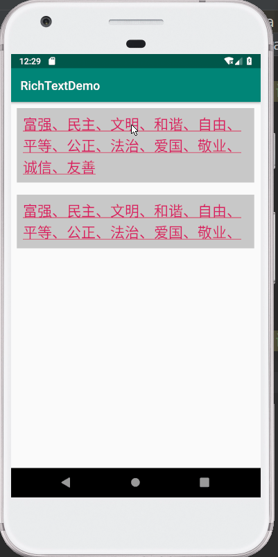
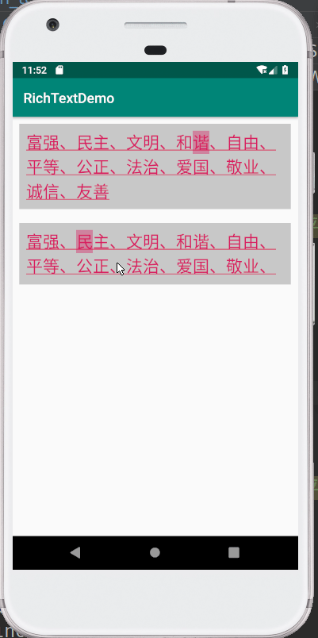
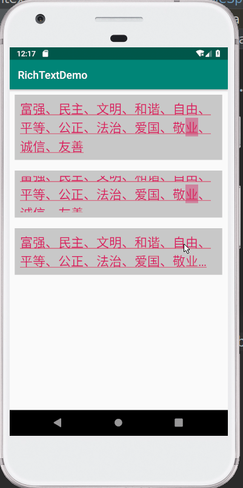
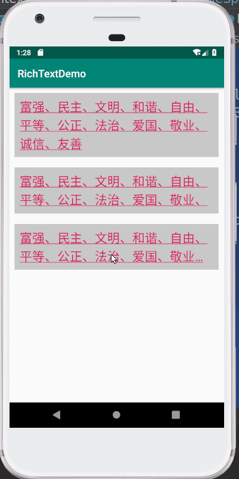

### 前言
`ClickableSpan`可以让我们在点击`TextView`相应文字时响应点击事件，比如常用的`URLSpan`，会在点击时打开相应的链接。而为了让`TextView`能够响应`ClickableSpan`的点击，我们需要为它设置`LinkMovementMethod`，但是这个`LinkMovementMethod`又有着很大的坑，接下来就总结下这些坑和我的解决办法。

### `LinkMovementMethod`的坑
#### 1、点不准
这里将每个字符都设置上`ClickableSpan`，并在点击时`Toast`当前被点的字符（文字颜色和背景色应该是`ClickableSpan`和`LinkMovementMethod`自动帮我们设置的）。设置完`LinkMovementMethod`后，你会发现自己明明没有点到相应的`ClickableSpan`，却还是响应了点击事件，或者明明点到了却不响应，还有的都点到文字外面了，还是会有响应，如下图。

#### 2、`ellipsize`不起作用且`TextView`会滚
将`maxLines`设置为`2`，`ellipsize`为`end`，却发现不起作用，而且整个`TextView`变成可以滚动的了。


### 简单分析下
我们大致看下`LinkMovementMethod`的实现。`LinkMovementMethod`继承自`ScrollingMovementMethod`，从名字可以看出来它是可以滚动的。他有一个`onTouchEvent`方法，看来是处理点击事件的，它会在`action == MotionEvent.ACTION_UP || action == MotionEvent.ACTION_DOWN`的时候去处理事件，获得点击位置的`ClickableSpan`，在`ACTION_UP`的时候响应点击事件。而在`action == MotionEvent.ACTION_MOVE`的时候交给父类`ScrollingMovementMethod`处理，这也就使`TextView`可以滚动，整个`TextView`可以滚动显示所有的文本，也就不会有`ellipsize`的省略号了。  
Android 这样处理`LinkMovementMethod`可能是为了在大量文字时更方便地阅读，可以上下滚动，点击的时候点击的位置可以不遮挡要点击文字。但是在有些情况下就不太适用了，比如只是想缩略的显示两行文本，而点击时要点那儿是那儿，这就需要我们来自己处理`TextView`的点击事件。
### 解决`LinkMovementMethod`滚动的问题
我当时在`stackoverflow`找到了
[解决方法](https://stackoverflow.com/questions/14579785/can-i-disable-the-scrolling-in-textview-when-using-linkmovementmethod)，需要设置`TextView`的`OnTouchListener`，然后自己处理点击事件，大致贴一下源码。
```java
public static class ClickableSpanTouchListener implements View.OnTouchListener {
    @Override
    public boolean onTouch(View v, MotionEvent event) {
        if (!(v instanceof TextView)) {
            return false;
        }
        TextView widget = (TextView) v;
        CharSequence text = widget.getText();
        if (!(text instanceof Spanned)) {
            return false;
        }
        Spanned buffer = (Spanned) text;
        int action = event.getAction();
        if (action == MotionEvent.ACTION_UP || action == MotionEvent.ACTION_DOWN) {
            int x = (int) event.getX();
            int y = (int) event.getY();

            x -= widget.getTotalPaddingLeft();
            y -= widget.getTotalPaddingTop();

            x += widget.getScrollX();
            y += widget.getScrollY();

            Layout layout = widget.getLayout();
            int line = layout.getLineForVertical(y);
            int off = layout.getOffsetForHorizontal(line, x);

            ClickableSpan[] links = buffer.getSpans(off, off, ClickableSpan.class);

            if (links.length != 0) {
                ClickableSpan link = links[0];
                if (action == MotionEvent.ACTION_UP) {
                    link.onClick(widget);
                }
                return true;
            }
        }
        return false;
    }
}
```
这段代码基本上就是从`LinkMovementMethod`的`OnTouchListener`拷贝过来的，我们来看下效果。

`TextView`不再滚动，省略号也有了，很好的解决了`LinkMovementMethod`的问题，但是毕竟基本是拷贝过来的，原来点击`Span`不准的问题还是存在。
### 解决点击`Span`不准的问题

`LinkMovementMethod`在处理点击事件时没有做边缘判断，得到的点击位置结果可能不准，因此要自己手动处理这些边界的问题，经过反复实验，总算解决了这个问题，先来看下效果。  
  
源码如下：
```java
public static class ClickableSpanTouchListener implements View.OnTouchListener {
    @Override
    public boolean onTouch(View v, MotionEvent event) {
        if (!(v instanceof TextView)) {
            return false;
        }
        TextView widget = (TextView) v;
        CharSequence text = widget.getText();
        if (!(text instanceof Spanned)) {
            return false;
        }
        int action = event.getAction();
        if (action == MotionEvent.ACTION_UP || action == MotionEvent.ACTION_DOWN) {
            int index = getTouchedIndex(widget, event);
            ClickableSpan link = getClickableSpanByIndex(widget, index);
            if (link != null) {
                if (action == MotionEvent.ACTION_UP) {
                    link.onClick(widget);
                }
                return true;
            }
        }
        return false;
    }

    public static ClickableSpan getClickableSpanByIndex(TextView widget, int index) {
        if (widget == null || index < 0) {
            return null;
        }
        CharSequence charSequence = widget.getText();
        if (!(charSequence instanceof Spanned)) {
            return null;
        }
        Spanned buffer = (Spanned) charSequence;
        // end 应该是 index + 1，如果也是 index，得到的结果会往左偏
        ClickableSpan[] links = buffer.getSpans(index, index + 1, ClickableSpan.class);
        if (links != null && links.length > 0) {
            return links[0];
        }
        return null;
    }

    public static int getTouchedIndex(TextView widget, MotionEvent event) {
        if (widget == null || event == null) {
            return -1;
        }
        int x = (int) event.getX();
        int y = (int) event.getY();

        x -= widget.getTotalPaddingLeft();
        y -= widget.getTotalPaddingTop();

        x += widget.getScrollX();
        y += widget.getScrollY();

        Layout layout = widget.getLayout();
        // 根据 y 得到对应的行 line
        int line = layout.getLineForVertical(y);
        // 判断得到的 line 是否正确
        if (x < layout.getLineLeft(line) || x > layout.getLineRight(line)
                || y < layout.getLineTop(line) || y > layout.getLineBottom(line)) {
            return -1;
        }
        // 根据 line 和 x 得到对应的下标
        int index = layout.getOffsetForHorizontal(line, x);
        // 这里考虑省略号的问题，得到真实显示的字符串的长度，超过就返回 -1
        int showedCount = widget.getText().length() - layout.getEllipsisCount(line);
        if (index > showedCount) {
            return -1;
        }
        // getOffsetForHorizontal 获得的下标会往右偏
        // 获得下标处字符左边的左边，如果大于点击的 x，就可能点的是前一个字符
        if (layout.getPrimaryHorizontal(index) > x) {
            index -= 1;
        }
        return index;
    }
}
```
首先在`getTouchedIndex`中会首先得到点击的行`line`，这里不能完全相信`layout.getLineForVertical`返回的数据，要自己判断下点击的位置是否真的在该行。然后通过`layout.getOffsetForHorizontal`拿到对应的下标，这里要考虑两个问题，第一个是`ellipsize`省略号的问题，通过`layout.getEllipsisCount`拿到省略的字符数，在判断当前下标的字符是不是已经被省略了；第二个就是`getOffsetForHorizontal`得到的下标会往右偏（就是点`“和”`的右半边的时候会得到`“谐”`的下标），这个大家可以自己打`log`或者`debug`试一下，判断下字符左边的横坐标大于 `x`，就说明点的是前一个字符，要`index -= 1`。  
然后就是根据`index`拿到对用的`ClickableSpan`，通过`Spanned.getSpans`就能拿得到，但是`LinkMovementMethod`中调用`getSpans`时的`start`和`end`都是下标，这样会使得得到的`ClickableSpan`往左偏（注意，`getOffsetForHorizontal`是得到的下标往右偏），这也就是使用`LinkMovementMethod`点不准的原因，这里要使`end = index + 1`。  
最后如果点击到的字符是`ClickableSpan`，那就在`ACTION_DOWN`时直接返回`true`表示要处理该组触摸事件，在`ACTION_UP`时响应`ClickableSpan`的点击事件。
### 结束
至此，我遇到的`ClickableSpan`的坑和解决方法也都讲清楚了，很多涉及源码的地方也都没有深入研究，比如`getOffsetForHorizontal`得到的下标为什么会往右偏之类的问题，之后还需要多多研究源码，这样才能提高自己。照例附上源码 [https://github.com/funnywolfdadada/RichTextDemo](https://github.com/funnywolfdadada/RichTextDemo)。  
下一篇会总结下`Html.formHtml`中`超链接`的处理，怎么自己处理`a`标签，拿到标签属性，同时响应点击事件，在本地打开对应页面。
