### 前言
我们现在在 Android App 中几乎天天都能见到 `ImageSpan`，比如 App 自定义的 emoji 表情和文本中带的一些小图标等。  

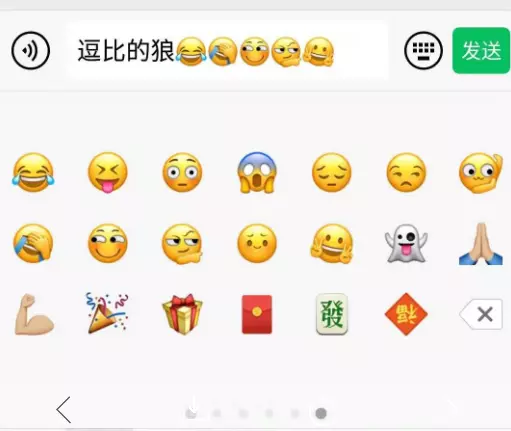

  
你可能要问了`既然都有 emoji 了，为啥还要自定义呢，输入法里的 emoji 和 ImageSpan 的有啥不一样呢？`。要做这玩意儿肯定还是产品提的需求啦，想自己原创一些比较 `贱` 的表情吧。现在好多输入法都自带的 emoji 只是一串字符，`TextView` 在渲染的时候会用系统自带的表情把它们画出来，而`ImageSpan`的话就需要自己手动画对应的图片。  
我在使用`ImageSpan`的过程中也遇到了一些坑，在这里就做下总结，分享出来，有什么不对的地方，也请各路大佬批评指正。
### ImageSpan
#### 1、ImageSpan 来自 ReplacementSpan
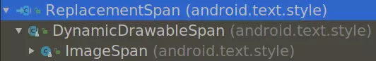
`ReplacementSpan`中空实现了`updateMeasureState`和`updateDrawState`
``` java
/**
 * This method does nothing, since ReplacementSpans are measured
 * explicitly instead of affecting Paint properties.
 */
public void updateMeasureState(TextPaint p) { }

/**
 * This method does nothing, since ReplacementSpans are drawn
 * explicitly instead of affecting Paint properties.
 */
public void updateDrawState(TextPaint ds) { }
```
而新增了`getSize`和`draw`来进行图片位置的确定以及图片内容的绘制
```java

/**
 * Returns the width of the span. Extending classes can set the height of the span by updating
 * attributes of {@link android.graphics.Paint.FontMetricsInt}. If the span covers the whole
 * text, and the height is not set,
 * {@link #draw(Canvas, CharSequence, int, int, float, int, int, int, Paint)} will not be
 * called for the span.
 *
 * @param paint Paint instance.
 * @param text Current text.
 * @param start Start character index for span.
 * @param end End character index for span.
 * @param fm Font metrics, can be null.
 * @return Width of the span.
 */
public abstract int getSize(@NonNull Paint paint, CharSequence text,
                    @IntRange(from = 0) int start, @IntRange(from = 0) int end,
                    @Nullable Paint.FontMetricsInt fm);

/**
 * Draws the span into the canvas.
 *
 * @param canvas Canvas into which the span should be rendered.
 * @param text Current text.
 * @param start Start character index for span.
 * @param end End character index for span.
 * @param x Edge of the replacement closest to the leading margin.
 * @param top Top of the line.
 * @param y Baseline.
 * @param bottom Bottom of the line.
 * @param paint Paint instance.
 */
public abstract void draw(@NonNull Canvas canvas, CharSequence text,
                          @IntRange(from = 0) int start, @IntRange(from = 0) int end, float x,
                          int top, int y, int bottom, @NonNull Paint paint);

```
`getSize`中的各个参数注释中已经解释的很清楚啦，但是这个`FontMetricsInt`是干啥的，注释中是我们可以通过它改变高度。其实它还会改变绘制图片时候的基线`baseline`和 TextView 的布局，布局的问题稍后再说，这个`baseline`又是啥呢，这个网上资料就太多了，简单的说就是文字的绘制都是通过这个`baseline`对齐的，除此之外还有`top`、`ascent`、`descent`、`bottom`和`leading`，可以参考下图，详细的就需要上网查资料吧。顺便附上`扔物线`大神的`HenCoder`教程: [自定义 View 1-3 drawText() 文字的绘制](https://hencoder.com/ui-1-3/)  
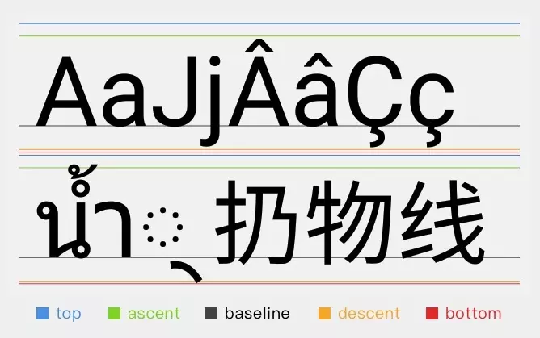 
`draw`方法就比较直白一点，就是画图嘛（当然需要一定的自定义绘制基础，不懂的可以参考上面的`HenCoder`教程），其中的`y`就是刚才说的`baseline`，整个一行的文本（或图片）都是以他对齐的，`draw`方法需要注意的是在使用`ellipsize`时要自己处理（你说的你行你上呀，画布画笔都给你了，省略号也自己画吧）。  
而继承它的`DynamicDrawableSpan`只是简单的实现了`ALIGN_BOTTOM`和`ALIGN_BASELINE`两种对齐方式，同时给了`public abstract Drawable getDrawable();`让其子类实现获得图片资源的方法，而继承`DynamicDrawableSpan`的`ImageSpan`则实现了该方法，提供了通过`drawable`、`resouce id`和`uri`等方式获得图片的方法。  
由此可见，`DynamicDrawableSpan`和`ImageSpan`其实没有干太多的事情，真正要用好`ImageSpan `还是需要熟悉`getSize`和`draw`两个方法，接下来就稍微深入地讨论下这两个方法使用过程中的坑。
#### 2、ImageSpan 的 getSize 和 draw 都干了啥
其实这两个方法的实现都在`DynamicDrawableSpan`中，`getSize`简单粗暴的设置了`FontMetricsInt`，`fm.top = fm.ascent = -drawable高度; fm.bottom = fm.descent = 0;`，并返回`drawable`的宽度，乍一看没问题，但是这一块是有坑的，稍后详细说。  
`draw`方法中处理了对齐方式，底部对齐的就设置`transY = bottom - b.getBounds().bottom;`，然后把画布挪过去再进行绘制。基线对齐的还要`transY -= paint.getFontMetricsInt().descent;`，原因是`baseline`在`bottom`上面距`descent`的地方，所以底部对齐后再减去`descent`就与`baseline`对齐了。
`注：这里的“底部对齐”指的是整行文本的底部，而不是文字的底部`  
接下来就来试一下不同对齐的效果吧。
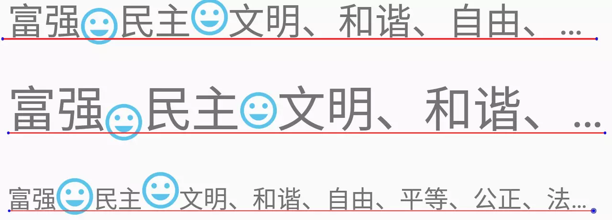
图中的笑脸从左到右，第一个是`ALIGN_BOTTOM`，第二个是`ALIGN_BASELINE`，用了三种字号来展示效果，图中红线大致就是`baseline`的位置。  
接下来重写下`draw`方法，搞一个顶部对齐的`ImageSpan`，`draw`的时候把画布移动到顶部`canvas.translate(x, top);`，效果如下图所示，第三个就是顶部对齐的。

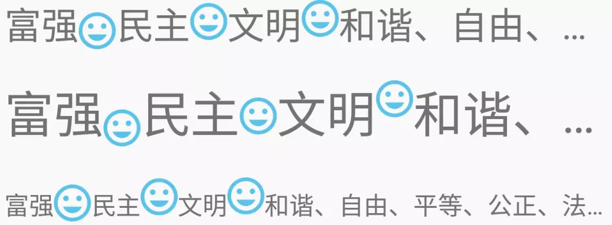
#### 3、居中对齐的 ImageSpan 怎么搞
当然，我们最想看的还是`文字居中对齐`，看起来更舒服一点。既然要与文字对齐，那就需要有与文字对齐的参考系，上面用的`bottom`和`top`注释中也都写了，是`Bottom of the line`和`Top of the line`，所以它们都是整行的，而不是文字的，要想与文字对齐，只能用`baseline`，因为绘制文字时也是以它对齐，然后再算出图片需要相对偏移多少就行了。  
那么问题就来了，图片的`baseline`在哪里呢？这就要用到之前提到过的`getSize`中的`FontMetricsInt`，它设置了图片的`ascent`和`descent`等东西，其实也就设置了`baseline`的相对位置，这里注意的是，`ascent`和`descent`都是参考`baseline`的，以`baseline = 0`，`ascent < 0`在上面，`descent > 0`在下面。从`DynamicDrawableSpan`的`getSize`实现中可以知道图片的`baseline`是与`descent`重合的，要与文字居中就是文字的`ascent`和`descent`要和图片的居中，这样我们知道了图片的`baseline`，就可以确定图片与文字居中对齐时的位置了。

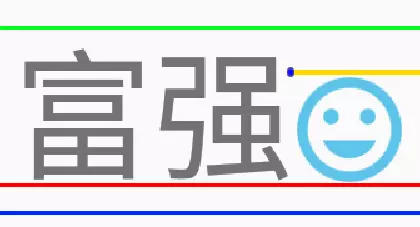
上图中绿线为文字的`ascent`，红线是`baseline`，蓝线是文字的`descent`，黄线是图片的`ascent`或`top`。设`transY`为画布最终要偏移的纵坐标，`y`为`baseline`坐标，`fm`为文字的`FontMetrics`，`textHeight = fm.descent - fm.ascent`为文字高度，`drawableHeight`为图片高度。  
首先图片是与文字`baseline`对齐的，我们要先把图片底部与文字的`descent`对齐，`transY = y - fm.descent`
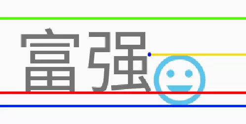
图片与文字的高度差为`offsetHeight = textHeight - drawableHeight`，图片在往上移动一半的高度差，`transY -= offsetHeight / 2`得到图片底部坐标，再减去图片的高度就得到最终的纵坐标偏移量，`trasnY -= drawableHeight`。  
化简下就是`transY = y + (fm.descent + fm.ascent) / 2 - drawableHeight / 2`。  
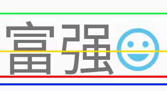
当然你也可以理解为，`y + (fm.descent + fm.ascent) / 2`得到文字中间的纵坐标，在减去`drawableHeight / 2`得到图片顶部的位置。  
最终绘制出来的效果如下图，从左数第四个笑脸就是`居中对齐`的：  

一切都是那么的美好，放在不同大小的字体中都显得十分的和谐，但如果文章就写到这里，那就各位观众老爷太不负责了。  
`当我们还沉浸在“居中对齐”的美好中时，QA 同学突然提 Bug 了：“你这个图片底部怎么被截了一部分？”，“。。。啥？”`
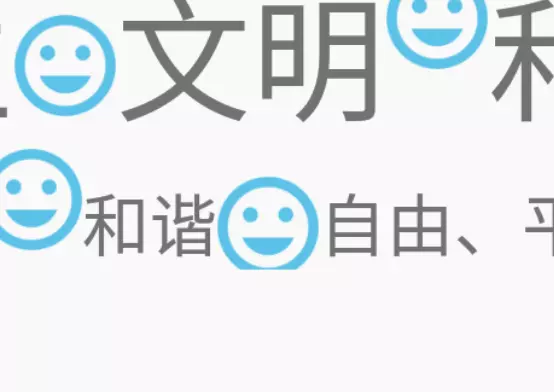
看`和谐`和`自由`间的笑脸，之前为了显示清楚，也为了扩大`TextView`的画布范围，我给它们都加了`padding`，现在把`padding`都设为`0`就出现了这种情况。究其原因，`居中对齐`相对其他对齐方式都往下移了一小部分，导致`ImageSpan`绘制的图片超出了`TextView`的范围，所以就画不出来了。  
要解决这类问题就要用到最开始说的能够改变`baseline`和布局的`getSize`。大致浏览下`TextView`的源码也能看到，`TextView`在`onMeasure`时会通过它的`Layout`去计算高度，在`StaticLayout`中会有`Span`高度计算之类的代码，`TextView`的`Layout`通过计算一行文本或`Span`的高度生成一些`LineHeightSpan`用于表示每行的高度，这里就不再深入源码了，免得无法自拔。
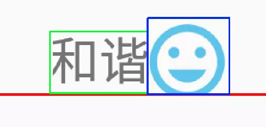
简单画下示意图，红线表示`bottom`，绿框表示文字计算出的区域，蓝色是图片计算的区域。图片为了`居中对齐`往下挪了一点，导致上面留出了空白，而下面缺画不出来了。我们可以通过重写`getSize`来改变图片计算的绘制区域，从而改变`TextView`测量时得到的绘制范围，图片就能正常绘制出来了。  
这部分代码比较简单，原理也跟`draw`中`居中对齐`的处理类似，就直接贴代码了。
```java
@Override
    public int getSize(Paint paint, CharSequence text, int start, int end, Paint.FontMetricsInt fm) {
//        return super.getSize(paint, text, start, end, fm);
        Drawable d = getDrawable();
        Rect rect = d.getBounds();

        float drawableHeight = rect.height();
        Paint.FontMetrics paintFm = paint.getFontMetrics();
        float textHeight = paintFm.descent - paintFm.ascent;

        if (fm != null) {
            float textCenter = (paintFm.descent + paintFm.ascent) / 2;
            fm.ascent = fm.top = (int) (textCenter - drawableHeight / 2);
            fm.descent = fm.bottom = (int) (drawableHeight + fm.ascent);
        }

        return rect.right;
    }
```

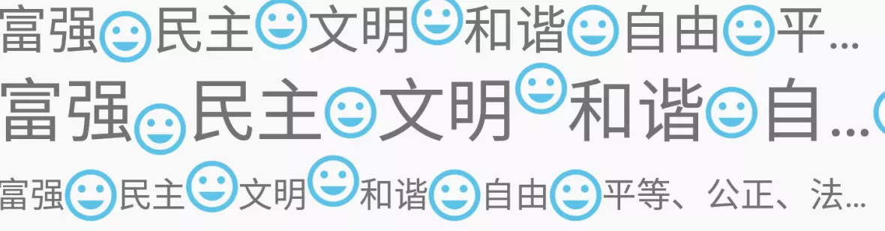
效果也很直观，每一行最右边的是修改后的`居中对齐`的`ImageSpan`，倒数第二个是没有重写`getSize`的，它也由于扩宽了显示范围而显示完整了，布局大致如下图所示。  
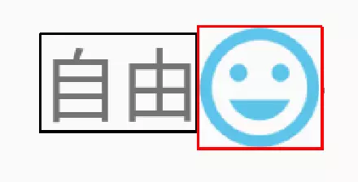
由于图片的绘制区域整体往下移了一点，`TextView`的这一整行都被顶高一点，这在`TexView`上倒是没啥影响，但在`EditText`上就不一样了。你想呀，本来只有文字的时候是这么高，加了图片（表情）之后这一行变高了，就会抖动一下，删掉时也会抖一下。大家可以拿微信试一下，在纯文本加第一个表情，或者纯表情加第一个文本的时候，都会轻微地抖一下，也都是这个原因。  
这种抖动的问题也不是不能解决，其实在`getSize`的时候把图片高度设置成和文字高度一样，再手动把图片的`Bitmap`调整到对应大小，重写`getDrawable`自己做下图片缓存，就没问题了。但是这样也带了性能损耗和内存浪费，有点得不偿失，怎么选还是看需求吧。  
#### 4、Ellipsize 的省略号被“吃”掉了
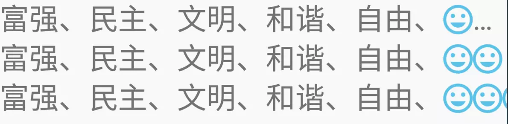
这三行文本，第一行在`平`字上加一个`ImageSpan`，第二行在`平`和`等`各加一个，第三行把后面的`、`也加上`ImageSpan`。可以明显看出省略号被`ImageSpan`给`吃`掉了。  
要解决这个问题就要知道啥时候是倒末尾了，不能在往后画了。其实`TextView`的`Layout`中有`getEllipsisStart`和`getEllipsisCount`可以知道哪里被省略了，但`draw`里面并没有`TextView`的引用，而且你拿到的`text`里的内容虽然变了，但它的长度还是折叠之前的长度（WTF），那怎么办呢？  
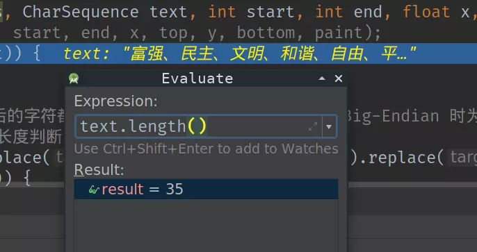
不知道你有没有想过，那既然`text`被折叠了，但它的长度又没变，那省略号后面的是啥东西呢。
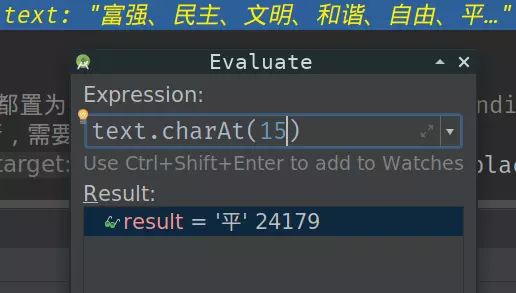
这个没问题。
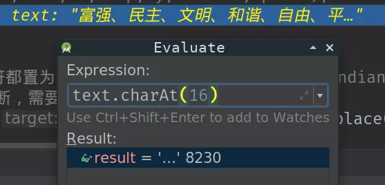
这个就是我们折叠后的省略号，它不是三个`'.'`，而是一个字符`'…'`
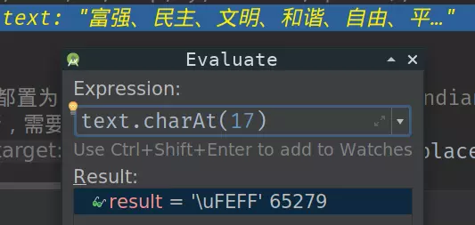
再往后，一直到最后就都是这玩意儿了`'\uFEFF'`，上网一查，原来是 `BOM（Byte Order Mark）`，`Big-Endian` 时为`'\uFEFF'`，`Little-Endian`时为`'\uFFFE'`，这些字符不影响显示，但影响长度判断，需要去掉。在`draw`的前面加上
```java
text = text.toString().replace("\uFEFF", "").replace("\uFFFE", "");
if (start >= text.length()) {
    return;
}
```
这里为了安全起见，把`'\uFFFE'`也给替换掉，这样超过省略号的部分也就不会再绘制了。
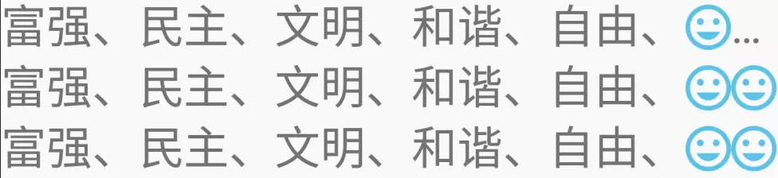
但是省略号还没画出来，为了把它也画出来，我们需要自己判断下当前传给我们的`text`是不是要画`'…'`，是的话就画`'…'`，不是的话就画原来的图片。
```java
if (end > text.length()) {
    end = text.length();
}
String subText = text.subSequence(start, end).toString();
if ("…".equals(subText)) {
    canvas.drawText(text, start, end, x, y, paint);
    return;
}
```
这样就 OK 啦！
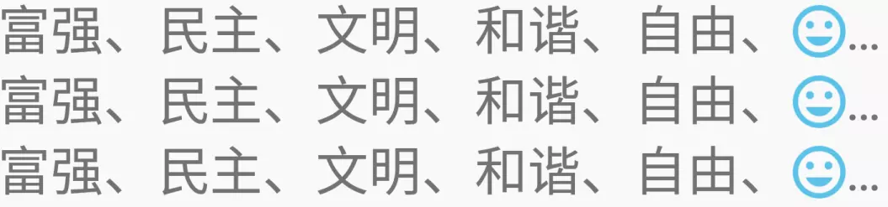
### 结束
罗嗦了这么多，也算是把使用`ImageSpan`时遇到的问题说清楚了，由于没有详细研究`TextView`及其`Layout`的源码，那里讲的有问题还请各位大佬批评指正。下面附上做实验用的源码，[https://github.com/funnywolfdadada/RichTextDemo](https://github.com/funnywolfdadada/RichTextDemo)。下一篇会讲一下`ClickableSpan`的坑和我的解决方法。
