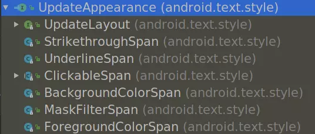
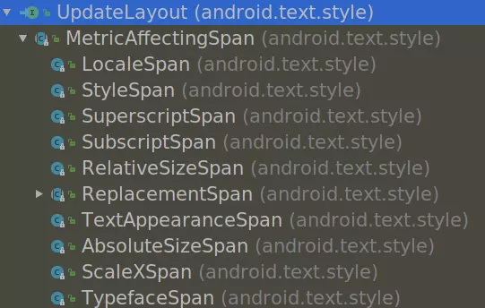
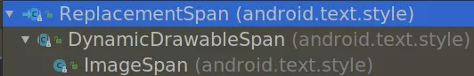
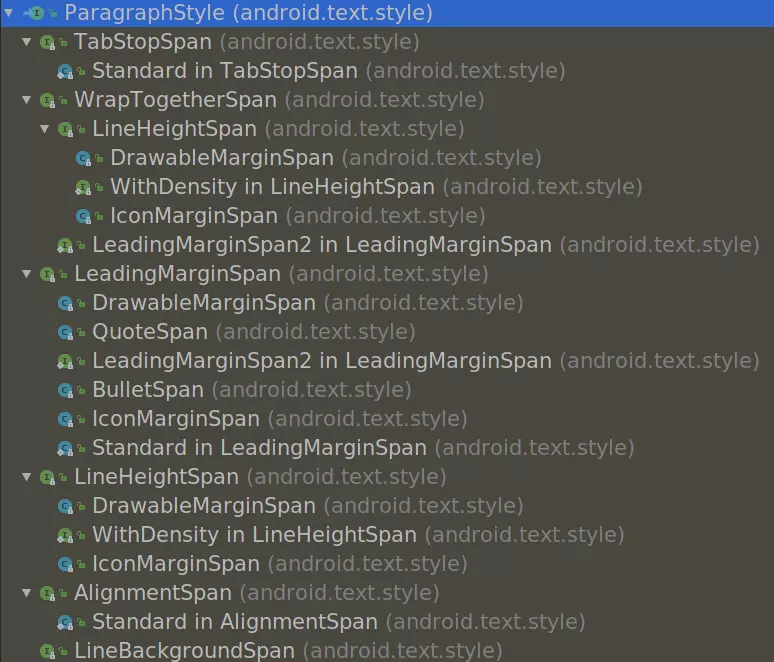

### 前言
最近一直在做 TextView 富文本处理的工作，接触到了`比较纤细的粗`、`字体颜色`、`内联图片`、`处理 ellipsize`、`LinkMovementMethod 的坑`和`ClickableSpan 的点击事件`等问题，经过`查资料`、`看源码`和`做实验`三连之后，对 Android TextView 的富文本处理有了小小的体会，写篇博客总结下自己的收获，日后在遇到类似问题也方便回顾。
### android.text.style
富文本相关的 `xxxSpan` 基本都在这个包下面啦，`android-28` 里的有 42 个文件，包含了各式各样`设置字体`、`自定义绘制`、`点击事件`、`段落样式`的 Span。

#### 1、CharacterStyle（来来来，你来挑画笔）
多数 Span 的基类，有一个抽象方法：  
`public abstract void updateDrawState(TextPaint tp);`  
TextPaint 继承自 Paint，这就给了我们一个机会去操纵画笔，设置`前景色`、`背景色`、`字体颜色`、`字体粗细`、`字体大小`等等等等，想怎么设置怎么设置。  
```
设计：这里的用户名要单独加粗
我：好，加粗
设计：不行，这样太粗了，要那种比较纤细的粗
我：我 。。。
```
`Paint.setFakeBoldText`就适用于这种情况，这个方法其实就是把画笔变粗了而已，而不是使用粗体的字体，要更精细地控制画笔粗细可以用`Paint.setStrokeWidth`。  
附上解决问题链接： 
[如何实现 “中间这几个字要加粗，但是不要太粗，比较纤细的那种粗” ？](https://juejin.im/post/597d88f75188257fc2177c36)
#### 2、UpdateAppearance

这个接口是空的，只是用来标识的，表示 Span 会改变字体的外貌（颜色、形状等），
`UpdateLayout` 稍后说，其他的 Span 都实现 `CharacterStyle` 的 `updateDrawState` 方法，并对画笔进行设置，达到变换字体外观的目的。
#### 3、ClickableSpan
增加了一个抽象方法`public abstract void onClick(@NonNull View widget);`，用于响应点击事件（需要外部配合，如 `LinkMovementMethod`或`OnTouchListener`）。  
`URLSpan` 继承自它，存储一个 URL，点击时用 `startActivity` 打开。
#### 4、UpdateLayout

跟 `UpdateAppearance` 一样是一个标识，从名字就能看出来，它还改变布局（位置、大小等），
唯一的继承类 `MetricAffectingSpan`有一个抽象方法
`public abstract void updateMeasureState(@NonNull TextPaint textPaint);`，用于改变字体的大小等属性。
#### 5、ReplacementSpan （画布给你，你行你来画）

之前的 Span 我们只能设置 `Paint`，能做的事情很有限， `ReplacementSpan`比`MetricAffectingSpan`更进一步，直接自己接管了绘制的任务，它有两个抽象方法`public abstract int getSize(Paint paint, CharSequence text, int start, int end, Paint.FontMetricsInt fm);`和`public abstract void draw(Canvas canvas, CharSequence text, int start, int end, float x, int top, int y, int bottom, Paint paint);`分别用于确定绘制范围和绘制内容。这就使得`ReplacementSpan`有很大的灵活性，想画啥就画啥，经常用于画内联的图片之类的东西。
#### 6、其他的 Span
`ParagraphStyle`相关的也有很多 Span，主要用于段落样式的处理，我也没用过，就不瞎说了

还有`TtsSpan`、`SuggestionSpan`、`EasyEditSpan`、`SpellCheckSpan`、`SuggestionRangeSpan` 。。。

### 最后
Android 提供了这么多 Span，我平时用的比较多的也就`ReplacementSpan`和`ClickableSpan`，`ReplacementSpan`用于现实自定义的 emoji 表情和内联的一些小图标之类的，`ClickableSpan`则用于自定义点击事件，比如在点击`@Somebody`、`#话题#`、`查看图片`等操作时，用本地的页面打开。这两个 Span 用的比较多，坑也比较多，接下来会专门对这两个 Span 做个稍微详细的总结。  
`Html.fromHtml`实现的富文本处理其实也是利用 Android 提供的 Span 实现，只不过 TextView 支持的标签十分有限，做一些简单的处理还行，毕竟 TextView 主要显示文本嘛，干嘛整那么复杂。我平时用的时候也主要是用`超链接`，然后通过自定义的`ClickableSpan`和`Route`打开本地页面。
