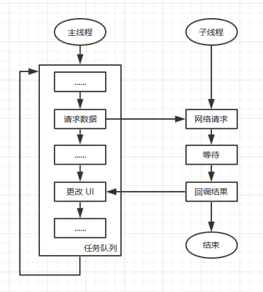
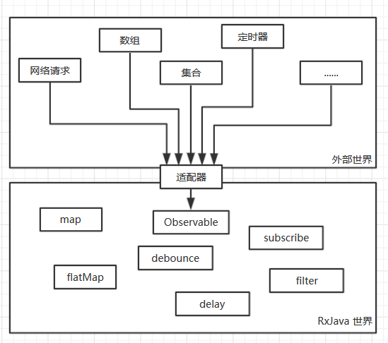
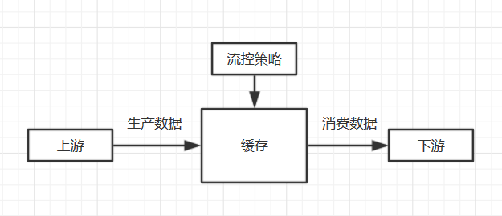
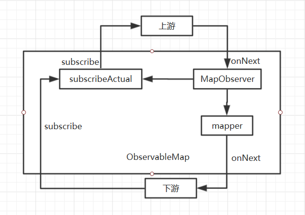
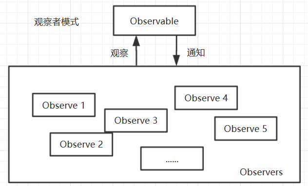

# 不那么好用的 RxJava

## 前言
当我们提到 RxJava 时会想到什么，**异步**、**事件流**、**响应式编程**、**观察者模式**、**链式编程**等等。对于 Android 开发者来说，在 kotlin 出现之前，RxJava 的编程方式的确给我们带来了**很爽**的编程体验，但是在不断的使用过程，感觉 RxJava 其实也没那么**爽**，反而有时候会觉得不是那么的方便，或者说它并没有我们想象的那么「强大」。最近也看了几篇很好的文章，也使我进一步加深么对 RxJava 的理解，这里也推荐给大家：  
[RxJava 沉思录（一）：你认为 RxJava 真的好用吗？](https://juejin.im/post/5b8f536c5188255c352d3528)  
[我为什么不再推荐RxJava](https://juejin.im/post/5cd04b6e51882540e53fdfa2)  
这里我只是简单谈一谈自己对 RxJava 的理解和自己的一些看法，欢迎大家批评指正！！

## 异步处理
看到很多文章都提到 RxJava 处理异步多么强大，各种线程切换的操作符很好地解决了 Android 上的主线程和子线程的数据传递。RxJava 也解决了「回调地狱（Callback Hell）」，异步处理不再需要回调一层套一层的搞，而是用链式调用的方式完成不同线程的回调。  
首先我们来看下「异步」为什么这么让人头疼。很多像 Android 一样的 UI 框架都限制改变 UI 的代码必须运行在主线程，而且主线程不允许被阻塞，或者干脆就是单线程模型，这样也可以很好的解决 UI 层的同步和性能问题。但是渲染 UI 的数据往往需要进行网络、文件或数据库等 IO 操作，或者需要在拿到数据后进行较长时间的后台运算，这些操作只能放在子线程来做，主线程当然不会等着子线程完成这些，这样就需要子线程完成操作后「异步」地通知主线程，而这个「异步通知」在目前来看只能通过回调的形式实现。  
  
而如果业务比较复杂，涉及多次异步操作，比如：(请求数据 A) -> (更新 UI) -> (请求数据 B) -> (更新 UI) -> (请求数据 C) -> (更新 UI)，那处理起来就会比较复杂。  
假设我们有以下操作：
- getDataA()：请求数据 A
- doSomethingOnMainA()：在主线程执行 A 操作
- getDataB()：请求数据 B
- doSomethingOnMainB()：在主线程执行 B 操作
如果采用传统的回调嵌套方式，可能会有如下的代码：
``` java
Thread {
    val a = getDataA(1)
    runOnUiThread {
        val resultA = doSomethingOnMainA(a)
        Thread {
            val b = getDataB(resultA)
            runOnUiThread {
                val resultB = doSomethingOnMainB(b)
                log("doCallback: Result = $resultB")
            }
        }.start()
    }
}.start()
```
这种方式即不容易理解，也不容易维护，如果再新增一些其他业务难免会造成「回调地狱」。当然，实际项目中估计也不会有人这么用，Android 提供的 `AsyncTask` 也能一定程度上解决这种问题。  
而 RxJava 用链式调用的方式把上述操作串起来，然后上一级的操作完成后会自动调用下一个操作,上面的代码也可以写成这样。
``` java
Observable.just(1)
    .observeOn(Schedulers.io())
    .map { getDataA(it) }
    .observeOn(AndroidSchedulers.mainThread())
    .map { doSomethingOnMainA(it) }
    .observeOn(Schedulers.io())
    .map { getDataB(it) }
    .observeOn(AndroidSchedulers.mainThread())
    .map { doSomethingOnMainB(it) }
    .subscribe { log("doRxJava: Result = $it") }
```
RxJava 的链式写法比单纯的回调嵌套要更加清晰，更加容易理解，也更好维护和更改代码。当然这种链接调用也不是 RxJava 独有的，`Promise` 也可以使用链式调用实现异步，我对 `Promise` 没有深入了解，这里就不多阐述了。  
但不管怎么写，这种显式地用回调的方式都让人感觉很不舒服，让我们回归本质，这其实就是一个「串行」操作，依次调用不同的函数而已，只不过要考虑线程切换的问题，让我们用同步的代码写一下看看（暂不考虑线程切换问题）。
``` java
val a = getDataA(1)
val resultA = doSomethingOnMainA(a)
val b = getDataB(resultA)
val resultB = doSomethingOnMainB(b)
```
这样当然是最简单明了的书写方式，而 kotlin 的协程就是一种**用写同步代码的方式来写异步**的工具，上面的逻辑用协程实现如下。
``` java
GlobalScope.launch(Dispatchers.Main) {
    val a = withContext(Dispatchers.IO) { getDataA(1) }
    val resultA = doSomethingOnMainA(a)
    val b = withContext(Dispatchers.IO) { getDataB(resultA) }
    val resultB = doSomethingOnMainB(b)
    log("doCoroutine: Result = $resultB")
}
```
之前也说了，异步操作的回调是少不了的，但是这里为什么没有回调呢。其实协程是在编译期，用状态机的方式帮我们做了回调。上面的代码用状态机写大致如下（为了方便理解，可能与实际反编译的代码不同）。
``` java
class SuspendLambda {
    int label = 0
    public void invoke(Object result) {
        switch (label) {
            case 0 :
                label++
                result = getDataA(result)
                if (result == SUSPEND) { return }
            case 1:
                label++
                result = doSomethingOnMainA(result)
                if (result == SUSPEND) { return }
            case 2 :
                label++
                result = getDataB(result)
                if (result == SUSPEND) { return }
            case 3:
                label++
                result = doSomethingOnMainB(result)
                if (result == SUSPEND) { return }
        }
    }
}
```

## 事件流


## RxJava 的设计模式

### 适配器模式
在 RxJava 的世界里，一切其他事件都可以转化成 `Observable` 或者更准确的说是**可观察者**（如果考虑上 `Single`、`Maybe`、`Flowable` 等）。

RxJava 用 `just`、`merge`、`range`、`timer`、`zip` 等等静态方法和 `Observable` 的一些子类实现了外部世界到 RxJava 世界的适配工作，还一个典型的例子就是 `Retrofit` 原生返回的 `Call` 到 `Observable` 的适配，具体代码在 `retrofit2.adapter.rxjava2.RxJava2CallAdapter` 中，核心函数 `adapt()` 如下。
``` java
public Object adapt(Call<R> call) {
    // 这里是做适配的代码，根据同步还是异步把 Call 适配成 Observable
    Observable<Response<R>> responseObservable = isAsync
        ? new CallEnqueueObservable<>(call)
        : new CallExecuteObservable<>(call);

    Observable<?> observable;
    // 这里根据 isResult 和 isBody 做了另一层包装
    if (isResult) {
      observable = new ResultObservable<>(responseObservable);
    } else if (isBody) {
      observable = new BodyObservable<>(responseObservable);
    } else {
      observable = responseObservable;
    }

    // 设置调度器
    if (scheduler != null) {
      observable = observable.subscribeOn(scheduler);
    }

    // Flowable、Single、Maybe 和 Completable 的包装/适配
    if (isFlowable) {
      return observable.toFlowable(BackpressureStrategy.LATEST);
    }
    if (isSingle) {
      return observable.singleOrError();
    }
    if (isMaybe) {
      return observable.singleElement();
    }
    if (isCompletable) {
      return observable.ignoreElements();
    }
    return observable;
  }
```

### 生产消费者模式
上游不断地生产事件，然后下游一级一级地消费上游的事件。这在 `Observable` 上体现的不是很明显，可能用带流控的 `Flowable` 能更加说明这一点，上游不断地生产数据，往缓存池里放，下游则从缓存池中消费。  


### 装饰者模式
RxJava 主要是用装饰者模式实现了整条链的建立和事件传递。

举个简单的例子，`map` 操作符在**建立链**的时候返回的是 `ObservableMap`，和上游的源一样是 `Observable` 的一个子类。它在被 `subscribe` 的时候会去调用 `subscribeActual` 方法，在这里调用 `source.subscribe(new MapObserver<T, U>(t, function))`，调用到源的 `subscribe` 方法，从而实现**订阅**从下游往上游传递，同时也实现了自己的操作逻辑，把上游订阅给自己的一个静态内部类 `MapObserver`。`MapObserver` 是对下游观察者进行了一次装饰，和其他观察者一样都实现了 `Observer`，在收到上游的**事件传递** `onNext(T t)` 时，先调用 `Function<? super T, ? extends U> mapper` 实现自己的逻辑，再分发给下游 `downstream.onNext(v)`。

### 观察者模式？
用 RxJava 的基本都知道观察者模式，但从上面的分析也可以看出，不管是异步操作，还是事件流的建立和处理，和观察者模式的关系并不是很密切，这可能也是我们对 RxJava 的误解之一。  
「观察者设计模式定义了对象间的一种一对多的组合关系，以便一个对象的状态发生变化时，所有依赖于它的对象都得到通知并自动刷新」。  

我们平时用的 `Observable` 和观察者模式关系不大，简单的看代码就能发现，`Observable` 只存了一个上下游，也就是说往下游发事件只能有一个下游的接收者，这哪儿是什么观察者模式，只是套用了这一名字而已。而且我们用的基本都是些 `Cold Observable`，简单点说就是「只有当有订阅者订阅的时候，Cold Observable 才开始执行发射数据流的代码，并且每个订阅者订阅的时候都独立的执行一遍数据流代码」，所以这就更说明不是观察者模式了。  
而在 RxJava 里真正称得上是观察者模式的就是 `Subject`，大概看下简介「Represents an {@link Observer} and an {@link Observable} at the same time, allowing multicasting events from a single source to multiple child {@code Observer}s.」
