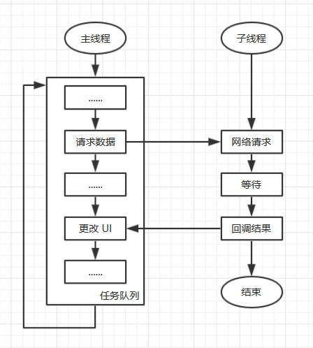
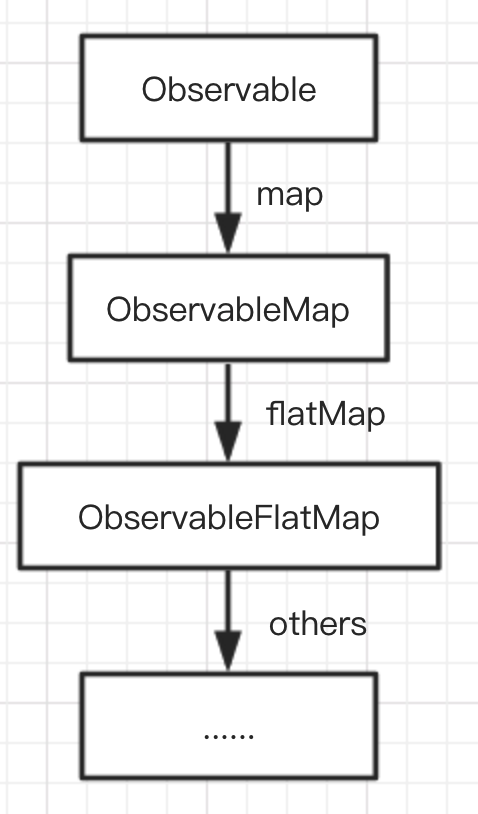
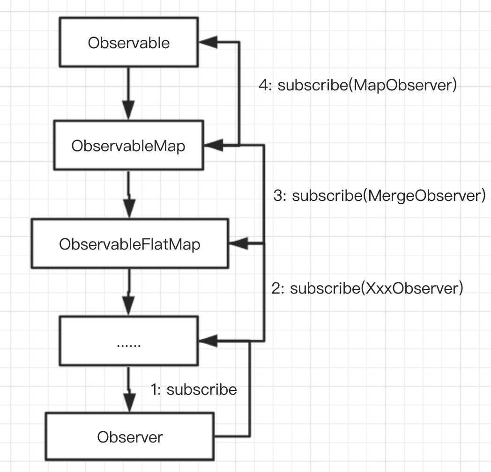
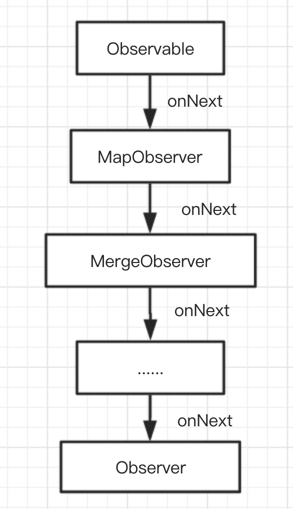
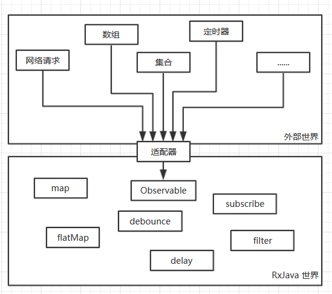
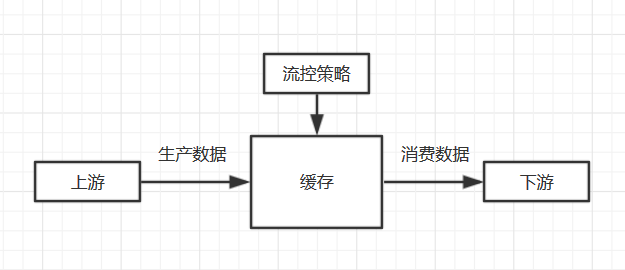
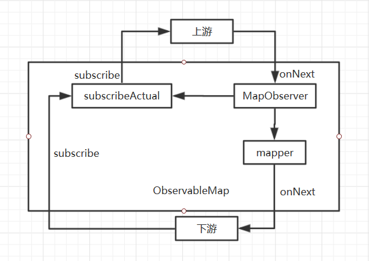
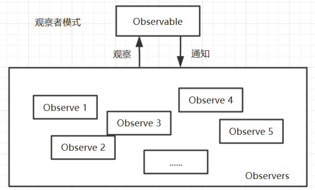

# 对 RxJava 的一点小小见解

## 前言
当我们提到 RxJava 时会想到什么，**异步**、**事件流**、**响应式编程**、**观察者模式**、**链式编程**等等。对于 Android 开发者来说，在 kotlin 出现之前，RxJava 的编程方式的确给我们带来了**很爽**的编程体验，但是在不断的使用过程，感觉 RxJava 其实也没那么**爽**，反而有时候会觉得不是那么的方便，或者说它并没有我们想象的那么「强大」。最近也看了几篇很好的文章，也使我进一步加深么对 RxJava 的理解，这里也推荐给大家：  
[RxJava 沉思录（一）：你认为 RxJava 真的好用吗？](https://juejin.im/post/5b8f536c5188255c352d3528)  
[我为什么不再推荐RxJava](https://juejin.im/post/5cd04b6e51882540e53fdfa2)  
[More of RxJava](https://juniperphoton.dev/more-of-rxjava/)
这里我只是简单谈一谈自己对 RxJava 的理解和自己的一些看法，欢迎大家批评指正！！

## 异步处理
看到很多文章都提到 RxJava 处理异步多么强大，各种线程切换的操作符很好地解决了 Android 上的主线程和子线程的数据传递。RxJava 也解决了「回调地狱（Callback Hell）」，异步处理不再需要回调一层套一层的搞，而是用链式调用的方式完成不同线程的回调。  
首先我们来看下「异步」为什么这么让人头疼。很多像 Android 一样的 UI 框架都限制改变 UI 的代码必须运行在主线程，而且主线程不允许被阻塞，或者干脆就是单线程模型，这样也可以很好的解决 UI 层的同步和性能问题。但是渲染 UI 的数据往往需要进行网络、文件或数据库等 IO 操作，或者需要在拿到数据后进行较长时间的后台运算，这些操作只能放在子线程来做，主线程当然不会等着子线程完成这些，这样就需要子线程完成操作后「异步」地通知主线程，而这个「异步通知」在目前来看只能通过回调的形式实现。  
  

而如果业务比较复杂，涉及多次异步操作，比如：(请求数据 A) -> (更新 UI) -> (请求数据 B) -> (更新 UI) -> (请求数据 C) -> (更新 UI)，那处理起来就会比较复杂。  

假设我们有以下操作：
- getDataA()：请求数据 A
- doSomethingOnMainA()：在主线程执行 A 操作
- getDataB()：请求数据 B
- doSomethingOnMainB()：在主线程执行 B 操作
如果采用传统的回调嵌套方式，可能会有如下的代码：
``` java
Thread {
    val a = getDataA(1)
    runOnUiThread {
        val resultA = doSomethingOnMainA(a)
        Thread {
            val b = getDataB(resultA)
            runOnUiThread {
                val resultB = doSomethingOnMainB(b)
                log("doCallback: Result = $resultB")
            }
        }.start()
    }
}.start()
```
这种方式即不容易理解，也不容易维护，如果再新增一些其他业务难免会造成「回调地狱」。当然，实际项目中估计也不会有人这么用，Android 提供的 `AsyncTask` 也能一定程度上解决这种问题。  
而 RxJava 用链式调用的方式把上述操作串起来，然后上一级的操作完成后会自动调用下一个操作,上面的代码也可以写成这样。
``` java
Observable.just(1)
    .observeOn(Schedulers.io())
    .map { getDataA(it) }
    .observeOn(AndroidSchedulers.mainThread())
    .map { doSomethingOnMainA(it) }
    .observeOn(Schedulers.io())
    .map { getDataB(it) }
    .observeOn(AndroidSchedulers.mainThread())
    .map { doSomethingOnMainB(it) }
    .subscribe { log("doRxJava: Result = $it") }
```
RxJava 的链式写法比单纯的回调嵌套要更加清晰，更加容易理解，也更好维护和更改代码。当然这种链接调用也不是 RxJava 独有的，`Promise` 也可以使用链式调用实现异步，我对 `Promise` 没有深入了解，这里就不多阐述了。  
但不管怎么写，这种显式地用回调的方式都让人感觉很不舒服，让我们回归本质，这其实就是一个「串行」操作，依次调用不同的函数而已，只不过要考虑线程切换的问题，让我们用同步的代码写一下看看（暂不考虑线程切换问题）。
``` java
val a = getDataA(1)
val resultA = doSomethingOnMainA(a)
val b = getDataB(resultA)
val resultB = doSomethingOnMainB(b)
```
这样当然是最简单明了的书写方式，而 kotlin 的协程就是一种**用写同步代码的方式来写异步**的工具，上面的逻辑用协程实现如下。
``` java
GlobalScope.launch(Dispatchers.Main) {
    val a = withContext(Dispatchers.IO) { getDataA(1) }
    val resultA = doSomethingOnMainA(a)
    val b = withContext(Dispatchers.IO) { getDataB(resultA) }
    val resultB = doSomethingOnMainB(b)
    log("doCoroutine: Result = $resultB")
}
```
之前也说了，异步操作的回调是少不了的，但是这里为什么没有回调呢。其实协程是在编译期，用状态机的方式帮我们做了回调。上面的代码用状态机写大致如下（为了方便理解，可能与实际反编译的代码不同）。
``` java
// SuspendLambda 整块代码都是回调，通过状态机的方式，每次都执行 invoke
class SuspendLambda {
    // 表示执行到哪段代码
    int label = 0
    public void invoke(Object result) {
        switch (label) {
            case 0 :
                label++
                // 执行 getDataA
                result = getDataA(result)
                // 如果这段代码需要挂起，就直接返回，等待挂起结束会继续回调 invoke
                // 如果不挂起，就继续执行下面的，没有 break
                if (result == SUSPEND) { return }
            case 1:
                label++
                // 这里的参数就是之前上一段 getDataA 的返回值
                result = doSomethingOnMainA(result)
                if (result == SUSPEND) { return }
            case 2 :
                label++
                result = getDataB(result)
                if (result == SUSPEND) { return }
            case 3:
                label++
                result = doSomethingOnMainB(result)
                if (result == SUSPEND) { return }
        }
    }
}
```
协程通过状态机的方式，将代码分段，然后执行时需要挂起就返回，等待挂起结束再次执行 `invoke` 就行，对于不同线程切换的问题，只需要把这段代码抛到不同的 `Dispatchers` 的线程上就行，可以认为整串代码就是个大的 `Runnable`，然后被分段成小的 `Runnable` 在不同的地方回调。但是书写的时候我们可以按照串行执行的思想，不需要考虑回调的问题，清晰易懂。
kotlin 协程的解析可以参考这篇文章 [了解Kotlin协程实现原理这篇就够了](https://ethanhua.github.io/2018/12/24/kotlin_coroutines/)  

RxJava 处理异步的确比嵌套回调好用，但是异步并不能算是 RxJava 的强项，他能做的别的方式也能做，甚至做得更好，而且随着链的边长，各种操作符会生成很多临时对象，这样还是挺消耗资源的。

## 事件流
RxJava 的强项不在异步，事件流处理才是 RxJava 厉害的地方，它以响应式的编程方式完成对各种事件流的复杂处理。RxJava 涉及的事件流处理过程简单来说可以分为：流的建立、订阅、事件处理和出错处理，下面以 `Observable` 为例简单分析下。

### 流的建立
一条 RxJava 事件流（或者说链）的建立其实就是我们在链式调用地使用各种操作符，不断往代码后面续的时候，这时候每个操作符都会生成一个对应的 `Observable` 来承接上下游，简图如下。  

``` java
public final <R> Observable<R> map(Function<? super T, ? extends R> mapper) {
    ObjectHelper.requireNonNull(mapper, "mapper is null");
    return RxJavaPlugins.onAssembly(new ObservableMap<T, R>(this, mapper));
}
```
上面是 `map` 操作符的代码，他生成了一个新的 `ObservableMap`，保存了上游的 `Observable` 在这里是 `this`，和一个 `mapper` 的转换方法。所以我们平时用的时候，如果把 RxJava 链直接放在某个函数体中的话，每次调用该函数都会重新生成这条链，会新生成一堆对象的实例，因此如果某条链频繁使用的话，可以缓存在成员变量中。

### 订阅
当我们对某条 RxJava 链调用 `subscribe` 方法时，就会触发整条链的`订阅`过程，从而从下游 `subscribe` 的地方开始，一级一级往上游传递`订阅`的事件，简图如下。 

`Observable` 的 `subscribe` 方法时会做一些其他处理，然后调用 `subscribeActual` 方法，还是以 `map` 操作符为例，来看下 `ObservableMap` 在订阅过程中都做了什么。
``` java
    @Override
    public void subscribeActual(Observer<? super U> t) {
        source.subscribe(new MapObserver<T, U>(t, function));
    }
```
它调用了上游 `source` 的 `subscribe` 订阅自己的一个静态内部类 `MapObserver`，同时也会把下游的 `Observer` 保存到 `MapObserver` 中，然后 `source` 也会在自己的 `subscribe` 方法中调 `subscribeActual` 方法，从将`订阅`一级一级往上游传递。和「流的建立」不同的是，不管 RxJava 链是否是缓存的，每次调用 `subscribe` 都会重新生成一堆新的对象实例，这也是 RxJava 被人诟病的地方之一，所以尽量不要在频繁调用的函数中使用 RxJava。

### 事件处理
事件处理可以说是 RxJava 的精髓所在，说简单点就是在上游 `onNext` 发送事件时，事件一级一级被处理，并往下游传递的过程。

``` java
public void onNext(T t) {
    ...
    U v;
    try {
        v = ObjectHelper.requireNonNull(mapper.apply(t), "The mapper function returned a null value.");
    } catch (Throwable ex) {
        fail(ex);
        return;
    }
    downstream.onNext(v);
    ...
}
```
这里简单看下 `MapObserver` 的 `onNext`，它先利用 `mapper` 将上游的 `t` 转换成 `v`，然后再调用下游 `downstream` 的 `onNext(v)` 将事件往下游传递。当然 `map` 属于比较简单的操作符，`flatMap` 切换事件流、`zip` 合并流、`buffer` 做缓存、`sample` 采样、`filter` 过滤等等好用的操作符组合在一起展现了 RxJava 强大的事件流操作能力。

### 出错处理
RxJava 的各种回调中执行的代码都是很安全的，`io.reactivex.functions` 包中的各种 `Function` 接口基本都显示声明会 `throws Exception`，RxJava 每个操作符都会增加 `try...catch...` 从而保证即使代码执行抛出异常也不会崩溃，只会回调到下游的 `onError` 中，而 `onError` 异常在多数情况下也会被 `catch` 住，这个取决于具体的操作符和 `Observer`。  
即使出错了，RxJava 还是会有「起死回生」的机会，它的 `onErrorResumeNext` 可以在上游 `onError` 时切换到另外一个流上， `onErrorReturn` 则会替换成一个新的事件继续往下游传递 `onNext`。 不过「起死回生」的作用范围只能是上游，如果 `onErrorResumeNext` 下游出错那就没办法挽救了。  
需要注意的是，RxJava 基本每个操作符出错是会断掉事件流的，还是以 `map` 为例来看下 `MapObserver`，「事件处理」中可以看到 `onNext` 出错后会调用 `fail` 函数，而该函数中会调用 `upstream.dispose()` 把流断掉。这对于一次性的网络请求等操作完全可以理解，反正上游也就发一次事件，发完就结束了，出错了断掉事件流也无所谓。但是对于类似 `PublishSubject` 等事件源，他们可能是一致存在着的，如果因为某一次出错就把整条流断掉会导致无法再收到后续的事件，这点需要特别注意！
``` java
protected final void fail(Throwable t) {
    Exceptions.throwIfFatal(t);
    upstream.dispose();
    onError(t);
}
```

## RxJava 的设计模式

### 适配器模式
在 RxJava 的世界里，一切其他事件都可以转化成 `Observable` 或者更准确的说是**可观察者**（如果考虑上 `Single`、`Maybe`、`Flowable` 等）。

RxJava 用 `just`、`merge`、`range`、`timer`、`zip` 等等静态方法和 `Observable` 的一些子类实现了外部世界到 RxJava 世界的适配工作，还一个典型的例子就是 `Retrofit` 原生返回的 `Call` 到 `Observable` 的适配，具体代码在 `retrofit2.adapter.rxjava2.RxJava2CallAdapter` 中，核心函数 `adapt()` 如下。
``` java
public Object adapt(Call<R> call) {
    // 这里是做适配的代码，根据同步还是异步把 Call 适配成 Observable
    Observable<Response<R>> responseObservable = isAsync
        ? new CallEnqueueObservable<>(call)
        : new CallExecuteObservable<>(call);

    Observable<?> observable;
    // 这里根据 isResult 和 isBody 做了另一层包装
    if (isResult) {
      observable = new ResultObservable<>(responseObservable);
    } else if (isBody) {
      observable = new BodyObservable<>(responseObservable);
    } else {
      observable = responseObservable;
    }

    // 设置调度器
    if (scheduler != null) {
      observable = observable.subscribeOn(scheduler);
    }

    // Flowable、Single、Maybe 和 Completable 的包装/适配
    if (isFlowable) {
      return observable.toFlowable(BackpressureStrategy.LATEST);
    }
    if (isSingle) {
      return observable.singleOrError();
    }
    if (isMaybe) {
      return observable.singleElement();
    }
    if (isCompletable) {
      return observable.ignoreElements();
    }
    return observable;
  }
```

### 生产消费者模式
上游不断地生产事件，然后下游一级一级地消费上游的事件。这在 `Observable` 上体现的不是很明显，可能用带流控的 `Flowable` 能更加说明这一点，上游不断地生产数据，往缓存池里放，下游则从缓存池中消费。  


### 装饰者模式
RxJava 主要是用装饰者模式实现了整条链的建立和事件传递。

举个简单的例子，`map` 操作符在**建立链**的时候返回的是 `ObservableMap`，和上游的源一样是 `Observable` 的一个子类。它在被 `subscribe` 的时候会去调用 `subscribeActual` 方法，在这里调用 `source.subscribe(new MapObserver<T, U>(t, function))`，调用到源的 `subscribe` 方法，从而实现**订阅**从下游往上游传递，同时也实现了自己的操作逻辑，把上游订阅给自己的一个静态内部类 `MapObserver`。`MapObserver` 是对下游观察者进行了一次装饰，和其他观察者一样都实现了 `Observer`，在收到上游的**事件传递** `onNext(T t)` 时，先调用 `Function<? super T, ? extends U> mapper` 实现自己的逻辑，再分发给下游 `downstream.onNext(v)`。

### 观察者模式？
用 RxJava 的基本都知道观察者模式，但从上面的分析也可以看出，不管是异步操作，还是事件流的建立和处理，和观察者模式的关系并不是很密切，这可能也是我们对 RxJava 的误解之一。  
「观察者设计模式定义了对象间的一种一对多的组合关系，以便一个对象的状态发生变化时，所有依赖于它的对象都得到通知并自动刷新」。  

我们平时用的 `Observable` 和观察者模式关系不大，简单的看代码就能发现，`Observable` 只存了一个上下游，也就是说往下游发事件只能有一个下游的接收者，这哪儿是什么观察者模式，只是套用了这一名字而已。而且我们用的基本都是些 `Cold Observable`，简单点说就是「只有当有订阅者订阅的时候，Cold Observable 才开始执行发射数据流的代码，并且每个订阅者订阅的时候都独立的执行一遍数据流代码」，所以这就更说明不是观察者模式了，而 `Hot Observable` 则是「不管有没有订阅者订阅，他们创建后就开发发射数据流。一个比较好的示例就是 鼠标事件。不管系统有没有订阅者监听鼠标事件，鼠标事件一直在发生，当有订阅者订阅后，从订阅后的事件开始发送给这个订阅者，之前的事件这个订阅者是接受不到的；如果订阅者取消订阅了，鼠标事件依然继续发射。」(Cold/Hot Observable 的区别这里不再过多赘述)。  
而在 RxJava 里真正称得上是观察者模式的就是 `Subject`，大概看下简介「Represents an {@link Observer} and an {@link Observable} at the same time, allowing multicasting events from a single source to multiple child {@code Observer}s.」  
我们平时用的多的 `PublishSubject` 实现了 `Subject`，内部存储了 `final AtomicReference<PublishDisposable<T>[]> subscribers` 来保存所有的观察者，然后手动 `onNext` 时遍历 `subscribers` 的 `onNext` 将事件发送出去。
