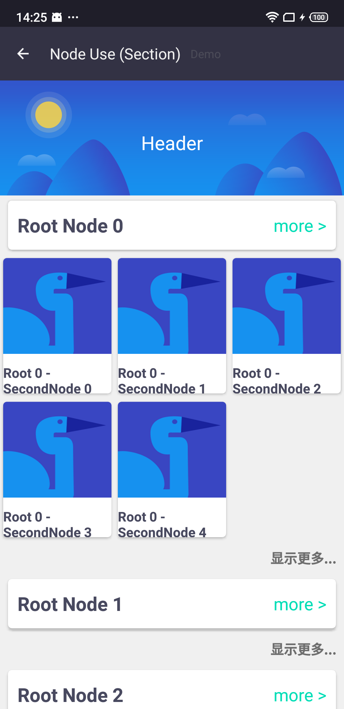
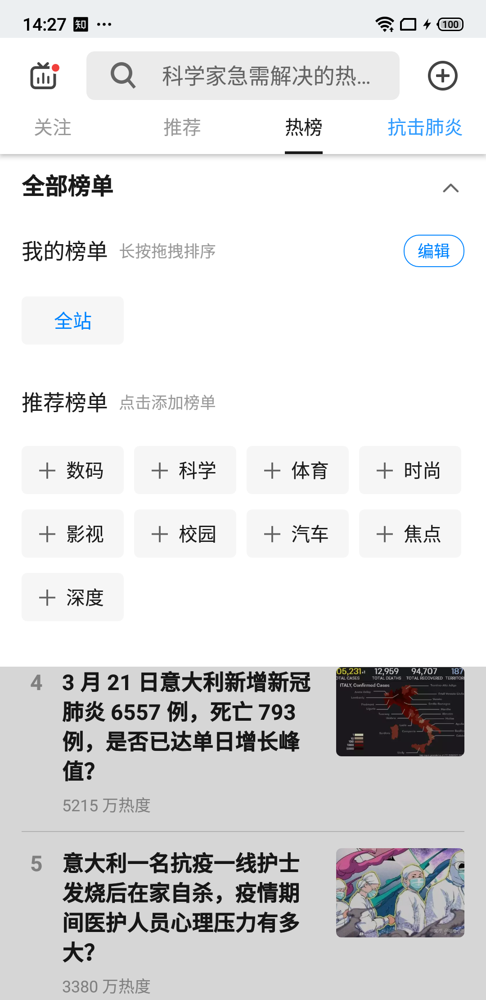
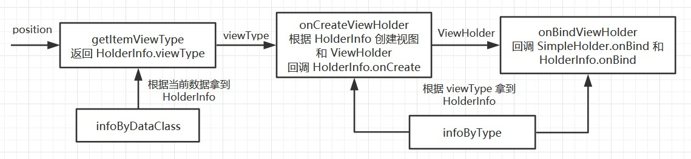

# 一百行代码造一个 RecyclerView.Adapter 轮子

市面上已经有很多开源且好用的 `Adapter` 库，为啥非要自己造轮子呢？   
  
  

学习和工作中我常用过 [BaseRecyclerViewAdapterHelper](https://github.com/CymChad/BaseRecyclerViewAdapterHelper) 和 [SugarAdapter](https://github.com/zhihu/SugarAdapter)，也都实现过复杂的列表，倒也不能说不好用或者不顺手，只是和自己的理念不太匹配，一个简单的 `Adapter` 为啥都要搞得那么复杂呢，于是决定按照自己的想法造一个**简单高效**的轮子。  

## Adapter 是干什么的

`Adapter` 适配器，顾名思义，是两类不同东西之间沟通的桥梁，`RecyclerView.Adapter` 则是为了**实现数据到视图的适配**，说白了就是一种 `Model -> View` 的映射关系。  
本着「单一职责」的原则，这里造的轮子只考虑 `Adapter` 的本职工作，不考虑添加什么「头部」、「尾部」之类的东西，简单高效地实现 `Model -> View` 的映射。  

这里先放下 Demo 中的截图，Demo 中会有 6 种卡片样式， 4 种数据类型和 3 种自定义的 ViewHolder。  


## SimpleAdapter 实现过程
这里主要讲述下实现的一些思路，和大致的实现，不管兴趣的可以直接看 Demo 的演示。

### 先实现一个 ViewHolder

`RecyclerView.ViewHolder` 承载着渲染数据的视图，但是没有对数据做任何封装。这里最基本的加个数据的泛型，缓存下当前的数据，提供一个 `onBind` 方法来接收 `onBindViewHolder` 时的数据。这样就实现了 SimpleAdapter 的第一个类 `SimpleHolder`，至于布局文件和渲染逻辑，之后再说。  

``` java
open class SimpleHolder<T: Any>(v: View) : RecyclerView.ViewHolder(v) {
    /**
     * holder 的当前数据
     */
    var data: T? = null
    @CallSuper
    open fun onBind(data: T) { this.data = data }
    //...
}
```

### 如何配置一条映射关系

这里的「一条映射关系」指的是：我拿到了一个数据 `T` -> 根据 `T` 里的数据确认下要渲染成什么样的视图 -> 这个视图用什么布局文件 -> 数据的渲染逻辑用什么 `ViewHolder`。也就是说「一条映射关系」是一种 `ViewHolder` 对某一类数据的渲染方式。由于 `RecyclerView` 对 `ViewHolder` 缓存是以 `getItemViewType` 的值为 key 的进行的，因此「一条映射关系」的配置需要与唯一的 `viewType` 相匹配。  

这里需要定义一个配置项，来配置一条映射关系，在定义之前，先来考虑下映射过程中都涉及到哪些东西：
- 首先是数据类型：`Class<T>`
- 有时候我们希望同样类型的数据，在不同情况下，渲染成不同的视图，增加一个过滤的 lambda：`(T)->Boolean`
- 视图方面首当其冲的当然是布局文件：`LayoutRes`
- 渲染逻辑复杂的还希望能够自定义 `ViewHolder`：`Class<out SimpleHolder<T>>`
- 由于 `RecyclerView` 的缓存机制，这里也要唯一确定一个：`viewType`
- 我们经常需要在 `ViewHolder` 创建时做一些通用逻辑：`(SimpleHolder<T>)->Unit`
- 当然还有 `onBindViewHolder` 时：`(SimpleHolder<T>, T)->Unit`

这些就组成了 SimpleAdapter 的第二个类 `HolderInfo`，这里就不再贴代码了。

### `SimpleAdapter` 里的实现

这是 SimpleAdapter 里的最后一个类，和其他 `Adapter` 一样，`SimpleAdapter` 也封装了一个 `List<Any>` 存放列表数据，泛型 `Any` 是为了不对数据类型做约束，支持不同类型数据的映射和渲染。  

- `fun getItemCount(): Int` 返回 `list.size`
- `fun getItemViewType(position: Int): Int` 会根据对应位置的数据拿到映射信息 `HolderInfo`，返回它的 `viewType`
- `fun onCreateViewHolder(parent: ViewGroup, viewType: Int): SimpleHolder<Any>` 再根据 `viewType` 拿到 `HolderInfo`，进而拿到布局文件和 `ViewHolder` 类型等数据，进而实例化出 `SimpleHolder<Any>`
- `fun onBindViewHolder(holder: SimpleHolder<Any>, position: Int)` 触发 `SimpleHolder.onBind` 和对应 `HolderInfo.onCreate`



#### 如何组织 `HolderInfo`

拿到 `HolderInfo` 的方式有两种，一种是 `getItemViewType` 根据当前数据拿到对应支持的 `HolderInfo`，另一种就是 `onCreateViewHolder` 和 `onBindViewHolder` 需要根据 `viewType` 拿到 `HolderInfo`。  

因此需要一个以数据类型 `Class` 为 key，`MutableList` 为 value 的 `Map`，value 是个列表是因为同一类型的数据可能对应多个 `HolderInfo`。另一个是以 `viewType` 为 key，`HolderInfo` 为 value 的 `SparseArray`。  

``` java
    private val infoByDataClass = HashMap<Class<Any>, MutableList<HolderInfo<Any>>>()
    private val infoByType = SparseArray<HolderInfo<Any>?>()
```

#### 一些全局的监听
``` java
typealias OnCreateHolder<T> = (SimpleHolder<T>)->Unit
typealias OnBindHolder<T> = (SimpleHolder<T>, T)->Unit
/**
    * 监听 onCreateViewHolder
    */
val onCreateListeners = ArrayList<OnCreateHolder<Any>>(2)
/**
    * 监听 onBindViewHolder
    */
val onBindListeners = ArrayList<OnBindHolder<Any>>(2)
```

#### 一些出错的处理

代码有问题，直接崩溃才能让我们及时发现，但是在线上的崩溃会极大影响用户体验，出现异常情况，我们希望能够有一定的降级机制来处理，这里对一些主要场景的问题提供了降级处理的方法。  

``` java
/**
    * getItemViewType 遇到不支持的数据类型时的出错处理，不设置会抛出异常
    */
var onGetViewTypeError: ((SimpleAdapter, Int)->Int)? = null
```
`SimpleAdapter` 里可能放入不支持的数据类型，导致 `getItemViewType` 无法处理，这时候就会触发这个回调，让使用者决定返回什么 `viewType`。  

``` java
/**
    * onCreateViewHolder 的出错处理，可以返回自定义的 SimpleHolder 来显示错误信息
    * 不设置或者返回 null 会重新抛出异常
    */
var onCreateError: ((SimpleAdapter, Exception, ViewGroup, Int)->SimpleHolder<Any>?)? = null
```
创建 `ViewHolder` 时出错可以让使用者提供一个降级的 `ViewHolder`，比如渲染一个显示出错信息的视图等。

``` java
/**
    * onBindViewHolder 的出错处理，不设置或者返回 null 会重新抛出异常
    */
var onBindError: ((SimpleAdapter, Exception, SimpleHolder<Any>, Int)->Unit)? = null
```
`onBindViewHolder` 时出错也提供同样的降级处理的机会，比如把整个视图隐藏掉。

## Demo


### SimpleAdapter 的使用

``` java
SimpleAdapter(list)
    .addHolderInfo(/* ... */)
    .addHolderInfo(/* ... */)
    // ...
```
`SimpleAdapter` 的构建很简单，只需要传入列表就行，之后添加需要的 `HolderInfo` 就能完成数据到视图的渲染，渲染方式下面细说。  

#### 一个数据类型 + 一个布局文件
``` java
addHolderInfo(
    HolderInfo(
        LoadingMore::class.java,
        R.layout.holder_loading_more
    )
)
```
这是最简单的创建 `HolderInfo` 的方式，会把某一类型的数据映射到布局文件创建的视图，由于没有设置任何回调，无法变更视图，因此只适用于视图固定的场合。上面的配置会渲染成「正在加载......」。  

#### 一个数据类型 + 一个布局文件 + 统一的处理方式
``` java
addHolderInfo(
    HolderInfo(
        TitleLine::class.java,
        R.layout.holder_title_line,
        onCreate = { holder ->
            holder.itemView.setOnClickListener { v ->
                val toast = holder.data?.toast ?: return@setOnClickListener
                v.context.toast(toast)
            }
        },
        onBind = { holder, data ->
            holder.v<TextView>(R.id.tv_title)?.text = data.title
            holder.v<TextView>(R.id.tv_info)?.text = data.info
        }
    )
)
```
一些简单的卡片，没必要继承 `SimpleHolder` 单独实现一个类，可以通过类似这种方式在 `onCreate` 和 `onBind` 中做些统一的渲染逻辑。Demo 中的「即将上线」、「热门电影」等就是用这种方式渲染的。  

#### 使用自定义的 `ViewHolder`
``` java 
addHolderInfo(
    HolderInfo(
        Movie::class.java,
        R.layout.holder_online_movie,
        OnlineMovieViewHolder::class.java,
        isSupport = { it.isOnline }
    )
)
```
一般卡片逻辑都比较复杂，会单独实现一个 `ViewHolder`，这里需要继承自 `SimpleAdapter`。由于一种数据类型可能渲染成多种卡片，还可能需要用 `isSupport` 过滤，当然 `onCreate` 和 `onBind` 也是可以用来处理统一逻辑的，比如设置一些 listener 等。Demo 中的在线电影、即将上映的电影和推荐的电影都是这种方式实现的。  

#### 出错处理 
``` java
onGetViewTypeError = { adapter, position ->
    sceneContext?.toast("不支持的数据: ${adapter.list[position]}")
    0
}
onCreateError = { _, _, parent, viewType ->
    val v = LayoutInflater.from(parent.context).inflate(R.layout.holder_error, parent, false)
    val holder = SimpleHolder<Any>(v)
    holder.v<TextView>(R.id.tv_info)?.text = "不支持的 viewType: $viewType"
    holder
}
```
Demo 中 `onGetViewTypeError` 会弹出 toast 提示，`onCreateError` 会显示一个出错的视图。

### 其他

Demo 中的布局方式用的是 `GridLayoutManager`，用起来也很简单，不再赘述。  

`ListViewModel` 中会处理刷新和加载更多的逻辑，这里简单处理了「空闲」、「刷新中」和「正在加载更多」三种状态。  

「正在加载更多」的实现，需要配置 `HolderInfo` 指定下渲染逻辑，在加载时往列表里添加一个对应的数据，加载完再删掉就行。加载更多的触发用的是 `RecyclerViewLoadMore`，原理就是 `RecyclerView.addOnScrollListener`，再列表接近底部时触发回调，加载更多。  

列表的更新用了 `LiveList`，是一个封装了列表操作和 `Adapter` 更新的类，就不用手动 `notifyXxx` 了。

## 结束

`RecyclerView` 不管是性能还是架构设计，都很优秀，`Recycler` 处理缓存，`LayoutManager` 处理布局，`ItemDecoration` 处理卡片的装饰，`ItemAnimator` 处理动画，各个类的职责分离且明确，非常值得我们学习。`SimpleAdapter` 只处理数据到视图的映射，什么头部卡片，底部卡片，都是数据层面的逻辑，只用变更列表数据，`Adapter` 只要考虑简单高效地解决 adapter 的逻辑就行。  

Demo 和工具类的库都在 [https://github.com/funnywolfdadada/HollowKit](https://github.com/funnywolfdadada/HollowKit) 中，之后还会不断地更新一些自己常用的工具，总结并补充相应 demo，依赖这个库只需要：  
```
allprojects {
    repositories {
        maven { url "https://raw.githubusercontent.com/funnywolfdadada/repository/master" }
    }
}

dependencies {
    implementation "com.funnywolf:hollowkit:$last_version"
}
```
